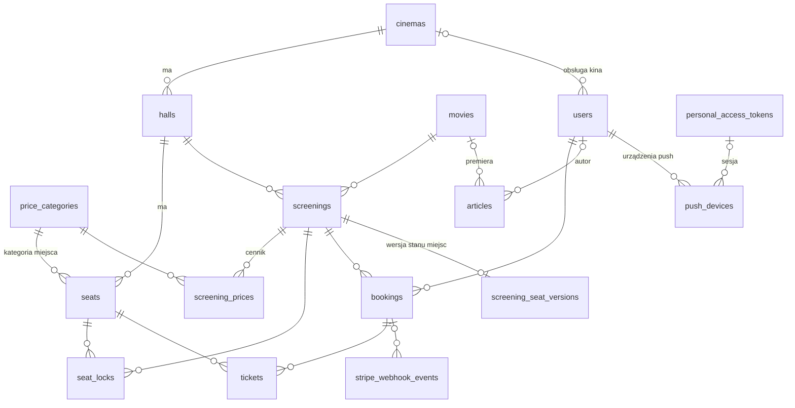
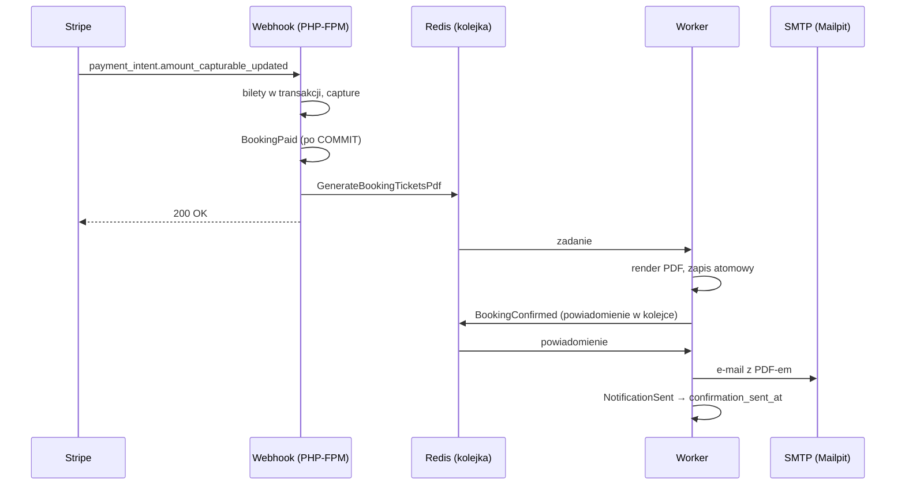

# System rezerwacji biletów kinowych

Pełna ścieżka sprzedaży biletów dla sieci kin: wybór kina i seansu, interaktywny
plan sali z atomową blokadą miejsc w czasie rzeczywistym, płatność Stripe,
bilety z kodem QR w PDF, panel administracyjny oraz aplikacja mobilna.

## Stack

| Warstwa | Technologia | Uzasadnienie |
|---|---|---|
| Backend | Laravel 13, PHP 8.4 | wymóg zadania |
| Baza danych | PostgreSQL 16 | patrz niżej |
| Cache, sesje, kolejka | Redis 7 (AOF) | jeden broker dla cache i kolejki, patrz Etap 5 |
| Serwer WWW | nginx + PHP-FPM (Alpine) | |
| Zadania w tle | kontenery `worker` (`queue:work`) i `scheduler` (`schedule:work`) | |
| WebSocket | Laravel Reverb (protokół Pushera) za nginx, kontener `reverb` | patrz Etap 6 |
| Panel administracyjny | Livewire 4 + Alpine, Pico CSS, bez kroku budowania | patrz Etap 7 |
| Aplikacja klienta (SPA) | Vue 3 + Vite + Vue Router + Pinia, TypeScript, Vitest | patrz Etap 8 |
| Powiadomienia push | Firebase Cloud Messaging HTTP v1 (własny klient), service worker | patrz Etap 8 |
| Płatności | Stripe (Payment Intents, `stripe/stripe-php`) | patrz Etap 4 |
| Bilety | `endroid/qr-code` (QR), `dompdf/dompdf` (PDF) | patrz Etap 5 |
| Poczta w środowisku deweloperskim | Mailpit | następca nierozwijanego Mailhoga |
| Konteneryzacja | Docker Compose | |

### Dlaczego PostgreSQL, a nie MySQL

Kluczowe mechanizmy bezpieczeństwa danych w tym systemie opierają się na
funkcjach, których MySQL nie posiada:

1. **Częściowe indeksy unikalne** (`UNIQUE ... WHERE ...`) — pozwalają wymusić
   „jedna aktywna blokada na miejsce" i „jeden nieanulowany bilet na miejsce"
   na poziomie bazy, bez blokad aplikacyjnych.
2. **Constraint `EXCLUDE USING gist`** — uniemożliwia zapisanie dwóch seansów
   nakładających się czasowo w tej samej sali.

Obie te rzeczy dałoby się zasymulować w MySQL kolumnami pomocniczymi i
transakcjami, ale kosztem złożoności i z gorszą gwarancją. Konsekwencja wyboru:
projekt jest związany z PostgreSQL — testy nie uruchomią się na SQLite,
co i tak byłoby bez sensu przy testowaniu współbieżności.

## Uruchomienie od zera

```bash
git clone <repo> cinema
cd cinema
# Pierwszy start buduje obraz i pobiera zależności composera — kilka minut; kolejne: sekundy.
docker compose up --build -d

# Aplikacja klienta (Etap 8): npm w przypiętym kontenerze Node, dist/ serwuje nginx.
sh tools/frontend/npm.sh ci --ignore-scripts
sh tools/frontend/npm.sh run build
```

Od Etapu 10 (blok D) kroki, które wcześniej trzeba było wykonać ręcznie, robi entrypoint
kontenera `php` (`docker/php/entrypoint.sh`) przed startem PHP-FPM:

- `backend/.env` z `.env.example`, jeśli go nie ma, i wygenerowane **puste** klucze
  (`APP_KEY`, `TICKET_QR_KEY`, `REVERB_APP_ID`, `REVERB_APP_KEY`, `REVERB_APP_SECRET`) —
  istniejący plik i ustawione wartości zostają nietknięte,
- `composer install` przy pierwszym starcie i po zmianie `composer.lock`,
- katalogi zapisu w `storage/` i dowiązanie <code>public/storage</code>,
- migracje (`cinema:boot --migrate`, z blokadą przed równoległym uruchomieniem; testy
  reguł startu: `BootCommandTest`),
- dane demonstracyjne tylko do **pustej** bazy (nigdy w produkcji),
- sygnał restartu dla workera i Reverba (nowy kod po aktualizacji).

Worker, scheduler i Reverb startują dopiero po tych krokach (healthcheck kontenera `php`).
Postęp: `docker compose logs -f php`.

Ręcznie zostają tylko klucze trybu testowego Stripe'a: `STRIPE_PUBLISHABLE_KEY`,
`STRIPE_SECRET_KEY` i `STRIPE_WEBHOOK_SECRET` w `backend/.env` (Dashboard Stripe →
Developers → API keys), potem `docker compose restart worker`. Powiadomienia push są
opcjonalne (`PUSH_ENABLED=false`); konfiguracja projektu Firebase i pliku konta serwisowego
w `docker/secrets/` — patrz Etap 8.

**Po restarcie Windows albo `wsl --shutdown`** Docker Desktop potrafi wystartować kontenery,
zanim podłączy dystrybucję WSL. Kontenery z montażami z repozytorium kończą się wtedy kodem
**127** i Docker ich nie ponawia (pułapka ET w `docs/etap10-notatki.md`). Wystarczy
`docker compose up -d`, gdy Docker Desktop zgłosi gotowość; jeśli pokaże okno
„WSL integration … unexpectedly stopped” — najpierw „Restart the WSL integration”.

| Adres | Co |
|---|---|
| <http://localhost:8080> | aplikacja klienta (SPA Vue), patrz Etap 8 |
| <https://localhost:8443> | to samo przez HTTPS (Etap 10, blok E) — `wss://`, Web Push poza localhost |
| <http://localhost:5173> | serwer deweloperski Vite: `docker compose --profile dev up -d frontend` |
| <http://localhost:8080/api/v1> | REST API |
| <http://localhost:8080/docs/api> | dokumentacja API (Scramble) |
| <http://localhost:8080/admin> | panel administracyjny (administrator i obsługa kina), patrz Etap 7 |
| <http://localhost:8025> | Mailpit — cała poczta wysłana przez aplikację |
| `ws://localhost:8080/app/{REVERB_APP_KEY}` | WebSocket (Reverb przez nginx), patrz Etap 6; przez HTTPS: `wss://localhost:8443/app/…` |

**HTTPS w środowisku deweloperskim (Etap 10, blok E).** nginx wystawia ten sam serwis na
<https://localhost:8443> (TLS 1.2/1.3, HTTP/2). Bez własnego certyfikatu generuje samopodpisany
(przeglądarka ostrzeże; `wss://` i API działają po akceptacji wyjątku, ale service worker
i Web Push wymagają certyfikatu, któremu przeglądarka ufa). Zaufany certyfikat lokalny, także dla
adresu komputera w sieci (telefon, inny komputer), daje mkcert — jednorazowo, na Windows:

```powershell
winget install FiloSottile.mkcert
mkcert -install                      # lokalne CA w magazynie zaufanych certyfikatów Windows
mkcert -cert-file cert.pem -key-file key.pem localhost 127.0.0.1 192.168.1.10
```

Pliki `cert.pem` i `key.pem` trafiają do `docker/nginx/certs/` (katalog poza gitem), potem
`docker compose up -d --force-recreate nginx`. Klucz CA mkcert zostaje na komputerze, który go
wygenerował — nigdy w repozytorium. Linki z maili i powiadomień push biorą adres z `APP_URL`;
`fcm_options.link` dostają tylko adresy HTTPS, więc do testu kliknięcia w powiadomienie:
`APP_URL=https://localhost:8443` (albo adres z certyfikatu). HSTS i przekierowanie HTTP → HTTPS
są tylko w produkcji: na localhost przeglądarka zapamiętałaby HTTPS dla całego hosta, a aplikacja
mobilna łączy się przez `http://localhost:8080` (`adb reverse`).

**CI (Etap 10, blok F): `.github/workflows/ci.yml`.** Przy każdym wypchnięciu na `dev` i `main`
i przy pull requeście: gitleaks na całej historii, frontend (npm ci, audit, typecheck, Vitest,
build), aplikacja mobilna (format, `flutter analyze --fatal-infos`, testy) oraz — z czystego klonu,
bez `backend/.env` — `docker compose up` z entrypointem, PHPUnit, sonda WebSocket
<code>bash tools/realtime-probe/run.sh</code> i sprawdzacz zgodności README z kodem. CI używa tych
samych skryptów co praca lokalna (`tools/frontend/npm.sh`, `tools/flutter/flutter.sh`), więc
wersje narzędzi są te same, przypięte po digeście; akcje GitHuba — po SHA commita.

**Wdrożenie (Etap 10, blok F2).** Po zielonych testach wypchnięcie na `dev` wdraża serwer DEV,
a na `main` — PROD (zadania `deploy-dev` i `deploy-prod`, środowiska GitHuba `dev` i `prod`). CI łączy
się przez SSH, robi `git pull` i uruchamia `tools/deploy/deploy.sh`: obrazy produkcyjne z tej rewizji
(`composer install --no-dev` w etapie `vendor`, build SPA), na PROD `artisan down` przed migracją,
nowa wersja (migracje z blokadą i restart workerów w entrypoincie), `cache:clear`, na PROD
`artisan up`. Serwery w zadaniu mogą być fikcyjne: dane są wyłącznie w sekretach środowisk
(`DEPLOY_HOST`, `DEPLOY_USER`, `DEPLOY_PATH`, `DEPLOY_SSH_KEY`, `DEPLOY_KNOWN_HOSTS`), a bez nich
krok wdrożenia kończy się adnotacją „pominięte” zamiast błędu. Przygotowanie serwera (jednorazowo):

```bash
git clone https://github.com/AndrzejSilinski/kino.git /srv/kino && cd /srv/kino
cp docker/prod/prod.env.example docker/prod/prod.env    # uzupełnić puste klucze (komentarz w pliku)
mkdir -p docker/prod/certs docker/prod/secrets          # cert.pem + key.pem (np. certbot), konto FCM
bash tools/deploy/deploy.sh prod                        # pierwsze uruchomienie ręcznie
```

`docker/prod/compose.yml` to stos bez bind mountów kodu: obrazy `kino-php` i `kino-nginx` (etapy
`prod`), PostgreSQL i Redis po digeście, wolumen `storage` wspólny dla PHP i nginx (plakaty).
nginx w produkcji przekierowuje HTTP na HTTPS, wysyła HSTS i bez certyfikatu na serwerze nie
wystartuje (żadnego samopodpisanego zastępstwa).

**APK wydania (Etap 10, blok G).** Build `release` ma włączone R8 (`isMinifyEnabled`,
`isShrinkResources`, reguły w `mobile/android/app/proguard-rules.pro`) i jest podpisany kluczem
wydania, który **nigdy nie trafia do repozytorium**: magazyn PKCS12 i `podpis.properties` leżą
w `~/.kino-podpis`, a `tools/flutter/flutter.sh` montuje ten katalog tylko do odczytu i tylko przy
`build`. Bez klucza build wydania przechodzi, ale z kluczem debug i głośnym ostrzeżeniem Gradle;
plik wskazany, lecz niekompletny, przerywa build. Jednorazowo (hasło wpisujesz sam):

```bash
bash tools/mobile/podpis.sh nowy        # magazyn i podpis.properties w ~/.kino-podpis (prawa 600)
sh tools/flutter/flutter.sh build apk --release --dart-define=API_BASE_URL=https://kino.example.com
sh tools/flutter/flutter.sh --powloka /work/tools/mobile/sprawdz-apk.sh \
  build/app/outputs/flutter-apk/app-release.apk "$(bash tools/mobile/podpis.sh odcisk)"
```

`tools/mobile/sprawdz-apk.sh` sprawdza podpis (`apksigner verify`, odcisk certyfikatu), brak
`android:debuggable`, kod Darta skompilowany AOT i ikonę powiadomień po usunięciu nieużywanych
zasobów. Zadanie `apk` w CI robi to samo i publikuje artefakt `kino-apk` (APK i `mapping.txt`
R8 do odczytywania stosów wywołań). Klucz w CI pochodzi z sekretów repozytorium
`KINO_PODPIS_MAGAZYN_BASE64` (`bash tools/mobile/podpis.sh schowek` kopiuje go do schowka bez
wypisywania), `KINO_PODPIS_ALIAS` i `KINO_PODPIS_HASLO`; adres API — ze zmiennej `KINO_API_BASE_URL`,
a `google-services.json` — z opcjonalnego sekretu `GOOGLE_SERVICES_JSON_BASE64`. Kopia zapasowa
`~/.kino-podpis` poza komputerem jest obowiązkowa: bez tego klucza nie da się wydać aktualizacji.

Webhooki Stripe'a lokalnie (Stripe CLI, osobny terminal):

```bash
stripe listen --forward-to localhost:8080/api/v1/webhooks/stripe
# wypisany sekret whsec_... wpisz do STRIPE_WEBHOOK_SECRET w backend/.env
```

Konta testowe (hasło `password`):

| E-mail | Rola |
|---|---|
| admin@cinema.test | administrator |
| anna@cinema.test | klient |
| piotr@cinema.test | klient |
| maria@cinema.test | klient |
| obsluga.warszawa@cinema.test | obsługa kina (Kino Atlantyk) |
| obsluga.krakow@cinema.test | obsługa kina (Kino Wisła) |
| obsluga.gdansk@cinema.test | obsługa kina (Kino Bałtyk) |

## Struktura repozytorium

```text
cinema/
├── docker-compose.yml        php, worker, scheduler, reverb, nginx, postgres, redis, mailpit, frontend (profil dev)
├── docker/
│   ├── nginx/default.conf    (Etap 10) serwery :80 i :443 (TLS) — wspólna treść w nginx/cinema.conf
│   ├── nginx/cinema.conf     SPA z frontend/dist, prefiksy Laravela do PHP-FPM, /app/ do Reverba, CSP
│   ├── nginx/Dockerfile      (Etap 10) obraz cinema/nginx:dev; nginx/tls.sh — certyfikat przy starcie
│   ├── nginx/certs/          (Etap 10) własny certyfikat TLS (mkcert) — poza gitem
│   ├── secrets/              (Etap 8) plik konta serwisowego Firebase — poza gitem, montowany tylko do odczytu
│   ├── php/Dockerfile        (Etap 10) etapy base/dev/vendor/prod, obrazy bazowe po digeście
│   ├── php/entrypoint.sh     (Etap 10) .env i klucze w dev, composer, storage, migracje, gotowość
│   ├── php/conf.d/uploads.ini  (Etap 7) limity wysyłania plików PHP, od Etapu 10 w obrazie
│   ├── php/prod/             (Etap 10) OPcache i pula FPM tylko dla obrazu produkcyjnego
│   └── postgres/init/        tworzy bazę cinema_testing przy pierwszym starcie wolumenu
├── backend/                  aplikacja Laravel (API, kolejki, scheduler)
│   ├── app/
│   │   ├── Services/         logika biznesowa: blokady, rezerwacje, płatności, bilety
│   │   ├── Services/Admin/   (Etap 7) logika panelu: kina, sale, układy, filmy, seanse, artykuły, pulpit
│   │   ├── Livewire/Admin/   (Etap 7) komponenty panelu — tylko dane formularza i wywołanie serwisu
│   │   ├── Support/          CatalogCache, ScreeningTimeline, ArticleMarkdown i inne klocki bez stanu
│   │   ├── Payments/         port PaymentGateway i jedyny adapter znający Stripe'a
│   │   ├── Push/             (Etap 8) klient FCM HTTP v1, token OAuth z konta serwisowego, treść powiadomień
│   │   ├── Services/Account/ (Etap 8) profil, hasło, avatar, urządzenia push
│   │   ├── Tickets/          podpis i obraz kodu QR, PDF, zapis PDF-ów
│   │   ├── Http/             kontrolery (tylko HTTP), FormRequesty, zasoby JSON
│   │   ├── Jobs/, Listeners/, Notifications/, Events/   praca w tle
│   │   ├── Policies/         autoryzacja na poziomie zasobu
│   │   └── Exceptions/       wyjątki domenowe z kodem HTTP i polem code
│   ├── database/             migracje, fabryki, seedery
│   ├── routes/api.php        /api/v1
│   ├── routes/web.php        (Etap 7) /admin — panel administracyjny
│   ├── public/vendor/admin/  (Etap 7) przypięte Pico CSS, laravel-echo, pusher-js z sumami SHA256
│   ├── routes/console.php    harmonogram
│   └── tests/                PHPUnit na PostgreSQL (Unit, Feature)
├── tools/realtime-probe/     (Etap 6) sonda WebSocket: pusher-js w kontenerze Node
├── tools/admin-assets/       (Etap 7) pobieranie zasobów panelu: Node po digeście, npm ci
├── tools/readme-compliance/  (Etap 7, rozszerzony w Etapie 8) nazwy z README i tabele testów PHPUnit i Vitest kontra kod
├── tools/frontend/npm.sh     (Etap 8) npm dla frontend/ w kontenerze Node po digeście
├── frontend/                 (Etap 8) SPA klienta: Vue 3, Vite, Vue Router, Pinia, TypeScript, Vitest
└── mobile/                   (Etap 9) Flutter
```

## Model danych



| Tabela | Rola | Najważniejsze ograniczenia |
|---|---|---|
| `cinemas` | kino: miasto, adres, **strefa czasowa**, `is_active` | `slug` UNIQUE |
| `halls` | sala: typy projekcji (`jsonb`), wymiary siatki planu | `(cinema_id, name)` UNIQUE |
| `seats` | miejsce: rząd, numer, typ, pozycja X/Y, kategoria cenowa | UNIQUE na `(hall, rząd, numer)` i na `(hall, x, y)`; CHECK typu |
| `price_categories` | standard, premium, VIP, loża — globalne dla sieci | `slug` UNIQUE |
| `movies` | tytuł, opis, czas trwania, kategoria wiekowa, gatunki (`jsonb`) | CHECK `duration_minutes > 0` |
| `screenings` | seans: `starts_at`, `ends_at`, `slot_ends_at`, projekcja, wersja językowa, status | **`EXCLUDE USING gist (hall_id =, tstzrange(starts_at, slot_ends_at) &&) WHERE status <> 'cancelled'`** |
| `screening_prices` | cena per seans i kategoria (grosze) | |
| `seat_locks` | tymczasowa blokada miejsca | **`UNIQUE (screening_id, seat_id) WHERE released_at IS NULL`** |
| `screening_seat_versions` | licznik wersji stanu miejsc per seans (Etap 6) | klucz główny = `screening_id`, CHECK `version > 0` |
| `bookings` | rezerwacja: `reference` (ULID), status, kwota, PaymentIntent, znaczniki powiadomień (od Etapu 8 także `payment_push_sent_at`), anulowanie (powód, kto) i rozliczenie zwrotu (`refund_requested_at`, `refund_completed_at`) | CHECK statusu i `bookings_refund_completed_after_request`, `stripe_payment_intent_id` UNIQUE, indeksy częściowe `bookings_confirmation_pending`, `bookings_refund_pending`, `bookings_paid_at` |
| `tickets` | bilet: `code` (UUID v4), cena, status, `validated_at`, `validated_by_user_id` | **<code>UNIQUE (screening_id, seat_id) WHERE status &lt;&gt; 'cancelled'</code>**, `code` UNIQUE |
| `users` | klient, obsługa kina, administrator; od Etapu 8 avatar (`avatar_path`), zgoda na push (`push_consent_at`) i przypomnienia (`screening_reminders`) | CHECK `(role = 'staff') = (cinema_id IS NOT NULL)` |
| `push_devices` | urządzenie z tokenem FCM (Etap 8): konto, sesja, platforma, ostatnie użycie | `public_id` i `token` UNIQUE, `personal_access_token_id` ON DELETE CASCADE, CHECK platformy |
| `stripe_webhook_events` | dziennik przetworzonych zdarzeń Stripe'a (bez treści) | klucz główny = `event_id` |
| `articles` | artykuł „Aktualności” / „Nadchodzące premiery” (Etap 7): typ, status, data publikacji, Markdown | `slug` UNIQUE, CHECK typu, statusu, daty publikacji i filmu premiery, indeks częściowy `articles_published` |

### Etap 1 — decyzje projektowe (1–13)

1. **Miejsca należą do sali, nie do seansu.** Plan sali definiuje się raz;
   stan miejsca na konkretnym seansie wynika z blokad i biletów, więc nie trzeba
   generować milionów wierszy „miejsce × seans" z góry.
2. **Love seat to jeden bilet z ceną pakietową.** Jedna pozycja na planie, jedna
   blokada, jeden kod QR — bez sklejania dwóch biletów, które trzeba by
   sprzedawać i anulować razem.
3. **`seats.type` i `price_category_id` to dwa niezależne wymiary.** Typ mówi,
   czym jest fotel (standard, podwójny, dla osób z niepełnosprawnością), kategoria
   — ile kosztuje. Miejsce dla osoby z niepełnosprawnością może być w strefie
   premium i odwrotnie.
4. **Pieniądze zawsze jako `integer` w groszach.** Żadnych `float` ani `decimal`
   w PHP; Stripe operuje na tych samych jednostkach.
5. **Seans ma trzy znaczniki czasu.** `starts_at`, `ends_at` (koniec filmu)
   i `slot_ends_at` (koniec sprzątania). Kolizje sal pilnuje `slot_ends_at`,
   a widz i raporty patrzą na `ends_at`.
6. **`tickets.screening_id` zdenormalizowane.** Bez tej kolumny indeks częściowy
   „jeden bilet na miejsce na seansie" nie miałby czego obejmować (seans jest
   w `bookings`, a indeks może obejmować tylko jedną tabelę).
7. **`seat_locks` używa `released_at` zamiast `DELETE`.** Ślad audytowy, a indeks
   częściowy i tak obejmuje tylko aktywne blokady.
8. **`bookings.user_id NOT NULL`.** Zakup wymaga konta; blokować miejsca można
   anonimowo (sesja zakupowa), ale płacić już nie.
9. **`bookings.reference` = ULID, `tickets.code` = UUID v4.** Numer rezerwacji jest
   sortowalny i czytelny dla supportu; kod biletu nie zdradza czasu zakupu.
   Żaden z nich nie jest sekwencyjny.
10. **PostgreSQL** — indeksy częściowe i `EXCLUDE` (patrz wyżej).
11. **Atomowość blokad na indeksie UNIQUE**, a nie na `SELECT ... FOR UPDATE`
    ani Redis <code>SETNX</code> (szczegóły w Etapie 2).
12. **Blokowanie all-or-nothing, `seat_id` sortowane rosnąco** — brak deadlocków
    i brak częściowo zajętych koszyków.
13. **Serwisy rzucają wyjątki domenowe**, a nie zwracają odpowiedzi HTTP; jedno
    miejsce tłumaczy je na JSON.

## Dane testowe

Seeder tworzy 3 kina w różnych miastach, 7 sal w trzech układach (z przejściami,
strefą Premium, rzędem VIP w sali IMAX, kanapami dla par w ostatnim rzędzie
i miejscami dla osób z niepełnosprawnością przy wejściu), 8 filmów,
repertuar od 2 dni wstecz do 13 dni w przód wraz z cennikami oraz jedno konto
obsługi na każde kino.

Ceny są wyliczane z ceny bazowej kategorii przez mnożniki: weekend +20%,
seans wieczorny +15%, poranek −20%, 3D ×1,15, IMAX ×1,35.

Generator repertuaru przesuwa kursor czasu dopiero za `slot_ends_at`
poprzedniego seansu, dzięki czemu nigdy nie narusza constraintu
`screenings_no_overlap`. Gdyby algorytm się pomylił, seeder przerwałby się
błędem bazy — poprawność jest weryfikowana przez samą bazę, nie przez
zaufanie do kodu.

## Znane ograniczenia i co zrobiłbym mając więcej czasu

- **Brak zakupu jako gość.** Wymagałby dostępu do biletów przez podpisany URL
  z ograniczonym czasem życia.
- **Gatunki filmów jako tablica `jsonb`.** Wystarczające do filtrowania;
  osobna tabela słownikowa byłaby potrzebna dopiero przy stronach gatunków
  i statystykach.
- **Kategorie cenowe globalne dla sieci.** Rozszerzenie do kategorii per kino
  to jedna nullowalna kolumna.
- **`halls.grid_rows` / `grid_cols` zdenormalizowane** względem `seats`.
  Świadome — frontend potrzebuje wymiarów planu przed pobraniem miejsc.
  Utrzymanie spójności należy do edytora układu sali.
- **Projekt związany z PostgreSQL.** Konsekwencja użycia indeksów częściowych
  i `EXCLUDE`; przenośność na inny silnik nie była celem.

Ograniczenia poszczególnych etapów są opisane w ich sekcjach.

## Stan prac

- [x] Etap 0 — Docker Compose, szkielet Laravela
- [x] Etap 1 — model danych, migracje, modele Eloquent, seeder
- [x] Etap 2 — blokowanie miejsc i test współbieżności
- [x] Etap 3 — REST API ścieżki zakupowej
- [x] Etap 4 — Stripe, webhook, obsługa wyścigu przy płatności
- [x] Etap 5 — bilety, QR, PDF, kolejki, mail, scheduler
- [x] Etap 6 — WebSocket (Laravel Reverb)
- [x] Etap 7 — panel administracyjny (Livewire), cache w Redisie, moduł informacyjny
- [x] Etap 8 — frontend Vue 3 (SPA), konto klienta, Web Push przez FCM
- [x] Etap 9 — aplikacja Flutter
- [ ] Etap 10 — CI/CD i dokumentacja

---

## Testy — stan obecny

Jedyna tabela w README, której liczby odpowiadają **dzisiejszemu** kodowi. Tabele testów w sekcjach
etapów to **stan na koniec etapu**: późniejsze etapy dopisywały testy do starszych klas (np.
`SeatLockApiTest` miał na koniec Etapu 3 dziewięć testów, dziś ma dziesięć), więc tamte liczby
opisują historię projektu, a nie obecny kod.

Sprawdzacz zgodności README z kodem (`tools/readme-compliance/check.php`, uruchamiany przez
wykonawcę paczek po każdym bloku i w CI) pilnuje obu rodzajów tabel inaczej:

- **ta tabela** — liczby testów i plików co do jednego, wobec PHPUnit i raportów Vitest i Fluttera;
- **tabele etapów** — każda wymieniona klasa i każdy plik nadal istnieją, a wiersze sumują się
  do „Razem”;
- **pokrycie** — każda klasa i każdy plik testów musi być w README gdzieś wymieniony.

| Zestaw | Testów | Klas / plików | Uruchomienie |
|---|---:|---|---|
| PHPUnit | **513** | 73 klas | <code>docker compose exec php php artisan test</code> |
| Vitest | **210** | 53 pliki | <code>sh tools/frontend/npm.sh test</code> |
| Flutter | **315** | 48 plików | <code>sh tools/flutter/flutter.sh test</code> |

W README tekst w odwróconych apostrofach (jak `SeatLockApiTest`) oznacza **nazwę z kodu**
(klasę, metodę, trasę, zmienną, plik) i jest sprawdzany; <code>tak zapisane</code> fragmenty to przykłady, składnia SQL albo polecenia
powłoki i sprawdzane nie są.

## Etap 2 — Blokowanie miejsc (współbieżność)

Najważniejsza część zadania. Gdy przy premierze setki osób klikają ten sam fotel,
system musi zagwarantować, że dokładnie jedna z nich go dostanie — i musi to
zagwarantować **baza danych**, a nie warunek w PHP.

### Co powstało

| Plik | Rola |
|---|---|
| `app/Services/SeatLockService.php` | cała logika: zakładanie, zwalnianie, czyszczenie blokad |
| `app/Exceptions/CinemaException.php` | bazowy wyjątek domenowy (status HTTP + kod błędu + kontekst) |
| `app/Exceptions/SeatsUnavailableException.php` | konflikt miejsca — 409 |
| `app/Exceptions/InvalidSeatSelectionException.php` | błędne dane wejściowe — 422 |
| `app/Exceptions/SeatLockLimitExceededException.php` | przekroczony limit miejsc — 422 |
| `app/Exceptions/ScreeningNotBookableException.php` | seans odwołany / zakończony / rozpoczęty — 409 |
| `app/Console/Commands/SweepExpiredSeatLocks.php` | czyszczenie wygasłych blokad (scheduler) |
| `app/Console/Commands/AttemptSeatLock.php` | pojedyncza próba blokady — narzędzie testu współbieżności |
| `tests/Feature/SeatLockConcurrencyTest.php` | **test obowiązkowy**: 20 równoczesnych procesów |
| `tests/Feature/SeatLock{Service,Expiry,Validation}Test.php` | 22 testy jednostkowe |
| `database/factories/*.php` | 10 factories |

### Mechanizm: częściowy indeks UNIQUE w PostgreSQL

Atomowość zapewnia jeden obiekt w bazie:

```sql
CREATE UNIQUE INDEX seat_locks_active_unique
    ON seat_locks (screening_id, seat_id)
    WHERE released_at IS NULL;
```

Gdy dwie transakcje próbują wstawić wiersz o tym samym kluczu, PostgreSQL wykrywa
konflikt na poziomie strony B-drzewa. Druga transakcja **blokuje się** i czeka na
rozstrzygnięcie pierwszej: po jej `COMMIT` dostaje `SQLSTATE 23505`, po `ROLLBACK`
spokojnie wstawia własny wiersz. Nie istnieje okno czasowe, w którym obie mogłyby
przejść — w odróżnieniu od naiwnego `if (! exists) insert`, które jest klasycznym
TOCTOU i przy stu równoczesnych żądaniach po prostu nie działa.

Wymuszenie leży w bazie, nie w aplikacji: nawet zapis wykonany z konsoli psql,
z pominięciem serwisu, nie złamie tej zasady.

### Dlaczego nie `SELECT ... FOR UPDATE`

`FOR UPDATE` blokuje **istniejące wiersze**. Nie blokuje ich nieobecności —
zapytanie zwracające zero wierszy nie zakłada żadnej blokady, więc dwa procesy
dostają pustkę i oba wstawiają. To phantom read i dokładnie ten błąd, którego
szuka się w tym zadaniu.

Żeby `FOR UPDATE` miało co blokować, potrzebna byłaby prefabrykowana tabela
<code>screening_seats</code> ze stanem każdego fotela na każdym seansie — miliony wierszy
generowanych z góry dla seansów, na które nikt nie przyjdzie. Wariant alternatywny,
blokowanie wiersza `screenings` jako mutexu na cały seans, serializuje całą salę:
przy premierze 300 osób wybierających **różne** miejsca stoi w jednej kolejce.

Poprawne warianty (<code>SERIALIZABLE</code> z pętlą retry na <code>40001</code>, `pg_advisory_xact_lock`)
działają, ale są droższe i mniej czytelne, a ograniczenie unikalności i tak zostałoby
jako pas bezpieczeństwa. Dwa mechanizmy zamiast jednego to koszt bez zysku.

### Dlaczego nie Redis <code>SET NX PX</code>

Redis kusi atomowym <code>SETNX</code> i wbudowanym TTL, ale wprowadza **drugie źródło prawdy**.
Bilety są w PostgreSQL; przy finalizacji płatności trzeba atomowo sprawdzić blokadę
i wystawić bilet, czego nie da się objąć jedną transakcją obejmującą Redis i Postgres
bez two-phase commit albo wzorca outbox — nakład nieproporcjonalny do zysku.
Dochodzi trwałość (<code>appendfsync everysec</code> gubi do sekundy zapisów, failover na replikę
gubi blokady) oraz brak śladu audytowego i raportowania.

Redis jest w projekcie i zostanie użyty do cache repertuaru i kolejek, ale
**nie odpowiada za poprawność blokad**. Przy skali wymagającej tysięcy blokad na
sekundę byłby szybkim filtrem przed bazą — warstwą dodatkową, nie zamiennikiem.

### Pułapka: predykat indeksu nie może zawierać `now()`

Naturalnym odruchem jest napisanie predykatu jako
<code>WHERE released_at IS NULL AND expires_at &gt; now()</code>. PostgreSQL na to nie pozwoli —
w predykacie indeksu wolno używać wyłącznie funkcji `IMMUTABLE`, a `now()` jest
`STABLE`. Konsekwencja jest fundamentalna dla całego projektu:

> **Blokada, która wygasła, ale nie została zwolniona, nadal zajmuje wpis w indeksie.**

Gdyby serwis tego nie obsłużył, miejsce po porzuconym koszyku byłoby zablokowane
na zawsze. Dlatego `SeatLockService::lock()` zwalnia wygasłe blokady
**w tej samej transakcji, tuż przed własnym INSERT-em** — między jednym a drugim
nie ma okna, w które ktoś mógłby wejść.

Scheduler czyszczący wygasłe blokady to **higiena, nie mechanizm poprawności**.
Gdyby nie działał wcale, system nadal sprzedawałby prawidłowo; rosłaby tylko tabela,
a plan sali pokazywałby zajęte miejsce do chwili, gdy ktoś w nie kliknie.

### Algorytm `lock()`

Poza transakcją (tanio, bez trzymania locków):

1. Seans jest `bookable` i jeszcze się nie zaczął — inaczej **409**.
2. Lista miejsc niepusta, bez duplikatów — inaczej **422**.
3. Wszystkie miejsca należą do sali tego seansu i są aktywne — inaczej **422**.
   Ta kontrola jest konieczna, bo `seat_locks` ma klucz obcy do `seats`, a nie do
   `halls`: bez niej dałoby się zablokować fotel z innego kina.

W transakcji:

4. **Sortowanie `seat_id` rosnąco.** Gdy jeden klient bierze miejsca `{5, 9}`,
   a drugi `{9, 5}` i każdy idzie w swojej kolejności, powstaje cykl oczekiwań —
   deadlock, który PostgreSQL rozstrzyga zabiciem jednej transakcji (`40P01`),
   czyli błędem 500 dla losowego użytkownika. Stała kolejność czyni deadlock
   **strukturalnie niemożliwym**.
5. **Zwolnienie wygasłych blokad** na wybranych miejscach (<code>released_at = now()</code>).
   Gdy robią to dwie transakcje naraz, `UPDATE` zakłada lock na wierszu; druga
   po zwolnieniu locka ponownie ewaluuje `WHERE` na nowej wersji wiersza
   (EvalPlanQual), widzi wypełnione `released_at` i aktualizuje zero wierszy.
6. **Idempotencja.** Miejsca, które ta sesja już trzyma, są pomijane przy wstawianiu.
   Podwójne kliknięcie i retry po timeoucie kończą się sukcesem, nie błędem.
   TTL **nie jest odnawiany** — inaczej klient trzymałby fotel bez końca, pingując
   endpoint co minutę.
7. **Kontrola limitu** miejsc na sesję (nie na żądanie — inaczej wystarczyłoby
   wysłać dziesięć żądań po jednym miejscu i zablokować całą salę).
8. **Jeden INSERT na wszystkie miejsca.** Konflikt na którymkolwiek wywraca całe
   zapytanie i transakcję: blokowanie jest **all-or-nothing**, bo nie chcemy
   sprzedać trzech miejsc z pięciu i posadzić rodziny osobno.
9. **Sprawdzenie sprzedanych biletów.** Bilety są w innej tabeli, więc indeks
   blokad ich nie pilnuje. Kontrola idzie **po** INSERT-cie: skoro nasz wpis
   przeszedł, nikt nie trzyma aktywnej blokady tego miejsca, a bilet powstaje
   wyłącznie z aktywnej blokady — więc nikt nie jest właśnie w trakcie finalizacji.

Po `23505` transakcja jest wycofywana, a dopiero **poza nią** serwis odpytuje bazę,
które konkretnie miejsca są zajęte, i zwraca je klientowi. W PostgreSQL transakcja
po błędzie jest zatruta (`25P02`) i nie wykonałaby żadnego kolejnego zapytania.

### Błędy domenowe zamiast wycieków `QueryException`

Serwis nie wie nic o HTTP i nie zwraca response'ów — rzuca wyjątki opisujące problem
biznesowy. Jedno miejsce w `bootstrap/app.php` (Etap 3) przetłumaczy je na spójny JSON,
dzięki czemu ten sam wyjątek obsłuży REST API, komendę konsolową i Livewire.
`QueryException` nigdy nie wychodzi na zewnątrz — niósłby fragment SQL-a, czyli wyciek
szczegółów implementacji.

| Kod błędu | HTTP | Kiedy |
|---|---|---|
| `SEATS_UNAVAILABLE` | 409 | miejsce trzyma inna sesja albo jest sprzedane |
| `SCREENING_NOT_BOOKABLE` | 409 | seans odwołany, zakończony lub już się zaczął |
| `EMPTY_SEAT_SELECTION` | 422 | pusta lista miejsc |
| `DUPLICATE_SEATS` | 422 | to samo miejsce podane dwa razy |
| `SEATS_NOT_IN_HALL` | 422 | miejsce nie istnieje lub jest z innej sali |
| `SEATS_INACTIVE` | 422 | miejsce wyłączone ze sprzedaży |
| `SEAT_LOCK_LIMIT_EXCEEDED` | 422 | przekroczony limit miejsc na sesję |

Rozróżnienie 409 od 422 jest celowe: **409** to konflikt stanu zasobu na serwerze
(żądanie było poprawne), **422** to błąd w danych żądania.

### Zwalnianie i scheduler

- `release()` — zwalnia wskazane miejsca; wymaga zgodności `session_id`, więc znajomość
  identyfikatora miejsca nie wystarcza do zwolnienia cudzej blokady. Idempotentne:
  powtórne odkliknięcie zwraca 0, a nie błąd. Nie rusza blokad wpiętych w rezerwację
  (`booking_id`) — te należą do procesu płatności.
- `releaseSession()` — porzucenie koszyka, zwalnia wszystko, co sesja trzyma na seansie.
- `sweepExpired()` — oznacza wygasłe blokady jako zwolnione, porcjami
  (`SEAT_LOCK_SWEEP_BATCH`, domyślnie 500), żeby jeden przebieg nie zakładał locków
  na dziesiątkach tysięcy wierszy. Dwa kroki, bo PostgreSQL nie zna `UPDATE ... LIMIT`.
- Komenda `cinema:seat-locks:sweep` w harmonogramie co minutę,
  z `withoutOverlapping()` i `runInBackground()`.

Blokady nigdy nie są usuwane — `released_at` zamiast `DELETE` daje ślad audytowy:
widać, kto trzymał miejsce i kiedy je puścił.

### Testy

```bash
php artisan test                        # całość
php artisan test --group=concurrency    # tylko test obowiązkowy
```

Baza testowa `cinema_testing` powstaje **automatycznie** przy pierwszym
`docker compose up` (skrypt `docker/postgres/init/01-create-test-database.sql`
wykonywany przez obraz postgres z <code>/docker-entrypoint-initdb.d/</code>). Nie ma żadnego
kroku ręcznego przed uruchomieniem testów.

**Testy nie działają na SQLite — i nie mogą.** SQLite nie zna częściowych indeksów
(`CREATE UNIQUE INDEX ... WHERE`) ani `EXCLUDE USING gist`, a `:memory:` to jedno
połączenie w jednym procesie. Test współbieżności musiałby więc testować coś innego
niż produkcja, co czyniłoby go bezwartościowym. `phpunit.xml` wskazuje PostgreSQL,
a osobny test-bezpiecznik (`DatabaseEnvironmentTest`) pilnuje, żeby nikt nie uruchomił
czyszczących testów na bazie deweloperskiej.

**Test obowiązkowy** uruchamia 20 procesów systemowych przez `proc_open()`.
Nie użyto <code>pcntl_fork()</code>: procesy potomne dziedziczyłyby po rodzicu to samo
połączenie PDO i stan aplikacji, więc nie byłyby niezależnymi klientami bazy.
Rozszerzenie `pcntl` jest w obrazie (potrzebuje go `queue:work` do limitu czasu
zadań), ale do tego testu się nie nadaje. Każdy proces boot-uje Laravel od
zera i otwiera własne połączenie — izolacja identyczna z produkcyjną. Wspólna
**bariera startu** (znacznik `microtime` przekazywany argumentem) sprawia, że wszystkie
uderzają w bazę równocześnie, zamiast po kolei w miarę startowania.

Test dowodzi trzech rzeczy:

1. przy 20 równoczesnych żądaniach na to samo miejsce powstaje **dokładnie jedna**
   blokada, a 19 pozostałych dostaje `SEATS_UNAVAILABLE` / 409 — żaden nie kończy
   się wyjątkiem technicznym;
2. równoczesne żądania na **różne** miejsca wszystkie się udają (blokada nie jest
   globalnym mutexem na seans);
3. blokowanie nachodzących na siebie par miejsc `{i, i+1}` w pierścieniu nie powoduje
   deadlocków — dzięki deterministycznej kolejności sortowania.

Test współbieżności używa `DatabaseTruncation`, a nie `RefreshDatabase`: ten drugi
opakowuje test w transakcję, a dane niezatwierdzone są **niewidoczne dla innych
połączeń** — procesy potomne nie zobaczyłyby ani seansu, ani miejsc i test byłby
fałszywie zielony. Z tego samego powodu klasa sprząta po sobie w `tearDown()`:
zapisuje dane naprawdę, więc nie ma transakcji, która by je cofnęła.

### Konfiguracja

```env
SEAT_LOCK_TTL=600                    # czas życia blokady w sekundach
SEAT_LOCK_MAX_SEATS=10               # limit miejsc na sesję i seans
SEAT_LOCK_SWEEP_BATCH=500            # rozmiar porcji przy czyszczeniu
```

### Znane ograniczenia i co dalej

- **Brak endpointów HTTP** — serwis jest gotowy, ale API ścieżki zakupowej powstaje
  w Etapie 3. Wtedy dojdzie `FormRequest`, mapowanie wyjątków na JSON w
  `bootstrap/app.php`, rate limiting na endpointach blokowania i przekazywanie
  identyfikatora sesji nagłówkiem.
- ~~Kontener `scheduler` jeszcze nie istnieje~~ — **rozwiązane w Etapie 5**:
  kontener `scheduler` uruchamia `schedule:work`, a `cinema:seat-locks:sweep`
  wykonuje się co minutę.
- ~~**Migracje nie uruchamiają się same** przy `docker compose up` — po starcie trzeba
  wykonać <code>php artisan migrate --seed</code>.~~ — **rozwiązane w Etapie 10** (blok D):
  entrypoint kontenera `php` wykonuje `cinema:boot --migrate`, a dane demonstracyjne
  wczytuje tylko do pustej bazy.
- ~~Brak broadcastu~~ — **rozwiązane w Etapie 6**: każda zmiana stanu miejsc
  podbija wersję w `SeatStateRecorder`, a po COMMIT wychodzi zdarzenie
  `seats.changed` na kanale seansu.
- **Bariera startu w teście to 3 sekundy** — na wolniejszej maszynie część procesów
  może wystartować już po niej. Test pozostaje poprawny (asercje dotyczą wyniku,
  nie czasu), ale kontencja jest wtedy słabsza. Docelowo lepszym rozwiązaniem byłaby
  bariera na tabeli w bazie albo na Redisie.
- **Gdybym miał więcej czasu**: dorzuciłbym test z <code>pg_sleep()</code> wstrzykniętym między
  zwolnienie wygasłej blokady a INSERT, żeby udowodnić, że okno między tymi krokami
  jest faktycznie zamknięte transakcją, a nie tylko wąskie.

---

## Etap 3 — REST API ścieżki zakupowej

Publiczne API dla dwóch klientów: aplikacji webowej Vue (Etap 8) i mobilnej
Flutter (Etap 9). Obsługuje pełną ścieżkę od wyboru kina po wycenę koszyka.

### Wersjonowanie

Wersja siedzi w ścieżce (<code>/api/v1/...</code>), nadawana przez `apiPrefix`
w `bootstrap/app.php`. Nie w nagłówku `Accept`, bo:

- aplikacja Flutter w sklepie nie aktualizuje się na żądanie — musi istnieć
  możliwość zamrożenia `v1` i wystawienia `v2` obok,
- prefiks nadaje framework, zanim wczyta plik tras, więc nie da się
  przypadkiem dodać endpointu bez wersji (grupa <code>Route::prefix('v1')</code>
  takiej gwarancji nie daje — wystarczy dopisać trasę pod klamrą),
- daje się wywołać `curl`-em, zacache'ować po URL i pokazać w Scramble.

### Endpointy

| Metoda | Ścieżka | Uwagi |
|---|---|---|
| POST | `/auth/register` | limit 10/h per IP |
| POST | `/auth/login` | limit 5/min per (e-mail+IP) oraz 20/min per IP |
| POST | `/auth/logout` | kasuje token TEGO urządzenia |
| GET | `/auth/me` | |
| GET | `/cinemas` | grupowane po miastach, bez paginacji |
| GET | `/cinemas/{cinema}` | klucz: slug |
| GET | `/cinemas/{cinema}/screening-dates` | kalendarz |
| GET | `/cinemas/{cinema}/screenings?date=` | paginowany |
| GET | `/screenings/{screening}` | |
| GET | `/screenings/{screening}/seat-map` | stan każdego miejsca |
| GET | `/screenings/{screening}/seat-locks` | koszyk + timer |
| POST | `/screenings/{screening}/seat-locks` | 201 / 409, limit 30/min per sesja |
| DELETE | `/screenings/{screening}/seat-locks/{seat}` | odkliknięcie, idempotentne |
| DELETE | `/screenings/{screening}/seat-locks` | porzucenie koszyka (sendBeacon) |
| GET | `/bookings` | tylko własne, paginowane |
| GET | `/bookings/{reference}` | klucz: ULID, chronione Policy |
| POST | `/broadcasting/auth` | (Etap 6) podpis kanału prywatnego; token opcjonalny, limit 60/min per klient i 1200/min per IP |

### Kształt odpowiedzi

Sukces — zawsze koperta `data`; listy dokładają `links` i `meta` z paginacji:

    { "data": { ... } }
    { "data": [ ... ], "links": { ... }, "meta": { ... } }

Koperta pozwala dołożyć `meta` do dowolnej odpowiedzi bez łamania kontraktu.
Nie ma pola <code>success</code> — status HTTP już to mówi, a dublowanie stanu w dwóch
miejscach kończy się tym, że któreś kłamie.

Błąd — jeden kształt dla wszystkiego:

    {
      "message": "Wybrane miejsca zostały właśnie zajęte.",
      "code": "SEATS_UNAVAILABLE",
      "context": { "seat_ids": [17, 18], "seats": ["B7", "B8"] },
      "errors":  { "pole": ["komunikat"] }
    }

- `message` — dla człowieka, po polsku, gotowe do wyświetlenia
- `code` — dla maszyny; frontend rozgałęzia się po nim, nigdy po treści
  komunikatu ani po samym statusie (409 ma dwie różne przyczyny)
- `context` — dane do reakcji UI, np. które fotele przemalować na czerwono
- `errors` — wyłącznie przy 422, w formacie zgodnym z Laravelem

### Kody błędów

| Kod | HTTP | Kiedy |
|---|---|---|
| `VALIDATION_FAILED` | 422 | błąd walidacji FormRequest |
| `UNAUTHENTICATED` | 401 | brak lub nieważny token |
| `INVALID_CREDENTIALS` | 401 | złe dane logowania |
| `FORBIDDEN` | 403 | Policy odmówiła dostępu do zasobu |
| `RESOURCE_NOT_FOUND` | 404 | adres poprawny, rekordu brak |
| `ENDPOINT_NOT_FOUND` | 404 | nie ma takiego adresu |
| `METHOD_NOT_ALLOWED` | 405 | zła metoda HTTP |
| `SEATS_UNAVAILABLE` | 409 | konflikt blokady miejsc |
| `SCREENING_NOT_BOOKABLE` | 409 | seans odwołany lub rozpoczęty |
| `PRICE_NOT_CONFIGURED` | 409 | brak ceny dla kategorii miejsca |
| `INVALID_SESSION_ID` | 422 | zły format nagłówka X-Session-Id |
| `CHANNEL_FORBIDDEN` | 403 | (Etap 6) brak dostępu do kanału WebSocket |
| `TOO_MANY_REQUESTS` | 429 | przekroczony limit (+ Retry-After) |
| `REALTIME_UNAVAILABLE` | 503 | (Etap 6) broadcaster nie potrafi podpisywać kanałów |
| `SERVER_ERROR` | 500 | wszystko pozostałe, bez stack trace |

### Konwencje pól

- **Pieniądze**: <code>{ "amount": 3500, "currency": "PLN", "formatted": "35,00 zł" }</code>.
  `amount` to grosze jako `int`. Formatuje serwer, bo `Intl.NumberFormat`
  w przeglądarce i <code>NumberFormat</code> w Darcie dają dla `pl_PL` różne wyniki.
- **Czas seansu**: ISO 8601 z offsetem, przeliczony do strefy KINA
  (<code>2026-09-11T18:30:00+02:00</code>). Klient wyświetla dosłownie — bez
  `toLocaleString()`. Widz w Londynie ma zobaczyć 18:30, godzinę z biletu.
- **Timer**: zawsze para `expires_at` + `expires_in_seconds`. Zegar telefonu
  bywa przestawiony; datą klient się resynchronizuje, sekundami odlicza.
- **Enum**: surowa wartość plus `*_label` po polsku, żeby klient nie
  utrzymywał własnego słownika tłumaczeń.

### Etap 3 — decyzje projektowe (14–31)

14. **Wersja API w ścieżce (<code>/api/v1</code>), nadawana przez `apiPrefix`.** Framework
    narzuca prefiks przed wczytaniem pliku tras, więc nie da się dodać endpointu
    bez wersji — nawet przez pomyłkę.
15. **Identyfikator sesji zakupowej wydaje serwer.** 32 losowe znaki alfanumeryczne,
    nagłówek `X-Session-Id` w żądaniu i w odpowiedzi. Klient generujący własny
    identyfikator mógłby wysłać `abc` i wejść w cudzy koszyk. Zły format to 422,
    a nie ciche wydanie nowego — inaczej klient z zepsutym localStorage gubiłby
    blokady bez żadnego sygnału.
16. **Sanctum z tokenami bearer, nie sesja cookie.** Jedno API dla Vue i Fluttera;
    aplikacja mobilna nie ma ciasteczek przeglądarki.
17. **Wylogowanie kasuje tylko `currentAccessToken()`.** `$user->tokens()->delete()`
    wyrzuciłoby użytkownika także z telefonu.
18. **Nieudane logowanie zawsze zwraca ten sam komunikat** (ochrona przed user
    enumeration). Przy nieistniejącym koncie wykonujemy hashowanie „na pusto”,
    żeby czas odpowiedzi nie zdradzał, czy konto istnieje.
19. **`role` poza `#[Fillable]`, a `AuthService` ustawia `UserRole::Customer` jawnie.**
    Dwie niezależne bariery przed privilege escalation przez masowe przypisanie.
20. **Jeden kształt błędu z polem `code`.** Frontend rozgałęzia się po `code`,
    a nie po statusie HTTP (409 ma co najmniej dwie różne przyczyny) ani po treści
    komunikatu, która może się zmienić przy tłumaczeniu.
21. **`dontReport(CinemaException::class)`.** Zajęte miejsce to normalny wynik
    biznesowy, nie awaria. Bez tego log tonąłby w tysiącach wpisów przy każdej
    premierze, a prawdziwe błędy ginęłyby w szumie.
22. **Logi na stderr (`LOG_CHANNEL=stderr`), nie do pliku** — zgodnie z 12-factor
    app; logi zbiera Docker. Przy okazji znika problem uprawnień do
    `storage/logs` między CLI (uid 1000) a PHP-FPM.
23. **`Money` jako typ wartościowy, formatowanie po stronie serwera.** Kwoty
    w groszach (int), pole `formatted` liczy backend, bo `Intl` w przeglądarce
    i <code>NumberFormat</code> w Darcie dają dla `pl_PL` różne wyniki (spacje, separatory).
24. **Czasy seansów w strefie kina, ISO 8601 z offsetem.** Widz w Londynie
    kupujący bilet do Krakowa ma zobaczyć godzinę z biletu, nie swoją lokalną.
25. **Enum jako surowa wartość + osobne pole `*_label` po polsku.** Klient
    rozgałęzia się po wartości, wyświetla etykietę i nie utrzymuje słownika
    tłumaczeń w dwóch aplikacjach.
26. **Plan sali nie ujawnia, czyja jest blokada** (`held` vs `held_by_you`).
    Ten sam payload pójdzie przez Reverb, a wymóg 1.3 zabrania danych osobowych
    w broadcastach.
27. **Wycena koszyka wyłącznie po stronie serwera (`CartPricingService`).** Serwis
    nie przyjmuje żadnej kwoty z zewnątrz. Brak ceny dla kategorii to wyjątek
    `PRICE_NOT_CONFIGURED`, nigdy ciche zero — darmowy bilet jest gorszy niż błąd.
28. **Limit blokowania miejsc kluczowany sesją zakupową, nie IP.** Klienci
    w galerii handlowej dzielą jedno publiczne IP za NAT-em; limit per IP
    zablokowałby wszystkich naraz.
29. **Policy na poziomie zasobu + ULID w URL.** Route model binding znajduje rekord
    niezależnie od tego, kto pyta — jedyną barierą przed IDOR jest
    `Gate::authorize()`. ULID utrudnia zgadywanie, ale nie jest zabezpieczeniem.
30. **`preventLazyLoading()` poza produkcją.** Problem N+1 objawia się jako błąd
    w teście, a nie jako 300 zapytań na produkcji.
31. ~~**Cache repertuaru świadomie przesunięty do Etapu 7**, razem z inwalidacją przy
    zmianach w panelu admina. Dziś dałoby się napisać tylko cache na TTL — czyli
    dokładnie to, co zadanie odradza. `RepertoireService` jest jedynym miejscem
    odczytu repertuaru, więc podmiana dotknie dwóch metod, a nie kontrolerów.~~
    **Zrealizowane w Etapie 7** (decyzje 136–142): kontrolery i testy API bez zmian.

### Etap 3 — pułapki, na które trafiliśmy (F–I)

- **F. `use Throwable;` w pliku bez namespace** (`bootstrap/app.php`) daje Warning
  „The use statement with non-compound name has no effect”. <code>php -l</code> tego nie
  wykrywa, a ostrzeżenie wypisuje się przed nagłówkami i psuje status HTTP.
  Rozwiązanie: w pliku bez namespace pisać `\Throwable` bez `use`.
- **G. Domknięcia w `with()` i `withCount()` dostają różne obiekty.**
  <code>with(['rel' =&gt; fn ($q) =&gt; ...])</code> dostaje obiekt relacji (`BelongsTo`,
  `HasMany`), a <code>withCount(['rel as alias' =&gt; fn ($q) =&gt; ...])</code> dostaje
  `Builder`. Otypowanie pierwszego jako `Builder` kończy się `TypeError`.
- **H. Laravel nie przebudowuje aplikacji między żądaniami w jednym teście.**
  Guard cachuje rozwiązanego użytkownika, więc test unieważnienia tokenu musi
  wywołać `$this->app['auth']->forgetGuards()` między żądaniami — inaczej drugie
  żądanie „przejdzie” z usuniętym tokenem.
- **I. Rate limiter trzyma liczniki w cache.** Bez `Cache::flush()` w `setUp()`
  drugie uruchomienie pakietu w ciągu minuty startuje ze zużytym limitem
  i testy padają losowo.

### Etap 3 — testy

| Klasa testu | Liczba | Obszar |
|---|---:|---|
| `AuthApiTest` | 8 | rejestracja, logowanie, wylogowanie, ochrona roli |
| `SeatLockApiTest` | 9 | blokowanie przez API: 409, idempotencja, `X-Session-Id`, limit |
| `CatalogApiTest` | 7 | kina, repertuar dnia, plan sali |
| `BookingAuthorizationTest` | 6 | policy rezerwacji, dostęp do cudzej rezerwacji (IDOR) |
| `CartPricingServiceTest` | 5 | wycena koszyka po stronie serwera, brak ceny |
| Etapy 1–2 | 29 | ograniczenia bazy, `SeatLockService`, test współbieżności |
| **Razem** | **64** | |

Uruchomienie całego pakietu (baza `cinema_testing` z `phpunit.xml`):

    art test

Testy integracyjne sprawdzają kontrakt API, nie implementację: status HTTP,
pole `code` błędu i kształt `data`. Dzięki temu refaktoryzacja serwisu nie
wymaga przepisywania testów, a zmiana kontraktu od razu je czerwieni.

---

## Etap 4 — płatności Stripe, webhook, wyścig przy płatności

Ścieżka zakupowa działa od kliknięcia miejsca do pobrania pieniędzy:
koszyk zamienia się w rezerwację, rezerwacja w płatność, a potwierdzona
płatność w bilety. Nieopłacone rezerwacje wygasają same i zwalniają miejsca.

Powstały: `config/payments.php`, warstwa `app/Payments` (interfejs
`PaymentGateway`, adapter Stripe'a, DTO, enum statusów), `BookingService`,
`PaymentService`, middleware `VerifyStripeSignature`, kontrolery checkoutu
i webhooka, komenda `cinema:bookings:expire`, tabela `stripe_webhook_events`
oraz 9 testów.

### Metoda integracji: Payment Intents + Payment Element / PaymentSheet

Do wyboru były Checkout (przekierowanie), Payment Element (osadzony)
i własny formularz karty. Wybrałem **PaymentIntent tworzony na serwerze**,
konsumowany przez Payment Element w Vue i PaymentSheet we Flutterze.

| Kryterium | Checkout | **Payment Element** | Własny formularz |
|---|---|---|---|
| Wspólny backend dla weba i mobile | webview + deep link | **jeden `client_secret`** | dwie implementacje |
| Timer 10 minut | sesja wygasa najwcześniej po 30 min | pełna kontrola | pełna kontrola |
| Zakres PCI DSS | minimalny | minimalny | najszerszy (SAQ D) |
| BLIK, Apple/Google Pay, 3-D Secure | tak | tak | ręcznie |

Rozstrzygnęły dwa argumenty. Po pierwsze, `flutter_stripe` przyjmuje ten sam
`client_secret` co Payment Element, więc backend nie wie, kto pyta.
Po drugie, czas: sesja Checkout wygasa najwcześniej po 30 minutach, a nasza
blokada miejsca po 10 — trzeba by synchronizować dwa niezależne zegary.

PaymentIntent tworzymy przed pokazaniem formularza (nie w trybie deferred),
bo BLIK nie działa, gdy dane płatności zbiera się przed utworzeniem intentu.

### Wyścig przy płatności

Problem z zadania: co, jeśli blokada miejsca wygaśnie dokładnie wtedy, gdy
klient finalizuje płatność?

```text
10:00:00  A blokuje miejsce H7 (TTL 10 min)
10:09:30  A klika "Zapłać", bank pokazuje 3-D Secure
10:10:00  blokada wygasa, scheduler zwalnia miejsce
10:10:05  B blokuje H7
10:10:40  A zatwierdza w aplikacji banku — płatność OK
10:10:42  webhook: "zapłacone" za miejsce, które ma już B
```

Problem nie sprowadza się do zegara. Webhook to wiadomość sieciowa
z opóźnieniem i ponowieniami, a w chwili płatności nasz serwer w niej nie
uczestniczy — rozmawiają ze sobą przeglądarka, bank i operator płatności.

Rozważone warianty:

| Wariant | Dlaczego sam nie wystarcza |
|---|---|
| Wydłużenie blokady na czas płatności | Zmniejsza okno, nie zamyka go |
| Blokada bez limitu do czasu webhooka | Porzucone płatności trzymają salę w nieskończoność |
| Weryfikacja w webhooku + automatyczny zwrot | Pieniądze zostały pobrane, czyli dokładnie to, czego zadanie zabrania |
| **Autoryzacja bez pobrania + weryfikacja + capture albo anulowanie** | Działa tylko dla metod ze wsparciem dla ręcznego capture (BLIK go nie ma) |

#### Wybrane rozwiązanie

Karty i portfele dostają <code>payment_method_options[card][capture_method]=manual</code>,
czyli **autoryzację bez pobrania**: bank blokuje środki, ale pieniądze nie
zmieniają właściciela. BLIK zostaje przy pobraniu automatycznym (nie wspiera
ręcznego capture), a jego ścieżkę ratunkową stanowi automatyczny zwrot.
Ustawienie jest per metoda płatności, bo globalne <code>capture_method=manual</code>
sprawiłoby, że Stripe w ogóle nie pokazałby klientowi BLIK-a.

Całość opiera się na dwóch regułach.

**Reguła 1: najpierw miejsce, potem pieniądze.** Proces ma dwa kroki i każdy
da się cofnąć, ale nie tak samo tanio. Cofnięcie biletu jest natychmiastowe,
darmowe i niewidoczne dla klienta. Cofnięcie płatności to zwrot: widoczny na
wyciągu, powolny i generujący zgłoszenia do obsługi. Dlatego najpierw
w jednej transakcji zamieniamy blokady w bilety (gwarancją jest indeks
`tickets_active_seat_unique`), a dopiero po jej zatwierdzeniu wołamy capture.
Nigdy odwrotnie.

**Reguła 2: o tym, czy miejsce jest nasze, decyduje wiersz w bazie, a nie
zegar.** Przy wystawianiu biletów NIE sprawdzamy `expires_at`. Sprawdzamy pod
`SELECT ... FOR UPDATE`, czy blokady rezerwacji nadal mają `released_at IS NULL`.

- Rezerwacja wygasła minutę temu, ale nikt nie zwolnił blokad? Honorujemy
  płatność — wygasła, lecz niezwolniona blokada nadal zajmuje indeks
  częściowy, więc nikt inny nie mógł tego miejsca zająć.
- Scheduler zdążył zwolnić blokady? Nie honorujemy, nawet sekundę po terminie.

Kompletność miejsc sprawdzamy przez porównanie sumy cen trzymanych foteli
z kwotą rezerwacji. Gdy czegokolwiek brakuje, suma się nie zgadza i nie
powstaje ani jeden bilet.

#### Maszyna stanów rezerwacji

```text
                         checkout (koszyk → rezerwacja)
                                    │
          ┌──────────────────── PENDING ─────────────────────┐
          │                        │                         │
   minął expires_at        amount_capturable_updated   payment_intent.canceled
   (scheduler)             albo succeeded (BLIK)              │
          ▼                        ▼                          ▼
  EXPIRED + anuluj PI     zajęcie miejsc w transakcji      CANCELLED
                          ┌────────┴─────────┐
                     udało się          nie udało się
                          │                  │
                    PAID + capture     karta → anuluj PI → EXPIRED
                                       BLIK  → zwrot     → REFUNDED
```

`payment_intent.payment_failed` nie zwalnia miejsc: PaymentIntent wraca do
stanu `requires_payment_method`, a klient może poprawić dane karty w oknie
płatności. Literówka w CVC nie może kosztować go miejsc — to świadome
odejście od dosłownego brzmienia zadania.

| Sytuacja | Wynik |
|---|---|
| Płatność w oknie | bilety, `paid`, capture |
| Autoryzacja po terminie, blokady nietknięte | bilety, `paid` — płatność późna, ale bezpieczna |
| Autoryzacja po przejęciu miejsca przez kogoś innego | brak biletów, anulowanie autoryzacji, **zero obciążenia** |
| To samo, ale BLIK (pobranie automatyczne) | brak biletów, automatyczny zwrot, `refunded` |
| To samo zdarzenie webhooka dwa razy | drugie nic nie zmienia, biletów tyle samo |
| Awaria między wystawieniem biletów a capture | Stripe ponawia zdarzenie, capture wykonuje się z tym samym kluczem idempotencji |
| Karta odrzucona | `pending`, miejsca trzymane do końca okna |

#### Idempotencja — trzy warstwy

1. **Tabela `stripe_webhook_events`** — pamięć o przetworzonych zdarzeniach
   i ślad audytowy (identyfikatory, typ, wynik; **bez treści zdarzenia**, bo
   payload zawiera dane osobowe płacącego). Wiersz powstaje PO przetworzeniu:
   zapis na wejściu sprawiłby, że przerwana obsługa zostałaby przy ponowieniu
   uznana za wykonaną.
2. **Maszyna stanów pod `SELECT ... FOR UPDATE`** na wierszu rezerwacji —
   właściwy zamek. Webhook i scheduler biorą ten sam wiersz, więc wykonują
   się po kolei i nie ma stanu pośredniego.
3. **<code>UNIQUE (screening_id, seat_id) WHERE status &lt;&gt; 'cancelled'</code>** na
   biletach — ostatnia linia obrony przed podwójną sprzedażą.

Po stronie operatora dochodzą **deterministyczne klucze idempotencji**
(`booking:{ULID}:create-intent`, <code>:capture</code>, `:cancel`, `:refund`). Klucz
losowy nie chroniłby przed ponowieniem po awarii, bo nowy proces wylosowałby
nowy. Podwójne kliknięcie "Zapłać" zatrzymują niezależnie: zamek na blokadach
w checkoucie, zapisane `stripe_payment_intent_id` i ten właśnie klucz.

#### Nowe endpointy

| Metoda | Ścieżka | Opis |
|---|---|---|
| POST | `/api/v1/screenings/{screening}/booking` | koszyk → rezerwacja + płatność; 201 przy pierwszym wywołaniu, 200 przy powtórzeniu |
| POST | `/api/v1/webhooks/stripe` | zdarzenia operatora; bez auth i bez CSRF, chroniony wyłącznie podpisem |

Checkout nie przyjmuje **żadnych danych w ciele żądania**: miejsca wynikają
z blokad sesji zakupowej, kwota z cennika seansu. Nowe kody błędów:
`EMPTY_CART` (422), `BOOKING_ALREADY_PENDING` (409), `BOOKING_NOT_PAYABLE`
(409), `PAYMENT_REJECTED` (402), `PAYMENT_PROVIDER_UNAVAILABLE` (503),
`INVALID_WEBHOOK_SIGNATURE` (400).

#### Konfiguracja

Klucze trybu testowego w `.env` (wzorzec w `.env.example`):
`STRIPE_PUBLISHABLE_KEY`, `STRIPE_SECRET_KEY`, `STRIPE_WEBHOOK_SECRET`,
`STRIPE_WEBHOOK_TOLERANCE` (300 s, ochrona przed powtórzeniem podsłuchanego
żądania), `PAYMENT_WINDOW_SECONDS` (domyślnie 600). Adapter odmawia startu,
gdy poza produkcją poda mu się klucz inny niż `sk_test_`.

Podpis weryfikujemy na surowym ciele żądania (`$request->getContent()`);
ponowne zakodowanie JSON-a zmienia bajty i unieważnia podpis. Odrzucone
żądanie trafia do logu jawnym `Log::warning`, bo `CinemaException` jest
w `dontReport()`, a próba podszycia się pod operatora to sygnał
bezpieczeństwa, nie normalny wynik biznesowy.

#### Testy Etapu 4

| Klasa | Testy | Obszar |
|---|---:|---|
| `StripeWebhookTest` | 5 | podpis podrobiony, brak podpisu, przeterminowany znacznik czasu, bilety po autoryzacji, brak duplikatów przy powtórzonym zdarzeniu |
| `PaymentRaceTest` | 4 | utrata miejsca w trakcie płatności, płatność późna przy nietkniętych blokadach, wygaszanie rezerwacji, nieudana próba zapłaty |

W testach podmieniamy wyłącznie operacje pieniężne. Weryfikacja podpisu
przechodzi przez prawdziwy kod, bo test atrapy kryptografii niczego nie dowodzi.

#### Znane ograniczenia

- Gdyby `capture` nie powiódł się trwale, rezerwacja zostaje `paid` bez
  pobranych pieniędzy do czasu zdarzenia `payment_intent.canceled`.
  Docelowo przydałaby się komenda uzgadniająca stan z operatorem.
- Zwroty przy BLIK-u pozostają jedyną ścieżką, w której klient widzi
  obciążenie i zwrot, a nie tylko blokadę środków.
- `capture` wołamy synchronicznie w obsłudze webhooka; po wdrożeniu kolejek
  (Etap 5) naturalne będzie przeniesienie go do zadania w tle.
  Po Etapie 5 świadomie zostało synchronicznie — uzasadnienie w sekcji Etapu 5.

---

## Etap 5 — bilety, kody QR, PDF, kolejki, mail, scheduler

Po opłaceniu rezerwacji klient dostaje e-mail z PDF-em (jeden bilet na stronę,
każdy z kodem QR), może pobrać PDF i pojedyncze kody z historii zakupów,
a obsługa kina skanuje bilety przy wejściu. Wszystko, co wolne albo zawodne
(render PDF, SMTP), dzieje się w tle — webhook Stripe'a nie czeka na pocztę.

Powstały: kontenery `worker`, `scheduler` i `mailpit`, warstwa `app/Tickets`
(podpis tokenu, obraz QR, PDF, zapis PDF-ów), `app/Queue/RetryPolicy`,
zdarzenie `BookingPaid`, zadanie `GenerateBookingTicketsPdf`, powiadomienia
`BookingConfirmed` i `ScreeningReminder`, endpointy pobierania i walidacji
biletów, rola obsługi kina, trzy nowe komendy harmonogramu i 67 testów.

### Przepływ po płatności



1. `PaymentService` emituje `BookingPaid` **wyłącznie po udanym capture**
   (albo po wystawieniu biletów dla płatności pobranej automatycznie) —
   jedno źródło prawdy zamiast nasłuchiwania na zmianę kolumny `status`.
2. Zdarzenie implementuje `ShouldDispatchAfterCommit`: gdyby transakcja się
   wycofała, worker nie dostanie zadania dla rezerwacji, której w bazie nie ma.
3. Listener `QueueBookingConfirmation` jest synchroniczny i robi tylko
   `dispatch()` (milisekundy). Błąd kolejki łapie i loguje — **webhook zawsze
   odpowiada 2xx**, bo bilety już istnieją, a pieniądze są pobrane.
   Ponowienie zdarzenia przez Stripe'a niczego by nie naprawiło; naprawia to
   komenda ponawiająca potwierdzenia (niżej).
4. `GenerateBookingTicketsPdf` renderuje i zapisuje PDF, po czym wysyła
   powiadomienie. Zadanie jest idempotentne (`ShouldBeUnique` po id rezerwacji,
   zapis przez plik tymczasowy i `move`).
5. `BookingConfirmed` jest powiadomieniem w kolejce z własnym `shouldSend()`:
   nie wyśle się dla rezerwacji nieopłaconej ani już potwierdzonej.
6. Listener `MarkBookingConfirmationSent` na `NotificationSent` ustawia
   `confirmation_sent_at` dopiero po faktycznym wysłaniu.

### Kolejka: Redis, nie RabbitMQ

| Kryterium | **Redis** | RabbitMQ |
|---|---|---|
| Nowy element infrastruktury | nie — Redis już jest (cache, limitery, zamki) | nowy broker, konfiguracja, monitoring |
| Sterownik w Laravelu | wbudowany, Horizon w przyszłości | pakiet zewnętrzny |
| Opóźnienia (backoff) | natywnie (sorted set) | wtyczka <code>delayed_message_exchange</code> |
| `ShouldBeUnique`, `onOneServer`, `withoutOverlapping` | ten sam Redis jako magazyn zamków | i tak potrzebny Redis |
| Routing, wielu konsumentów, gwarancje potwierdzeń | podstawowe | mocna strona |

Rozstrzyga skala i koszt: kilkadziesiąt e-maili na minutę w szczycie premiery
to nic dla Redisa, a zamki dla harmonogramu i unikalnych zadań i tak w nim
żyją. RabbitMQ miałby sens przy wielu usługach wymieniających zdarzenia.
Ryzyko Redisa — utrata zadań przy restarcie — ogranicza włączony AOF.

### Ponawianie i nieudane zadania

Wszystkie zadania i powiadomienia korzystają z `RetryPolicy` (trait
`UsesRetryPolicy`):

| Parametr | Wartość | Dlaczego |
|---|---|---|
| Maksymalna liczba prób | 3 | wymóg zadania; SMTP, który nie działa trzy razy z rzędu, wymaga człowieka |
| Opóźnienia | 10 s, potem 40 s (podstawa 10 s, mnożnik 4) | wykładniczo: chwilowa czkawka mija po 10 s, restart usługi po minucie |
| Rozrzut (jitter) | ±20% | po awarii SMTP setki zadań nie wracają w tej samej sekundzie |
| `--timeout` workera | 60 s | zabija zawieszone zadanie |
| `retry_after` Redisa | 90 s | musi być **większe** niż timeout, inaczej zadanie wykona się dwa razy równolegle |
| `stop_grace_period` | 75 s | przy restarcie kontenera bieżące zadanie zdąży się skończyć |

`$tries` jest **właściwością**, a `backoff()` **metodą**: powiadomienia
i mailable w kolejce ignorują metodę `tries()` (pułapka Y).

Po trzeciej porażce zadanie trafia do `failed_jobs`, a `Queue::failing`
(w `QueueServiceProvider`) zapisuje wpis `error` z klasą zadania, UUID,
kolejką i **klasą** wyjątku — bez jego komunikatu, bo komunikat błędu SMTP
potrafi zawierać adres e-mail klienta. Pełny ślad zostaje w `failed_jobs`.

```bash
docker compose exec php php artisan queue:failed        # lista
docker compose exec php php artisan queue:retry all     # ponowienie po naprawie
```

### Kod QR — co jest w środku

```text
T1.9b2f4c1e-3a7d-4e8b-9c0f-1a2b3c4d5e6f.Xq3vB9kLmN0pR2sT
│  │                                    └─ 12 bajtów HMAC-SHA256, base64url
│  └─ tickets.code (UUID v4)
└─ wersja formatu
```

Rozważone warianty:

| Wariant | Problem |
|---|---|
| Sam UUID | każdy ciąg w formacie UUID trafia do bazy; brak wersjonowania |
| JWT z danymi biletu | długi (gęsty QR, gorzej czytelny z pękniętego ekranu telefonu), dane osobowe i miejsce w kodzie, zmiana seansu unieważnia wydruk |
| URL do API | skaner obsługi nie jest przeglądarką; adres zdradza infrastrukturę |
| **`T1.{uuid}.{mac}`** | krótki, podpisany, bez danych osobowych; stan biletu zawsze z bazy |

- **Podpis** odrzuca podrobione i zniekształcone kody bez zapytania do bazy
  (`hash_equals`, stały czas porównania).
- **Osobny klucz `TICKET_QR_KEY`**, nie `APP_KEY`: rotacja klucza aplikacji
  (sesje, szyfrowanie) nie może unieważnić sprzedanych biletów. Brak wartości
  domyślnej — aplikacja bez klucza odmawia wystawienia biletu, zamiast podpisać
  go pustym ciągiem. `phpunit.xml` ma własny klucz testowy.
- **MAC skrócony do 12 bajtów (96 bitów).** Weryfikacja jest wyłącznie online,
  za limiterem 120 prób na minutę, więc zgadnięcie podpisu jest niewykonalne.
  Skrót ma konkretny powód: token ma 56 znaków i mieści się w **QR wersji 6**
  (41×41 modułów). Przy pełnym MAC-u kod przechodził do wersji 7, która ma
  wzorzec wyrównania dokładnie na środku — pod logo. Test dekodujący obraz
  (`zbarimg`) padał, choć korekcja błędów teoretycznie powinna to wytrzymać.
- **Prefiks `T1`** zostawia miejsce na `T2` z podpisem Ed25519, gdyby skanery
  miały działać offline (klucz publiczny w skanerze zamiast sekretu HMAC).

Parametry obrazu (`endroid/qr-code` 6): korekcja błędów **High** (30%), logo
na 20% szerokości z wyciętym tłem, margines 10% (strefa ciszy), kodowanie
ISO-8859-1 (token jest czystym ASCII, a nagłówek ECI dla UTF-8 myli część
starszych skanerów), 480 px.

Kod biletu nie pojawia się w URL-ach, odpowiedziach API ani jako tekst w PDF-ie
— jedynym nośnikiem jest obraz QR, a `TicketResource` zwraca `qr_url`.
Test `TicketQrRendererTest` generuje PNG i **dekoduje go** `zbarimg`, bo test
sprawdzający tylko nagłówek PNG przepuściłby nieczytelny kod.

### PDF: dompdf

| Biblioteka | Dlaczego nie |
|---|---|
| wkhtmltopdf / Snappy | projekt zarchiwizowany, binarka z nieaktualnym WebKitem |
| Browsershot (Chromium) | kilkaset MB w obrazie, proces przeglądarki na każde zadanie |
| mPDF | licencja GPL-2.0 |
| **dompdf 3** | czysty PHP, LGPL, wystarczający CSS dla prostego układu biletu |

- **Czcionka DejaVu Sans** — wbudowane czcionki PDF (Helvetica) nie mają
  polskich znaków; zamiast „ą” byłoby „?”. Cache czcionek w `storage/fonts`.
- **Bezpieczne opcje**: wyłączone zasoby zdalne, JavaScript i PHP w szablonie.
  Tytuł filmu pochodzi z panelu admina; <code>&lt;img src="http://..."&gt;</code> w opisie nie
  może zamienić renderera w narzędzie do skanowania sieci wewnętrznej.
- **Obrazy jako data URI** (QR i logo) — konsekwencja wyłączenia zasobów zdalnych.
- **Jeden bilet na stronę A4**: każdy bilet da się wydrukować i wręczyć
  osobno.
- **Godziny w strefie czasowej kina**, liczone przez `BookingTicketsPresenter`.
  Ten sam presenter przygotowuje dane dla PDF-a i treści e-maila, więc oba
  kanały nie mogą się rozjechać.
- **Zapis**: `storage/app/private/tickets`, najpierw plik tymczasowy, potem
  `move` — pobierający nigdy nie dostanie połowy pliku. Gdy pliku brak
  (worker jeszcze nie skończył, dysk wyczyszczony), `TicketPdfStore` renderuje
  PDF w locie.

### Poczta

Mailpit w kontenerze przechwytuje całą pocztę (<http://localhost:8025>).
Mailhog nie jest rozwijany od 2020 roku; Mailpit ma ten sam model pracy
i API do testów.

- `BookingConfirmed` — numer rezerwacji, seans, miejsca, PDF w załączniku
  (`bilety-{reference}.pdf`).
- `ScreeningReminder` — przypomnienie przed seansem, **bez załącznika**:
  bilety klient już ma, a kilkusetkilobajtowy PDF wysłany drugi raz tylko
  obciąża skrzynki i zwiększa ryzyko trafienia do spamu.

Gwarancje dostarczenia są różne i świadomie dobrane:

| Wiadomość | Gwarancja | Dlaczego |
|---|---|---|
| Potwierdzenie | **at-least-once** | brak biletów jest gorszy niż duplikat; worker, który padnie między SMTP a zapisem znacznika, wyśle je ponownie |
| Przypomnienie | **at-most-once** | brak przypomnienia to drobiazg, dwa przypomnienia wyglądają na błąd systemu |

### API biletów

| Metoda | Ścieżka | Kto | Opis |
|---|---|---|---|
| GET | `/api/v1/bookings/{booking}/tickets/pdf` | właściciel rezerwacji | PDF ze wszystkimi biletami |
| GET | `/api/v1/bookings/{booking}/tickets/{ticket}/qr` | właściciel rezerwacji | PNG kodu jednego biletu |
| POST | `/api/v1/tickets/validate` | obsługa kina, administrator | skanowanie przy wejściu |

- **Token Sanctum zamiast podpisanego URL-a.** Podpisany link zostaje w historii
  przeglądarki, logach proxy i można go przesłać dalej — a PDF to bilety na
  okaziciela. Aplikacja mobilna i tak ma token.
- **`scopeBindings()`** — bilet jest szukany wyłącznie wśród biletów rezerwacji
  z URL-a, więc id cudzego biletu daje 404, a nie cudzy kod QR.
- Odpowiedzi z biletami mają `Cache-Control: private, no-store`.
- Pobranie biletów rezerwacji, która nie jest opłacona: 409
  `BOOKING_TICKETS_UNAVAILABLE`.
- Limitery per użytkownik: `ticket-downloads` 30/min, `ticket-validation`
  120/min (bramka przy dużej sali to ok. 1–2 skany na sekundę).

#### Walidacja biletu

Kolejność sprawdzeń jest celowa — tańsze i niezdradzające informacji najpierw:

1. uprawnienie do seansu (policy `ScreeningPolicy::validateTickets`):
   administrator wszędzie, obsługa tylko w swoim kinie → 403;
2. format i podpis tokenu → 422 (bez zapytania do bazy);
3. bilet istnieje → 404;
4. bilet należy do skanowanego seansu → 409 z godziną właściwego seansu, żeby
   obsługa mogła pokierować widza do innej sali;
5. okno czasowe: od `TICKET_VALIDATION_OPENS_MINUTES` przed początkiem do końca
   filmu (`ends_at`) → 409;
6. **atomowy <code>UPDATE tickets SET status = 'used' … WHERE id = ? AND status = 'valid'</code>**;
7. gdy `UPDATE` nie zmienił wiersza, serwis czyta bilet ponownie i zwraca
   przyczynę: wykorzystany (z godziną pierwszego skanu) albo anulowany → 409.

Status biletu jest sprawdzany **wynikiem `UPDATE`**, a nie wcześniejszym
`SELECT`-em. Bramki przy dwóch wejściach skanujące ten sam zrzut ekranu
jednocześnie przejdą kroki 1–5, ale tylko jeden `UPDATE` zmieni wiersz — drugi
skaner dostaje „bilet już wykorzystany”. Sprawdzenie statusu przed `UPDATE`
przepuściłoby oba.

| Kod | HTTP | Znaczenie |
|---|---:|---|
| `TICKET_TOKEN_INVALID` | 422 | kod nie jest biletem tego systemu albo podpis się nie zgadza |
| `TICKET_NOT_FOUND` | 404 | poprawny podpis, brak biletu (np. usunięty) |
| `TICKET_WRONG_SCREENING` | 409 | bilet na inny seans |
| `TICKET_CANCELLED` | 409 | bilet anulowany |
| `TICKET_ALREADY_USED` | 409 | bilet już zeskanowany |
| `TICKET_OUTSIDE_VALIDATION_WINDOW` | 409 | za wcześnie (w odpowiedzi `opens_at`) albo film się skończył (`ended_at`) |

Wszystkie kody pochodzą z jednej klasy `TicketValidationException`
z metodami fabrycznymi — skaner rozgałęzia się po `code`, a komunikat po polsku
wyświetla obsłudze.

### Rola obsługi kina

Nowa wartość `UserRole::Staff` i kolumna `users.cinema_id`. Constraint
`CHECK ((role = 'staff') = (cinema_id IS NOT NULL))` gwarantuje w bazie, że
pracownik obsługi zawsze ma kino, a klient i administrator nie mają żadnego.
Klucz obcy `restrictOnDelete` — kina z kontami obsługi nie da się usunąć
niechcący. Seeder tworzy jedno konto obsługi na kino.

### Harmonogram

| Komenda | Częstość | Co robi |
|---|---|---|
| `cinema:seat-locks:sweep` | co minutę | zwalnia wygasłe blokady (Etap 2) |
| `cinema:bookings:expire` | co minutę | wygasza nieopłacone rezerwacje (Etap 4) |
| `cinema:screenings:finish` | co 5 min | oznacza zakończone seanse jednym `UPDATE` |
| `cinema:bookings:resend-confirmations` | co 15 min | ponawia brakujące potwierdzenia |
| `cinema:screenings:send-reminders` | co 5 min | przypomnienia przed seansem |

Każde zadanie ma `withoutOverlapping()`, `onOneServer()` (zamek w Redisie —
przy dwóch replikach schedulera nic nie wykona się dwa razy),
`runInBackground()` i `appendOutputTo()`. Wyjście trafia do `/proc/1/fd/2`
kontenera, czyli do <code>docker compose logs scheduler</code>; domyślne `/dev/null`
ukrywało błędy komend (pułapka V).

**Ponawianie potwierdzeń.** Komenda bierze rezerwacje opłacone **15–120 minut
temu** bez `confirmation_sent_at` (indeks częściowy
`bookings_confirmation_pending`). Dolna granica daje zwykłej ścieżce czas na
trzy próby z backoffem; górna nie pozwala, żeby po tygodniowej awarii SMTP
klienci dostali potwierdzenia do seansów, które już się odbyły. Po dłuższej
awarii jest `--all`.

**Przypomnienia.** Rezerwacja jest **najpierw zajmowana** jednym zapytaniem
<code>UPDATE bookings … SET reminder_sent_at = now() FROM screenings … RETURNING id</code>,
a dopiero potem powiadomienie trafia do kolejki. Dwa równoległe przebiegi nie
wyślą dwóch przypomnień (stąd at-most-once). Pomijane są:

- seanse, które już się zaczęły,
- rezerwacje opłacone już po momencie przypomnienia — klient właśnie dostał
  potwierdzenie, drugi e-mail minutę później byłby spamem.

`ScreeningReminder::shouldSend()` sprawdza jeszcze raz status rezerwacji
i seansu w chwili wysyłki (seans mógł zostać odwołany, gdy zadanie czekało).

### Infrastruktura

```text
php        PHP-FPM, obsługa HTTP
worker     php artisan queue:work redis --timeout=60 --tries=3 --sleep=3 --max-time=3600
scheduler  php artisan schedule:work
mailpit    SMTP :1025, interfejs :8025
```

- `worker` i `scheduler` używają tego samego obrazu (kotwica `x-php-app`
  w `docker-compose.yml`) i działają jako `www-data` (uid 82), nie root.
- `--max-time=3600` — worker kończy się co godzinę, a Docker go wznawia;
  wycieki pamięci w długo żyjącym procesie nie narastają.
- **Worker trzyma kod w pamięci** — po zmianie kodu
  <code>docker compose restart worker scheduler</code> (pułapka N).
- Obraz PHP zawiera `zbar` i `imagemagick` wyłącznie na potrzeby testu
  dekodującego QR.

### Konfiguracja

| Zmienna | Domyślnie | Znaczenie |
|---|---|---|
| `QUEUE_CONNECTION` | `redis` | |
| `REDIS_QUEUE_RETRY_AFTER` | `90` | sekundy; musi być większe niż `--timeout` workera |
| `MAIL_HOST` / `MAIL_PORT` | `mailpit` / `1025` | |
| `MAIL_FROM_ADDRESS` / `MAIL_FROM_NAME` | `bilety@cinema.test` / `Kino - bilety` | |
| `TICKET_QR_KEY` | **brak** | klucz podpisu QR, `openssl rand -hex 32` |
| `TICKET_VALIDATION_OPENS_MINUTES` | `60` | ile minut przed seansem obsługa może skanować |
| `CONFIRMATION_RETRY_AFTER_MINUTES` | `15` | dolna granica okna ponawiania potwierdzeń |
| `CONFIRMATION_RETRY_WINDOW_MINUTES` | `120` | górna granica |
| `SCREENING_REMINDER_MINUTES` | `120` | ile minut przed seansem wysłać przypomnienie |
| `SCHEDULE_OUTPUT` | `/dev/null` | w Compose `/proc/1/fd/2` |

Parametry obrazu QR i PDF-a są w `config/tickets.php`.

### Etap 5 — decyzje projektowe (46–90)

46. **Redis jako kolejka**, nie RabbitMQ — brak nowego brokera, zamki w tym samym Redisie.
47. **Token `T1.{uuid}.{mac}`** — krótki, podpisany, wersjonowany, bez danych osobowych.
48. **dompdf** — czysty PHP, LGPL, bez przeglądarki w obrazie.
49. **endroid/qr-code** — generowanie po stronie serwera, logo, pełna kontrola ECC.
50. **Mailpit** zamiast nierozwijanego Mailhoga.
51. **Rola `staff` z `cinema_id` i policy** zamiast osobnej tabeli uprawnień.
52. **Osobny kod błędu dla każdego wyniku walidacji** — skaner pokazuje obsłudze konkretną przyczynę.
53. **Zdarzenie `BookingPaid`** oddziela płatności od biletów i poczty.
54. **Łańcuch zadanie → powiadomienie** — PDF powstaje raz, e-mail tylko go dołącza.
55. **PDF zapisany na dysku z renderem awaryjnym** — szybkie pobieranie, brak zależności od workera.
56. **`RetryPolicy` + `Queue::failing`** — jedna polityka ponowień i jeden log porażek.
57. **`reminder_sent_at` zajmowany atomowo** przed wysłaniem.
58. **Powiadomienie dopiero po capture, odbiorca idempotentny.**
59. **Worker i scheduler jako uid 82, zapisy przez atomowy `move`.**
60. **Kod biletu usunięty z URL-i i odpowiedzi API** — jedynym nośnikiem jest obraz QR.
61. **`$tries` jako właściwość, `backoff()` jako metoda** (pułapka Y).
62. **Log porażki bez komunikatu wyjątku** — komunikat może zawierać dane osobowe.
63. **Osobny `TICKET_QR_KEY`, bez wartości domyślnej, własny klucz w `phpunit.xml`.**
64. **Parametry QR**: ECC High, logo 20%, margines 10%, ISO-8859-1.
65. **Test dekoduje obraz QR**, zamiast sprawdzać nagłówek PNG.
66. **MAC 12 bajtów → QR wersji 6** bez wzorca wyrównania pod logo.
67. **Renderer PDF dostaje gotowe teksty** z presentera; szablon nie liczy stref czasowych.
68. **Jeden bilet na stronę, bez kodu jako tekstu.**
69. **Bezpieczne opcje dompdf** — bez zasobów zdalnych, JS i PHP.
70. **Znaczniki `confirmation_sent_at` / `reminder_sent_at` + indeks częściowy.**
71. **`users.cinema_id` z `restrictOnDelete`.**
72. **`BookingPaid` emitowane tylko przez `PaymentService`**, we wszystkich trzech gałęziach kończących się opłaceniem.
73. **Listener synchroniczny z `try/catch`**; webhook zawsze 2xx po wystawieniu biletów.
74. **Zadanie PDF idempotentne, unikalne i atomowe.**
75. **Powiadomienie w kolejce z `shouldSend()`**, gwarancja at-least-once.
76. **`BookingTicketsPresenter` wspólny dla PDF-a i e-maila.**
77. **Katalog `tickets` z uprawnieniami dla wszystkich** — PHP-FPM i worker mają różne uid (pułapka AB).
78. **Token Sanctum zamiast podpisanego URL-a** do pobierania biletów.
79. **Bilet w URL-u ograniczony do rezerwacji (`scopeBindings`)**, klucz trasy = `id`.
80. **Kolejność walidacji od najtańszej + atomowy `UPDATE`** rozstrzygający wyścig skanerów.
81. **Jedna klasa wyjątku walidacji z metodami fabrycznymi.**
82. **Limitery per użytkownik** dla pobierania i walidacji.
83. **`qr_url` w `TicketResource` zamiast kodu.**
84. **Wyjście harmonogramu do logów kontenera.**
85. **`onOneServer()`** na wszystkich zadaniach harmonogramu.
86. **Kończenie seansów jednym `UPDATE`**, bez ładowania modeli.
87. **Ponawianie potwierdzeń w oknie 15–120 min, co 15 min.**
88. **Commit po każdym bloku pracy** — łatwy powrót zamiast kopii w `/tmp`.
89. **Przypomnienia at-most-once**, z oknem czasowym i pomijaniem spóźnionych płatności.
90. **Przypomnienie bez PDF-a.**

### Etap 5 — pułapki, na które trafiliśmy (N–AH)

- **N. Worker trzyma kod w pamięci.** Zmiana w klasie zadania nie działa, dopóki
  nie zrestartuje się kontenera `worker`.
- **O. `retry_after` musi być większe niż `--timeout`.** Inaczej Redis oddaje
  trwające zadanie drugiemu procesowi i wykonuje się ono równolegle dwa razy.
- **P. Pliki tworzone przez <code>docker compose exec</code> należą do roota.** Katalogi
  zakładamy w WSL jako zwykły użytkownik.
- **Q. W `phpunit.xml` kolejka jest `sync`.** `dispatch()` wykonuje zadanie od
  razu, w środku testowanej akcji; testy przepływu używają `Queue::fake()`.
- **R. `preventLazyLoading()` działa też w workerze.** Powiadomienie sięgające
  po niezaładowaną relację rzuca wyjątek dopiero w tle — relacje ładujemy jawnie.
- **S. Reguła nginx dla plików statycznych** — sprawdzone, nie dotyczy: ścieżki
  `/tickets/pdf` i `/qr` nie mają rozszerzeń, więc trafiają do PHP.
- **T. Czcionki dompdf.** Wbudowane czcionki nie mają polskich znaków, a katalog
  cache czcionek musi być zapisywalny dla workera.
- **U. `schedule:list` pokazuje zadania, ale ich nie uruchamia.** Potrzebny jest
  `schedule:work` (albo cron z `schedule:run`).
- **V. Wyjście schedulera domyślnie idzie do `/dev/null`.** Błąd komendy był
  niewidoczny, dopóki wyjście nie trafiło do logów kontenera.
- **W. Pływający tag obrazu bazowego.** Przebudowa pobrała nowszy obraz PHP
  i trwała prawie 4 minuty zamiast kilku sekund.
- **X. Domknięcia z `tinker --execute` nie da się zserializować** do kolejki
  (kod z `eval`). Do testów workera powstała klasa `QueueProbeJob`.
- **Y. Powiadomienia i mailable ignorują metodę `tries()`.** Liczbę prób trzeba
  podać właściwością `$tries`.
- **Z. Nieistniejący pakiet.** Dekoder QR proponowany jako zależność PHP nie
  jest na Packagist — sprawdzać przed <code>composer require</code>. Zastąpił go `zbarimg`.
- **Z2. `zbarimg` bez `imagemagick` nie czyta PNG** (<code>NoDecodeDelegate</code>).
- **Z3. Logo zasłania środkowy wzorzec wyrównania QR wersji 7.** Rozwiązanie:
  krótszy token i wersja 6 (decyzja 66).
- **AA. Błąd wewnątrz <code>$(...)</code> nie przerywa łańcucha `&&`.** Pusty wynik
  `cat` szedł dalej jako pusty skrypt; pomaga <code>test -s plik &amp;&amp;</code>.
- **AB. Flysystem zapisuje „prywatne” pliki z prawami 0700/0600.** Plik
  utworzony przez worker (uid 82) był nieczytelny dla innego procesu.
- **AC. Dysk z `'throw' => false` zwraca `false` zamiast rzucać wyjątek.**
  Wynik `put()` / `move()` trzeba sprawdzać jawnie.
- **AD. `PendingDispatch` wysyła zadanie w destruktorze.** Wyjątek kolejki
  wylatywał poza `try`; pomaga `unset()` wewnątrz bloku `try`.
- **AE. `ShouldBeUnique` zakłada zamek także przy `Queue::fake()`.** Drugi
  dispatch w tym samym teście był po cichu pomijany.
- **AF. `/tmp` w WSL znika po restarcie.** Kopie zapasowe zastępuje <code>git diff</code>.
- **AG. <code>git diff</code> nie pokazuje plików nieśledzonych** — do tego <code>git status</code>.
- **AH. PDO pgsql nie przyjmuje dwa razy tego samego parametru nazwanego.**
  W surowym <code>UPDATE … RETURNING</code> użyte są parametry pozycyjne `?`.

### Etap 5 — testy

| Klasa testu | Liczba | Obszar |
|---|---:|---|
| `RetryPolicyTest` (Unit) | 4 | liczba prób, wykładnicze opóźnienia, granice rozrzutu |
| `TicketTokenSignerTest` (Unit) | 14 | format, determinizm, podmiana UUID, inny klucz, zmieniona wersja, zniekształcone tokeny (data provider), brak klucza |
| `TicketQrRendererTest` | 4 | **dekodowanie obrazu z logo przez `zbarimg`**, kwadratowy PNG, data URI, brak pliku logo |
| `TicketPdfRendererTest` | 5 | strefa czasowa kina, miejsca i QR w kolejności, brak kodu jako tekstu, strona na bilet, nieopłacona rezerwacja |
| `StaffCinemaConstraintTest` | 3 | constraint roli i kina w bazie |
| `BookingConfirmationFlowTest` | 6 | `BookingPaid` dopiero po capture, brak drugiego ogłoszenia, ponowienie po awarii capture, BLIK, nieudana płatność, utrata miejsc |
| `GenerateBookingTicketsPdfTest` | 6 | zapis PDF i zlecenie e-maila, pominięcie nieopłaconej i już potwierdzonej, załącznik bez kodów, znacznik blokujący ponowną wysyłkę, polityka ponowień |
| `TicketDownloadTest` | 7 | PDF i QR właściciela, cudzy PDF, brak logowania, nieopłacona, bilet z innej rezerwacji → 404, `qr_url` zamiast kodu |
| `TicketValidationTest` | 10 | wpuszczenie, drugi skan, inny seans, podrobiony kod, anulowany, przed otwarciem wejścia, obsługa innego kina, klient, administrator, brak logowania |
| `FinishScreeningsCommandTest` | 2 | tylko zaplanowane seanse po końcu filmu, ponowne uruchomienie |
| `ResendBookingConfirmationsCommandTest` | 2 | okno ponawiania, `--all` |
| `SendScreeningRemindersCommandTest` | 4 | tylko opłacone w oknie, brak ponownej wysyłki, godzina w strefie kina bez kodu, anulowanie przed wysyłką |
| Etapy 1–4 | 74 | (w tym `StripeWebhookTest` i `PaymentRaceTest` z `Queue::fake()`) |
| **Razem** | **141** | |

### Etap 5 — weryfikacja na żywo

Poza testami automatycznymi sprawdzone ręcznie na działającym środowisku:

- płatność testowa przez Stripe CLI → webhook → bilety → capture;
- zadanie celowo padające: trzy próby z opóźnieniami ok. 10 s i 40 s, wpis
  w `failed_jobs` i w logu workera;
- kod QR odczytany przez `zbarimg` i aparat telefonu;
- PDF: `pdftotext` (polskie znaki), <code>pdffonts</code> (osadzona DejaVu Sans);
- e-mail z załącznikiem w Mailpit; ponowny dispatch nie wysłał duplikatu;
- pobranie PDF-a i QR przez `curl` z tokenem właściciela i odmowa dla innego
  użytkownika;
- dwa równoległe skany tego samego biletu: jeden sukces, jeden
  „już wykorzystany”;
- logi komend harmonogramu w <code>docker compose logs scheduler</code>;
- odzyskanie potwierdzenia komendą ponawiającą po zatrzymanym workerze.

### Etap 5 — znane ograniczenia i co dalej

- **`capture` nadal synchronicznie w webhooku** (zapowiedź z Etapu 4). Świadomie:
  capture musi nastąpić tuż po wystawieniu biletów, a ponowienia zapewnia sam
  Stripe. Przeniesienie do kolejki dodałoby stan „bilety są, pieniędzy jeszcze
  nie” bez realnego zysku przy czasie capture rzędu kilkuset milisekund.
- **Duplikat potwierdzenia jest możliwy** (at-least-once), przypomnienie może
  nie dojść (at-most-once) — patrz tabela gwarancji.
- **Brak zgody klienta na przypomnienia** — dziś dostaje je każdy. Docelowo
  preferencja w profilu; push (FCM) dojdzie z aplikacją mobilną.
- **Weryfikacja kodu tylko online.** Skanowanie offline wymagałoby tokenu `T2`
  z podpisem asymetrycznym i synchronizacji listy wykorzystanych biletów.
- **Brak ręcznego wpisania kodu** przy uszkodzonym ekranie — obsługa może
  wyszukać rezerwację po numerze w panelu (Etap 7).
- **Pracownik obsługi przypisany do jednego kina.** Obsługa kilku kin
  wymagałaby tabeli łączącej.
- **PDF-y na dysku lokalnym.** Przy kilku replikach PHP potrzebny jest S3 lub
  inny wspólny dysk; `TicketPdfStore` jest jedynym miejscem do zmiany.
- **Jeden Redis dla cache i kolejki, bez limitu <code>maxmemory</code>.** Dziś rośnie do
  granic pamięci hosta. Docelowo osobne instancje: cache z limitem i <code>allkeys-lru</code>,
  kolejka z <code>noeviction</code>, żeby wypychanie kluczy nigdy nie usunęło zadania.
- ~~**`zbar` i `imagemagick` w obrazie produkcyjnym**~~ — **rozwiązane w Etapie 10**
  (blok D): są tylko w etapie `dev` wieloetapowego `docker/php/Dockerfile`, a obrazy
  bazowe są przypięte po digeście.
- ~~**Migracje i restart workera nie są automatyczne**~~ — **rozwiązane w Etapie 10**
  (blok D): entrypoint migruje bazę i wysyła `queue:restart` oraz `reverb:restart`.

---

## Etap 6 — WebSocket (Laravel Reverb)

Plan sali zmienia się na żywo u wszystkich oglądających, właściciel rezerwacji
dowiaduje się o wyniku płatności bez odpytywania API, a panel dostaje feed
sprzedaży. Serwer WebSocket to **Laravel Reverb** (protokół Pushera), więc
klienci używają gotowych bibliotek: `laravel-echo` + `pusher-js` w Vue
i klienta Pushera we Flutterze.

Zasada przewodnia całego etapu: **broadcast to powiadomienie, a nie warunek
sprzedaży**. Blokada miejsca, płatność i bilety są zatwierdzone w bazie, zanim
cokolwiek wyjdzie do Reverba. Awaria Reverba kończy się ostrzeżeniem w logu,
nigdy błędem operacji.

### Architektura

```text
przeglądarka / telefon                       kontenery PHP (php, worker, scheduler)
  │                                             │
  │ ws://localhost:8080/app/{REVERB_APP_KEY}    │ POST http://reverb:8080/apps/{id}/events
  ▼                                             ▼   (podpis sekretem aplikacji)
nginx ── location /app/ ──────────────────► reverb (php artisan reverb:start)
  │
  └── /api/v1/broadcasting/auth ──► PHP-FPM: ChannelAuthorizationService → Policies
```

- Reverb nie ma portów na hoście. Klienci wchodzą przez nginx ścieżką `/app/`,
  a API publikacji (`/apps/...`) jest dostępne wyłącznie w sieci Dockera.
- Laravel publikuje zdarzenie **zwykłym żądaniem HTTP** (`pusher/pusher-php-server`
  na Guzzle). Reverb rozsyła je subskrybentom kanału.

### Kanały i zdarzenia

| Kanał | Kto może subskrybować | Zdarzenia |
|---|---|---|
| `private-screenings.{id}` | każdy, także anonim — jeśli seans jest w sprzedaży i jeszcze się nie zaczął (`ScreeningPolicy::watchSeatMap`) | `seats.changed`, `seats.resync` |
| `private-bookings.{reference}` | **tylko właściciel** rezerwacji (`BookingPolicy::listen`) | `booking.status-changed` |
| `private-cinemas.{id}.sales` | administrator i obsługa **tego** kina (`CinemaPolicy::viewSales`) | `sales.activity` |
| `private-sales` | tylko administrator (`CinemaPolicy::viewAnySales`) | `sales.activity` |

Payloady (pełne, bez skrótów):

```json
// seats.changed — stan ABSOLUTNY zmienionych miejsc, pogrupowany po statusie
{"screening_id": 53, "version": 7, "seats": {"held": [311, 312]}}

// seats.resync — zmiana za duża na jedno zdarzenie; klient pobiera plan sali
{"screening_id": 53, "version": 8}

// booking.status-changed
{"reference": "01M2…", "status": "paid", "status_label": "Opłacona",
 "occurred_at": "2026-09-15T20:01:52+00:00"}

// sales.activity — typ: booking.created | paid | cancelled | expired | refunded
{"type": "booking.paid", "reference": "01M2…", "status": "paid", "status_label": "Opłacona",
 "cinema": {"id": 1, "name": "Kino Atlantyk"},
 "screening": {"id": 51, "starts_at": "2026-09-15T16:45:00+02:00", "movie_title": "Incepcja", "hall_name": "Sala 1"},
 "seats_count": 2, "total": {"amount": 4400, "currency": "PLN", "formatted": "44,00 zł"},
 "occurred_at": "2026-09-15T20:01:52+00:00"}
```

**Żadnych danych osobowych** (wymóg 1.3): ani sesji zakupowej, ani e-maila,
imienia czy `user_id`. Broadcast mówi, *które* miejsce jest zajęte, a nie
*czyje*; feed mówi, *co* sprzedano, a nie *komu*. Testy pilnują białej listy
kluczy, więc nowe pole w payloadzie musi być świadomą decyzją.

Kiedy wychodzą zdarzenia rezerwacji:

| Moment | Kanał właściciela | Feed sprzedaży |
|---|---|---|
| `BookingService::checkout()` — **nowa** rezerwacja | — (klient zna wynik z odpowiedzi) | `booking.created` |
| `BookingPaid` — dopiero po capture (decyzja 72) | `paid` | `booking.paid` |
| wygaśnięcie / anulowanie / zwrot | status | `booking.expired` / `.cancelled` / `.refunded` |
| wycofanie biletów | `cancelled` | `booking.cancelled` |

### Autoryzacja kanałów

`POST /api/v1/broadcasting/auth` — własny endpoint zamiast `Broadcast::routes()`.
Standardowa ścieżka odrzuca kanał `private-*` kodem 403, zanim zapyta callback
kanału, jeśli żądanie nie ma zalogowanego użytkownika — a plan sali ma działać
także dla kupującego bez konta.

- Token bearer jest **opcjonalny**; użytkownika czytamy strażnikiem `sanctum`.
  O dostępie anonima decyduje Policy, nie middleware.
- `ChannelAuthorizationService` ma jawną mapę *nazwa kanału → zasób → Policy*.
  Nieznany kanał to odmowa — nie ma „domyślnie wpuść”.
- Podpis HMAC liczy ta sama biblioteka, której używa framework
  (<code>getPusher()-&gt;authorizeChannel()</code>), więc serwis nie dotyka obiektu `Request`.
- Sukces to surowe `{"auth": "klucz:podpis"}` bez koperty `data` — tego wymaga
  protokół Pushera. Błędy mają zwykły kształt z polem `code`.

| Kod | HTTP | Kiedy |
|---|---|---|
| `CHANNEL_FORBIDDEN` | 403 | brak uprawnień, nieznany kanał **albo nieistniejący zasób** (bez enumeracji rezerwacji i seansów) |
| `REALTIME_UNAVAILABLE` | 503 | skonfigurowany broadcaster nie potrafi podpisywać (błąd konfiguracji, logowany) |
| `VALIDATION_FAILED` | 422 | zły `socket_id` albo kanał spoza `private-*` |
| `TOO_MANY_REQUESTS` | 429 | limiter `broadcasting-auth`: 60/min per klient (użytkownik, sesja zakupowa albo IP) **i** 1200/min per IP |

### Kolejność zdarzeń i reconnect: wersja stanu miejsc

Tabela `screening_seat_versions` trzyma licznik per seans. Każda transakcja,
która zmienia stan miejsc (blokada, zwolnienie, sweep, bilety, wygaśnięcie,
wycofanie), jako **ostatnią instrukcję** wykonuje:

```sql
INSERT INTO screening_seat_versions (screening_id, version, updated_at) VALUES (?, 1, now())
ON CONFLICT (screening_id) DO UPDATE SET version = screening_seat_versions.version + 1, updated_at = now()
RETURNING version
```

- Upsert blokuje wiersz licznika do COMMIT, więc **numer wersji odpowiada
  kolejności commitów**. Transakcje, które przegrały wyścig o miejsce (409),
  do licznika w ogóle nie dochodzą.
- Plan sali (`GET /api/v1/screenings/{screening}/seat-map`) zwraca `seat_state_version`.
  Wersję czytamy **przed** stanem miejsc, więc jest dolną granicą: stan może
  zawierać zmiany nowsze niż wersja, nigdy starsze. Nie trzeba `REPEATABLE READ`.

**Algorytm klienta** (wymóg 1.3: „po utracie połączenia pełny stan przez REST,
potem subskrypcja”):

1. `GET seat-map` → stan i wersja `V`.
2. Subskrypcja `private-screenings.{id}`.
3. Po `subscription_succeeded` ponowny odczyt wersji. Jeśli jest większa niż
   `V`, zmiana wpadła w okno między snapshotem a subskrypcją — klient pobiera
   plan jeszcze raz. **Kolejność z wymogu ma to okno; licznik je zamyka.**
4. Zdarzenia z `version <= znana` klient pomija; zdarzenie z <code>version &gt; znana + 1</code>
   oznacza lukę → `GET seat-map`. `seats.resync` → `GET seat-map`.

Zdarzenia niosą stan absolutny, więc ponowne zastosowanie jest nieszkodliwe.

Działająca konfiguracja klienta `pusher-js` (host, port, własny handler
autoryzacji) jest w `tools/realtime-probe/probe.mjs`, funkcja `connect()`.
W `laravel-echo` nazwy zdarzeń z `broadcastAs()` podaje się z kropką na
początku (`.seats.changed`), inaczej Echo dokleja przestrzeń nazw `App\Events`.

### Wysyłka po COMMIT, odporność i bezpiecznik

```text
DB::transaction
  ├─ … zmiana stanu miejsc / rezerwacji …
  ├─ SeatStateRecorder::record() → wersja N → DB::afterCommit(seatsChanged)
  └─ BookingService → DB::afterCommit(bookingChanged)
COMMIT ──────────────────────────────────────────────────────────────────
  └─ RealtimeNotifier
       ├─ bezpiecznik otwarty?  → pomiń (0 ms, bez logu)
       ├─ event(ShouldBroadcastNow) → Reverb (connect_timeout 0,5 s)
       └─ wyjątek → otwórz bezpiecznik na 10 s + JEDNO ostrzeżenie w logu
```

- **Po ROLLBACK zdarzenie nie wychodzi** — callback `afterCommit` przepada,
  więc klient nigdy nie zobaczy „ducha” zmiany, której nie ma w bazie.
  Żądanie HTTP do Reverba nie trzyma też blokad wierszy.
- **`ShouldBroadcastNow`, bez kolejki.** Spóźnione o 10–40 s zdarzenie (ponowienie
  z kolejki) niosłoby stan już nieaktualny.
- **Krótkie timeouty klienta publikacji** (`client_options`): framework domyślnie
  czeka 10 s na połączenie i 30 s na odpowiedź. Zmierzone przy niedostępnym
  hoście: 0,51 s zamiast 10,00 s.
- **Bezpiecznik** (`RealtimeCircuitBreaker`): klucz w cache (Redis) z czasem życia.
  Dopóki istnieje, żaden proces — php-fpm, worker, scheduler — nie próbuje
  wysyłać. `->add()` repozytorium cache to w Redisie <code>SET NX</code>, więc z kilku procesów, które
  zawiodły jednocześnie, dokładnie jeden zapisuje ostrzeżenie. Awaria samego
  cache nie blokuje wysyłki (*fail-open*).

Koszt awarii Reverba przed i po bezpieczniku:

| Scenariusz | Bez bezpiecznika | Z bezpiecznikiem |
|---|---|---|
| blokada miejsca | +0,5 s każda | +0,5 s pierwsza, potem ~0 |
| przejście rezerwacji (miejsca, właściciel, feed) | +1,5 s każde | ~0 przy otwartym |
| przebieg wygaszania 100 rezerwacji | do ~150 s | ~0,5 s |

### Infrastruktura

- Kontener **`reverb`** z tej samej kotwicy `x-php-app` co `php`, `worker`
  i `scheduler`: `php artisan reverb:start`, uid 82, healthcheck `GET /up`,
  bez sekcji `ports`.
- **nginx** `location ^~ /app/` z nagłówkami `Upgrade` / `Connection`
  i `proxy_read_timeout 120s`. Adres Reverba idzie przez zmienną
  i `resolver 127.0.0.11`, dzięki czemu nginx startuje i obsługuje API także
  wtedy, gdy kontenera `reverb` nie ma (502 wyłącznie na `/app/`).
- `laravel/reverb` 1.x instalowany ręcznie: `config/broadcasting.php` zawiera
  tylko połączenia `reverb`, `log` i `null`; `config/reverb.php` jest
  opublikowany bez zmian.
- **Reverb trzyma konfigurację w pamięci** — po zmianie `REVERB_*`:
  `docker compose restart reverb`.

### Konfiguracja

| Zmienna | Domyślnie | Znaczenie |
|---|---|---|
| `BROADCAST_CONNECTION` | `reverb` | w `phpunit.xml`: `null` |
| `REVERB_APP_ID` / `REVERB_APP_KEY` / `REVERB_APP_SECRET` | **brak** | identyfikator, klucz publiczny (trafia do klientów) i sekret podpisu |
| `REVERB_HOST` / `REVERB_PORT` / `REVERB_SCHEME` | `reverb` / `8080` / `http` | adres Reverba widziany **z kontenerów PHP** |
| `REVERB_SERVER_HOST` / `REVERB_SERVER_PORT` | `0.0.0.0` / `8080` | na czym nasłuchuje sam Reverb |
| `REVERB_CLIENT_CONNECT_TIMEOUT` / `REVERB_CLIENT_TIMEOUT` | `0.5` / `1.5` | sekundy; limit publikacji |
| `BROADCAST_MAX_PAYLOAD_BYTES` | `8000` | większa zmiana idzie jako `seats.resync` (Reverb przyjmuje do 10 000 bajtów) |
| `BROADCAST_BREAKER_SECONDS` | `10` | czas wstrzymania wysyłki po porażce; `0` wyłącza bezpiecznik |

### Etap 6 — decyzje projektowe (91–127)

91. **Ręczna instalacja Reverba** zamiast <code>install:broadcasting</code> / <code>reverb:install</code> —
    kontrola nad każdym plikiem; instalatory dopisują trasy kanałów i zależności frontu.
92. **Celowana aktualizacja zależności**: Guzzle 7 zamiast przeskoku całego drzewa
    (3 pakiety w dół zamiast 34 zmian, framework bez zmiany wersji).
93. **Krótkie timeouty klienta publikacji**: 0,5 s na połączenie, 1,5 s łącznie.
94. **Rozdzielone adresy Reverba**: publikacja z kontenerów na `reverb:8080`,
    klienci przez nginx `/app/`; osobne zmienne dla nasłuchu serwera.
95. **Reverb za nginx, wystawione tylko `/app/`**; HTTP API publikacji niedostępne z zewnątrz.
96. **`resolver` + zmienna w `proxy_pass`** — brak kontenera `reverb` nie wyłącza API.
97. **Kontener `reverb` z kotwicy `x-php-app`**, uid 82, healthcheck `GET /up`, bez portów na hosta.
98. **Własny endpoint autoryzacji** zamiast `Broadcast::routes()` — anonim na kanale seansu.
99. **Mapa kanał → zasób → Policy, domyślnie odmowa**; podpis przez `authorizeChannel()`.
100. **403 także dla nieistniejącego zasobu** — endpoint nie zdradza, które rezerwacje istnieją.
101. **Surowe `{"auth"}`** jako jedyny świadomy wyjątek od koperty `data`.
102. **`BookingPolicy::listen` węższe niż `view`** — administrator ma feed, nie podsłuch klienta.
103. **Feed kina dla obsługi tego kina, feed sieci tylko dla administratora.**
104. **503 `REALTIME_UNAVAILABLE`** dla broadcastera bez podpisów; odmowa pozostaje 403.
105. **Limiter o dwóch progach** (60/min per klient, 1200/min per IP) — przetrwa burzę
    reconnectów i salę za jednym NAT-em.
106. **Licznik wersji per seans** podbijany upsertem jako ostatnia instrukcja transakcji.
107. **Wersja w snapshocie jako dolna granica** — odczyt przed stanem miejsc.
108. **`SELECT … FOR UPDATE` + `UPDATE` po `id`** — wersja obejmuje wyłącznie miejsca
    zmienione w tej transakcji (sweep mógł część zwolnić wcześniej).
109. **Wysyłka przez `DB::afterCommit` z jednego miejsca** (`SeatStateRecorder`) —
    serwisy nie znają Reverba.
110. **`ShouldBroadcastNow` bez kolejki.**
111. **Awaria Reverba = ostrzeżenie w logu** (`RealtimeNotifier`), bez treści wyjątku (jak 62).
112. **Stan absolutny, posortowany, bez danych osobowych**; jawne `broadcastWith()`,
    bo bez niego Laravel wysłałby publiczne właściwości zdarzenia.
113. **`seats.resync` zamiast dzielenia payloadu** — jedna wersja = jedno zdarzenie.
114. **`event()` zamiast wstrzykniętego dispatchera** — `Event::fake()` działa w testach
    niezależnie od chwili zbudowania serwisu.
115. **„paid” ogłasza słuchacz `BookingPaid`**, nie `fulfil()` — bez sprzedaży, której nie było.
116. **Status przejścia podaje wywołujący**, nie odczyt z bazy po COMMIT.
117. **`booking.created` tylko do feedu** — nikt nie może jeszcze słuchać kanału rezerwacji.
118. **Jedno zdarzenie feedu na dwa kanały** — jedno żądanie do Reverba.
119. **Pola jak w REST** (`total`, `status_label`) i biała lista kluczy w testach.
120. **`seats_count` z `seat_locks`** — są przypięte do rezerwacji przy każdym statusie.
121. **Bez <code>tickets_ready</code>** — pobranie PDF-a generuje brakujący plik, a flaga
    wprowadzałaby problem kolejności zdarzeń.
122. **Bezpiecznik w cache z TTL**, `add()` = jeden log, *fail-open*, `BROADCAST_BREAKER_SECONDS`.
123. **Sonda WebSocket w repozytorium** (`tools/realtime-probe`), `pusher-js` 8.6.0
    przypięty z `package-lock.json`.
124. **Node w kontenerze z UID użytkownika**; tokeny sondy w pliku `0600`, usuwane po teście.
125. **Reconnect: REST → subskrypcja → ponowny odczyt wersji**; luka w numeracji → snapshot.
126. **`allowed_origins` = `*`** — klienci mobilni i serwerowi nie wysyłają <code>Origin</code>,
    a Reverb z listą odrzuca brak nagłówka; dane chronią podpisy kanałów i Policies.
127. **`starts_at` w strefie kina, `occurred_at` w strefie aplikacji** — oba ISO 8601 z offsetem.

### Etap 6 — pułapki, na które trafiliśmy (AI–AV)

- **AI. Guzzle 8 kontra `guzzlehttp/psr7` 2.x.** <code>composer require laravel/reverb</code>
  kończył się kodem 2; <code>-W</code> zmieniłby 34 pakiety razem z frameworkiem.
  Rozwiązanie: <code>require --no-update</code>, potem `update` czterech wskazanych pakietów.
- **AJ. Domyślne timeouty publikacji to 10 s i 30 s.** Przy niedziałającym
  Reverbie blokada miejsca wisiałaby 10 sekund.
- **AK. `Broadcast::routes()` odrzuca gościa przed callbackiem kanału** — kanał
  seansu dla anonima wymagał własnego endpointu.
- **AL. `NullBroadcaster` niczego nie sprawdza.** Test „odmowy” na
  `BROADCAST_CONNECTION=null` jest fałszywie zielony — testy autoryzacji
  przełączają się na broadcaster podpisujący z testowym kluczem.
- **AM. `BroadcastManager` pamięta utworzone połączenia.** Zmiana configu
  w teście nie działa bez `forgetDrivers()`.
- **AN. Statyczny <code>proxy_pass http://reverb:8080</code>** — gdy kontenera nie ma,
  nginx nie startuje wcale i pada całe API.
- **AO. `sed -i` na pliku zamontowanym pojedynczo.** `sed` tworzy nowy plik
  (nowy i-węzeł), a kontener dalej widzi stary.
- **AP. Reverb odrzuca połączenie bez nagłówka <code>Origin</code>,** gdy `allowed_origins`
  nie jest `*`. `pusher-js` w Node i klienci mobilni tego nagłówka nie wysyłają.
- **AQ. `PusherBroadcaster` opakowuje `Pusher\ApiErrorException`
  w `BroadcastException`** — klasa wyjątku zależy od tego, czy wołamy klienta
  Pushera wprost, czy przez broadcaster.
- **AR. Blok skopiowany bez pierwszej linii** (<code>cd ~/cinema &amp;&amp; {</code>) — polecenia
  wykonały się pojedynczo, a `cd` zmienił katalog powłoki.
- **AS. Nowe pliki gotowe, łatka niezastosowana.** Testy padły na „zdarzenie
  wysłane 0 razy”, a <code>wc -l</code> nowych plików się zgadzało. Przed testami:
  <code>git status</code> musi pokazać `M` przy łatanych plikach.
- **AT. Raport nadpisywany `>`, commit dopisywany `>>`.** Plik z samym wynikiem
  commitu wyglądał na „zrobione”, choć pełnego zestawu nie uruchomiono.
  Komenda commitu sprawdza teraz w raporcie <code>EXIT całość: 0</code>.
- **AU. `pusher-js` 8 wymaga opcji `cluster`** nawet przy własnym `wsHost`.
- **AV. Po restarcie Dockera / WSL** pełny zestaw kończy się <code>EXIT 1</code> bez linii
  <code>Tests:</code>, a tinker wypisuje <code>Could not open input file: artisan</code> — nieaktualne
  montowanie katalogu, pomaga <code>cinema-up</code>.

### Etap 6 — testy

| Klasa testu | Liczba | Obszar |
|---|---:|---|
| `BroadcastingAuthTest` | 22 | kanał seansu (anonim, klient, odwołany, rozpoczęty, nieistniejący), kanał rezerwacji (właściciel przez token bearer, inny klient, administrator, anonim, nieistniejąca → 403), feed kina i sieci (obsługa swojego i innego kina, administrator, klient, anonim), nieznany kanał, walidacja, 503 bez podpisów, limiter |
| `SeatStateVersionTest` | 14 | wersja raz na operację, retry i 409 bez wersji, zwolnienia, sweep per seans, bilety, wygaśnięcie (także po sweepie), wycofanie, `seat_state_version` w planie sali |
| `SeatLockConcurrencyTest` | (3) | rozszerzony o wersję: 20 procesów na jedno miejsce → wersja 1, 10 różnych miejsc → 10 |
| `SeatEventsBroadcastTest` | 12 | jedno zdarzenie na zmianę z tą samą wersją, po COMMIT i nigdy po ROLLBACK, zwolnienia i sweep, bilety, payload bez danych osobowych, `seats.resync`, prawdziwy broadcaster pod martwym adresem |
| `BookingEventsBroadcastTest` | 13 | pełny payload feedu, podwójny checkout, ROLLBACK, przejścia (data provider), „paid” dopiero po capture, wycofanie biletów, biała lista kluczy, **nazwy kanałów ze zdarzeń przepuszczone przez prawdziwą autoryzację**, awaria Reverba |
| `RealtimeCircuitBreakerTest` | 6 | broadcaster liczący próby: otwarcie, wygaśnięcie (`travel`), sukcesy, `0` wyłącza, checkout bez zapytania przy otwartym, awaria cache |
| Etapy 1–5 | 141 | |
| **Razem** | **208** | |

### Etap 6 — weryfikacja na żywo

- Handshake WebSocket `101` przez nginx `/app/`; `/apps/...` z zewnątrz → 404;
  zatrzymany `reverb` → 502 wyłącznie na `/app/`, API działa.
- Publikacja do niedostępnego hosta: 0,51 s zamiast 10,00 s.
- Podpis kanału z endpointu porównany z niezależnie policzonym HMAC.
- Blokada przez API przy zatrzymanym Reverbie: `201` w 0,55 s, ostrzeżenie w logu
  (przed bezpiecznikiem).
- Zdarzenia rezerwacji: publikacja na dwa kanały w 0,05 s, payload 385 bajtów.
- Bezpiecznik: trzy cykle blokada/zwolnienie przy zatrzymanym Reverbie — pierwsza
  blokada 0,70 s, kolejne operacje 0,04–0,06 s, klucz w Redisie z TTL 8 s,
  **jedno** ostrzeżenie; po wygaśnięciu klucza wysyłka wraca, zero ostrzeżeń.
- **Sonda `tools/realtime-probe`** (`pusher-js` w kontenerze Node, przez nginx):
  **15/15 PASS** — dwóch anonimowych subskrybentów dostaje „held” i „free”
  z tą samą wersją po blokadzie `curl`-em, klient traci połączenie i wraca
  według algorytmu z wersją, właściciel dostaje status rezerwacji, administrator
  identyczny wpis feedu na obu kanałach, a anonim i obcy klient dostają
  `403 CHANNEL_FORBIDDEN` na cudzej rezerwacji i feedach.

~~Sonda potrzebuje danych i tokenów przygotowanych w tinkerze~~ — **od Etapu 10 (blok B2)**
uruchamia ją jedno polecenie, lokalnie i w CI: <code>bash tools/realtime-probe/run.sh</code>.
Dane (seans w sprzedaży, anulowaną rezerwację techniczną, tokeny Sanctum) przygotowuje
i po przebiegu usuwa `tools/realtime-probe/sonda.php`, a `tools/realtime-probe/run.sh`
blokuje i zwalnia miejsce przez API w chwilach, które sonda sama sygnalizuje.

### Etap 6 — znane ograniczenia i co dalej

- **Kanał seansu jest „prywatny” jako bramka, a nie tajemnica.** Subskrybować
  może każdy, kto ogląda seans w sprzedaży; chroni go brak danych osobowych
  w payloadzie, a nie podpis.
- **Jedna instancja Reverba.** Skalowanie poziome wymaga włączenia skalowania
  Reverba przez Redis pub/sub oraz load balancera przepuszczającego WebSocket.
- ~~**Brak `wss://` w środowisku deweloperskim**~~ — **rozwiązane w Etapie 10** (blok E):
  nginx wystawia <https://localhost:8443>, a klienci wybierają `wss://` sami, według adresu strony.
- **Po awarii Reverba wysyłka wraca najpóźniej po 10 s** (bezpiecznik). Klienci
  wykrywają lukę po numerze wersji albo odświeżają stan przy reconnect.
- **Teoretyczny deadlock** między `fulfil()` (blokady rezerwacji w kolejności
  `seat_id`) a sweepem i `finish()` (kolejność `id`). PostgreSQL wykrywa go
  i przerywa jedną transakcję: webhook Stripe'a zostanie ponowiony, sweep
  wykona się w następnym przebiegu. Docelowo jedna kolejność blokad wszędzie.
  **Rozwiązane w Etapie 7** (decyzje 166–167).
- **`payment_intent.payment_failed` nie jest rozgłaszane** — rezerwacja zostaje
  `pending` (klient może poprawić dane karty w oknie płatności), a błąd karty
  zna od razu ze Stripe.js.
- **`occurred_at` w feedzie to chwila wysyłki**, nie znacznik z bazy. Feed jest
  powiadomieniem; źródłem prawdy będzie lista rezerwacji w panelu (Etap 7).
- **Sonda wywołuje zdarzenia rezerwacji próbną wysyłką**, a nie prawdziwym
  checkoutem (ten tworzyłby płatność w Stripe) — przejścia pokrywają testy.
- ~~**`.env.example` ma <code>CACHE_STORE=database</code>**, a środowisko używa Redisa;
  bez `APP_NAME` klucze w Redisie mają prefiks <code>laravel-…</code>.~~ — **rozwiązane w Etapie 10**
  (blok B): `.env.example` opisuje cały stos z `docker-compose.yml`, a `APP_NAME=Kino` daje
  prefiksy <code>kino-database-</code> i <code>kino-cache-</code>.

---

## Etap 7 — panel administracyjny (Livewire), cache w Redisie, moduł informacyjny

Panel pod <http://localhost:8080/admin> obsługuje całą część administracyjną zadania:
strukturę kin i sal z edytorem układu, filmy z plakatami, repertuar z walidacją
kolizji i kopiowaniem dni, sprzedaż (pulpit, lista rezerwacji, plan sali, feed na
żywo, anulowanie ze zwrotem) oraz artykuły. Katalog w publicznym API jest
cachowany w Redisie z inwalidacją przy każdej zmianie w panelu.

Zasada przewodnia: **komponent Livewire tylko zbiera dane i woła serwis**.
Każda reguła zależna od stanu bazy (kolizje, sprzedaż, nadchodzące seanse)
zapada w serwisie pod blokadą wiersza, a komponent pokazuje komunikat
z wyjątku domenowego.

### Panel: dostęp i role

| Rola | Co widzi i może |
|---|---|
| administrator | wszystko: kina, sale, układy, filmy, repertuar, rezerwacje z pełnym e-mailem klienta, anulowanie, artykuły, pulpit sieci |
| obsługa kina | tylko **swoje kino** i tylko odczyt: pulpit, lista rezerwacji (e-mail zamaskowany), plan sali, siatka repertuaru |
| klient, gość | brak dostępu (formularz logowania, 403 dla zalogowanego klienta) |

- **Logowanie sesją** (guard `web`), a nie tokenem — panel to strony renderowane
  przez serwer, ciasteczko HttpOnly. API zostaje przy tokenach Sanctum.
  `PanelAuthService` daje jeden komunikat dla złego hasła, nieistniejącego konta
  i konta klienta; limit liczy **wyłącznie porażki** (5/min konto+IP, 20/min IP),
  udane logowanie zeruje licznik konta. Po zalogowaniu `session()->regenerate()`,
  przy wylogowaniu `invalidate()` + `regenerateToken()`.
- **Gate `panel.access`** (`AdminPanelServiceProvider`) to bramka grupy `/admin`.
  O konkretnym rekordzie decydują Policies: `CinemaPolicy`, `HallPolicy`,
  `MoviePolicy`, `ScreeningPolicy`, `BookingPolicy`, `ArticlePolicy`.
- **Każda publiczna metoda komponentu to endpoint.** `authorize()` w `mount()`
  i w każdej akcji, identyfikatory z `#[Locked]`, rekord ładowany od nowa w akcji.
  Zakres obsługi kina liczony na serwerze przy każdym renderze — podmieniony
  `?kino=` w adresie niczego nie odsłania.
- **Sesje w Redisie w DB 2** (połączenie `session`): DB 0 to kolejka i muteksy
  harmonogramu, DB 1 cache. `cache:clear` nie wylogowuje administratorów.

Trasy panelu (`routes/web.php`): `/admin/login`, `/admin` (pulpit),
`/admin/cinemas`, `/admin/cinemas/{cinema}/halls`, `/admin/halls/{hall}/layout`,
`/admin/movies`, `/admin/cinemas/{cinema}/screenings` (siatka tygodnia),
`/admin/cinemas/{cinema}/screenings/copy`, `/admin/bookings`,
`/admin/bookings/{booking}`, `/admin/screenings/{screening}/seats`,
`/admin/articles` oraz `POST /admin/broadcasting/auth`. Trasy panelu nie trafiają
do `/docs/api` (Scramble dokumentuje wyłącznie `api/v1`).

### Zasoby frontu panelu bez kroku budowania

Pico CSS 2.1.1, `laravel-echo` 2.4.0 i `pusher-js` 8.6.0 leżą w
`backend/public/vendor/admin/` razem z `SHA256SUMS` i licencjami. Pobiera je
`tools/admin-assets/fetch.sh`: Node w kontenerze przypiętym **po digeście**,
`npm ci` z `package-lock.json`, pliki należą do użytkownika WSL. Własny JS panelu
to dwa pliki: `public/js/admin/hall-layout-editor.js` (Alpine) i
`public/js/admin/realtime.js` (Echo).

### Cache katalogu w Redisie: liczniki generacji

`CatalogCache` trzyma repertuar dnia, kalendarz dni, listę kin, listę filmów
i artykuły. **Klucz = nazwa + numery generacji**, od których zależą dane:

```text
catalog:repertoire:day:c3:2026-09-20:g2.5.11      (epoka . kino 3 . filmy)
```

- **Inwalidacja to `increment()` licznika** — jedno `INCRBY`, atomowe, bez `KEYS`,
  `SCAN` i tagów. Stare klucze przestają być czytane i wygasają po TTL
  (`CATALOG_CACHE_TTL`, 600 s) — TTL jest sprzątaniem, nie mechanizmem.
- **Kolejność:** generacje czytamy **przed** zapytaniem do bazy, podbijamy je
  **po COMMIT** (`DB::afterCommit`). Podbicie przed COMMIT pozwoliłoby czytelnikowi
  zapisać stare dane pod nową generacją na cały TTL; po ROLLBACK nic się nie podbija.
- **Generacje:** `epoch` (podbija `DatabaseSeeder` — po `migrate:fresh --seed`
  id zaczynają się od nowa), `cinema:{id}` (sale, układy, seanse, cenniki, nazwa
  i strefa kina), `cinemas`, `movies`, `articles`. Zmiana pośrednia też podbija:
  `ScreeningLifecycleService` kończy seanse jednym `UPDATE` i podbija generacje kin.
- **Tylko tablice i skalary.** `config/cache.php` ma `serializable_classes = false`,
  więc model zapisany w Redisie wraca po cichu jako `__PHP_Incomplete_Class`.
  `CatalogCache` rzuca wyjątek już przy próbie zapisu obiektu, a `RepertoireService`
  odtwarza modele przez `newFromBuilder()` i `setRelation()` — kontrolery, zasoby
  i testy API z Etapu 3 zostały bez zmian.
- **Poza cache:** liczniki sprzedanych i zablokowanych miejsc oraz wszystko, co zależy
  od „teraz” (seans rozpoczęty, artykuł zaplanowany) — liczone przy odczycie.
  Premiera nie unieważnia cache co sekundę.
- **Stampede:** po podbiciu liczy tylko ten, kto zdobędzie zamek; reszta czeka do 2 s
  i czyta gotowy wynik. Brak zamka w czasie = wynik bez zapisu (*fail-open*).
- **Listy bez kluczy per strona:** `MovieCatalogService` i `ArticleCatalogService`
  trzymają jedną listę i wycinają stronę w PHP — parametry `?page`, `?per_page`
  i `?type` nie mnożą kluczy. W cache nie ma adresów URL plakatów (zatrucie cache
  nagłówkiem `Host` jednego żądania).

### Struktura: kina, sale, edytor układu

- **Bez twardego usuwania** kin, sal i filmów — `is_active`. Wyłączenie kina, sali
  i filmu, zmiana strefy czasowej kina, typu projekcji sali i czasu trwania filmu
  są zablokowane, dopóki istnieją nadchodzące seanse (409, `StructureChangeBlockedException`
  z kodami `CINEMA_HAS_UPCOMING_SCREENINGS`, `CINEMA_TIMEZONE_LOCKED`,
  `HALL_HAS_UPCOMING_SCREENINGS`, `HALL_PROJECTION_TYPE_IN_USE`,
  `MOVIE_HAS_UPCOMING_SCREENINGS`, `MOVIE_DURATION_LOCKED`).
- **Slug kina nadawany raz** — adres zapamiętany przez klientów nie psuje się po zmianie nazwy.
- **Edytor układu** (`HallLayoutEditor`): generator prostokąta z przejściami
  (`HallLayoutGenerator`), potem klikanie w siatkę w Alpine — bez żądania na każdy
  fotel. Serwer dostaje cały układ przy zapisie i waliduje go w całości
  (`HallLayoutService`): nakładające się kratki, miejsce podwójne zajmujące
  kratki `x` i `x+1`, kategorie, pusty układ (`HALL_LAYOUT_INVALID`, z listą wszystkich problemów).
- **Dwa tryby zapisu układu.** *Pełny* — sala bez historii sprzedaży i bez
  nadchodzących seansów: `DELETE` + `INSERT`, rzędy i numery od nowa. *Ograniczony* —
  tożsamość miejsc zamrożona (id, pozycja, rząd, numer, szerokość), wolno zmienić
  kategorię, typ standard ↔ dla niepełnosprawnych i dostępność. Bilet z przeszłości
  dalej wskazuje „B7”. Strażnicy sprzedaży: miejsce z blokadą albo płatnością w toku
  (`HALL_LAYOUT_SEATS_HELD`), sprzedane (`HALL_LAYOUT_SEATS_SOLD`), kategoria bez
  ceny w cenniku nadchodzącego seansu (`HALL_LAYOUT_PRICES_MISSING`). Po zapisie
  `SeatsResync` dla nadchodzących seansów i generacja kina.

### Filmy i plakaty

- **Przekodowanie, a nie zapis 1:1** (`PosterImageProcessor`): tylko JPG i PNG,
  `getimagesize()` przed dekodowaniem i limit 16 Mpx (bomba dekompresyjna nie
  zaalokuje pamięci), minimum 300 × 450 px, wynik JPEG q85 w ramce 800 × 1200 na
  białym tle. Nowy plik nie niesie EXIF-u ani danych doklejonych za obrazem.
  GD w obrazie nie obsługuje WebP i AVIF, stąd tylko JPG i PNG.
- **Plik i wiersz bez wspólnej transakcji** (`MovieAdminService`): obraz zapisany
  przed transakcją pod nową nazwą `posters/{ulid}.jpg`, stary usuwany po COMMIT,
  nowy przy ROLLBACK. Awaria pośrodku zostawia osierocony plik, nigdy wiersz
  wskazujący plik, którego nie ma.
- **Limity:** reguła `max:5120` (5 MB), a PHP przyjmuje do 8 MB
  (`docker/php/conf.d/uploads.ini`, od Etapu 10 kopiowany do obrazu jako `zz-uploads.ini`) — plik 6 MB
  dostaje polski komunikat walidacji zamiast cichego odrzucenia przez PHP.
- **Dysk `public`** z względnym dowiązaniem <code>public/storage</code>; dysk `local` ma
  `'serve' => false`, bo trasa `storage/{path}` zajmowała ten sam prefiks.
  `APP_URL` wskazuje port nginx (8080) — adresy plakatów w mailach i kolejce.
- **`GET /api/v1/movies`** — aktywne filmy, najnowsze premiery pierwsze, bez opisu.

### Repertuar: seanse, kolizje, siatka, kopiowanie

- **`ScreeningTimeline` to jedyne miejsce liczenia czasu seansu** (panel, seeder,
  fabryka): `starts_at` → reklamy → `ends_at` → sprzątanie → `slot_ends_at`.
  Bufory są globalne (`SCREENING_ADS_MINUTES`, `SCREENING_CLEANUP_BUFFER_MINUTES`)
  i działają na nowe seanse — istniejące mają zapisane końce.
- **Kolizje w trzech warstwach, jedna definicja** (`ScreeningSlot::overlaps`,
  przedział półotwarty): blokada wiersza sali szereguje zmiany repertuaru i układu;
  pod blokadą zapytanie zwraca **listę kolidujących seansów** (409 `SCREENING_CONFLICT`);
  constraint `screenings_no_overlap` łapie resztę, a SQLSTATE `23P01` tłumaczymy
  na ten sam wyjątek.
- **Godzina w strefie kina.** `ScreeningTimeline::localStart()` odrzuca godziny,
  których nie ma przy zmianie czasu na letni, i podwójne przy zmianie na zimowy
  (`SCREENING_INVALID`).
- **Seans ze sprzedażą jest zamrożony** (`SCREENING_HAS_SALES`, `SCREENING_HAS_BOOKINGS`):
  `FOR UPDATE` na wierszu seansu czeka na `INSERT` do `seat_locks`, `bookings`
  i `tickets`, bo klucz obcy bierze `FOR KEY SHARE` na tym samym wierszu.
  Kolejność blokad: sale rosnąco → kino `FOR SHARE` → film `FOR SHARE` → seans.
- **Ceny w złotych jako tekst** („25,50”) zamieniane na grosze bez liczby
  zmiennoprzecinkowej.
- **Siatka tygodnia** (`ScreeningWeek`): sale × 7 dni w strefie kina, liczba
  sprzedanych biletów z linkiem do planu sali; obsługa kina widzi siatkę swojego
  kina bez edycji (`CinemaPolicy::viewRepertoire`).
- **Kopiowanie dnia** (`RepertoireCopyService`): każdy seans przez
  `ScreeningAdminService::create()` w osobnym SAVEPOINT — te same reguły co ręcznie.
  Wszystko albo nic (`REPERTOIRE_COPY_BLOCKED` z pełnym raportem), podgląd to ten
  sam przebieg zakończony ROLLBACK, seans identyczny z istniejącym oznaczony „już jest”
  (podwójne kliknięcie niczego nie dubluje), blokada doradcza na kino i dzień docelowy.
  Godzina lokalna zostaje ta sama także przez zmianę czasu.

### Sprzedaż: lista rezerwacji i plan sali

- **Lista** (`BookingIndex`): filtry w adresie (`kino`, `data`, `film`, `status`, `nr`),
  paginacja, numer rezerwacji po prefiksie ULID (min. 4 znaki). Dzień seansu w strefie
  **tego** kina: `(screenings.starts_at AT TIME ZONE cinemas.timezone)::date`.
  Relacje ładowane z góry — `preventLazyLoading` wywraca test przy zapomnianym `with()`.
- **Dane osobowe:** administrator widzi pełny e-mail klienta, obsługa kina
  zamaskowany (`PersonalData::maskEmail`, `a***@example.com`). Identyfikator płatności
  Stripe tylko w końcówce.
- **Plan sali seansu** (`ScreeningSeatPlan`): ten sam `SeatMapService` co publiczne API,
  bez sesji klienta; sprzedane miejsce linkuje do rezerwacji, cudza blokada zostaje
  anonimowa. Seans w sprzedaży odświeża się co 10 s.

### Jedna kolejność blokad

Deadlock powstaje, gdy dwie transakcje blokują te same wiersze w różnej kolejności.
Reguły po Etapie 7:

1. **`seat_locks`:** każde `SELECT … FOR UPDATE` idzie przez scope
   `SeatLock::scopeInLockOrder()` (w zapytaniach `->inLockOrder()`) = `ORDER BY screening_id, seat_id` (checkout, `fulfil()`,
   `finish()`, zwalnianie, sprzątanie). Wśród niezwolnionych blokad para jest unikalna,
   więc kolejność jest całkowita także w porcji sprzątania wielu seansów.
2. **Między tabelami:** rezerwacja → `seat_locks` albo bilety → wersja stanu miejsc.
   Dlatego checkout przy podwójnym kliknięciu tylko **czyta** wiersz rezerwacji
   (trzyma już `seat_locks`), a anulowanie opłaconej rezerwacji blokuje bilety
   **przed** sprawdzeniem „żaden nie wykorzystany” — skan przy wejściu czeka na nie.

Obie reguły sprawdzają testy na logu zapytań (`SeatLockOrderingTest`,
`AdminBookingCancellationTest`).

### Anulowanie rezerwacji przez administratora ze zwrotem

```text
BookingService::cancelByAdmin()  ── transakcja: status cancelled, powód, kto, bilety cancelled,
        │                           miejsca wolne (wersja stanu miejsc), refund_requested_at
        ▼  po COMMIT
PaymentService::settleRefund()   ── retrieveIntent: da się anulować → cancelIntent (klucz :cancel)
        │                                          succeeded        → refundIntent (klucz :refund)
        │                                          processing       → zostaw
        ▼
BookingService::completeRefund() ── transakcja: refund_completed_at; status refunded tylko gdy
                                    pieniądze wróciły, void zostawia cancelled
```

- **Miejsca wracają do sprzedaży od razu**, niezależnie od operatora płatności.
  Porażka rozmowy ze Stripe'em nie cofa anulowania: rezerwacja zostaje na liście
  zaległych (`refund_requested_at` bez `refund_completed_at`, indeks częściowy
  `bookings_refund_pending`), a komenda `cinema:bookings:retry-refunds` ponawia ją co
  5 minut (rozliczenia starsze niż 120 s — świeże rozlicza panel).
- **Decyzja z bieżącego stanu płatności**, a nie z naszej bazy: status `paid` nie mówi,
  czy capture już się odbył (`fulfil()` ustawia go przed capture). Te same klucze
  idempotencji co w webhooku i wygaszaniu = żadnego podwójnego zwrotu; po wygaśnięciu
  klucza (24 h) kod `charge_already_refunded` też oznacza sukces.
- **Webhook po anulowaniu:** rezerwacja z `refund_requested_at` dostaje wynik
  `admin_cancelled` — spóźnione `amount_capturable_updated` nie pobierze pieniędzy,
  a `succeeded` nie zleci drugiego zwrotu. `fulfil()` uznaje istnienie biletów za
  „już opłacone” tylko przy statusie `paid`.
- **Kiedy nie wolno:** status inny niż `pending`/`paid` (`BOOKING_NOT_CANCELLABLE`),
  seans opłaconej rezerwacji już się zaczął (`BOOKING_SCREENING_STARTED`), bilet
  wykorzystany (`BOOKING_TICKETS_USED`), powód krótszy niż 10 albo dłuższy niż 255
  znaków (`CANCELLATION_REASON_INVALID`, 422). Anuluje wyłącznie administrator
  (`BookingPolicy::cancel`).
- **Powód to notatka wewnętrzna:** widzą go tylko administratorzy w panelu. Nie ma
  go w mailu do klienta (`BookingCancelledByCinema`, kolejka, `shouldSend()` w chwili
  wysyłki), w logach, w feedzie ani w API klienta — `GET /api/v1/bookings/{booking}`
  zwraca `cancellation.cancelled_at` i `cancellation.refund` (`none`, `pending`, `refunded`).

### Pulpit i feed sprzedaży na żywo

| Liczba | Definicja (`SalesDashboardService`) |
|---|---|
| sprzedaż brutto | rezerwacje opłacone dziś (`paid_at`) ze statusem `paid` albo `refunded` — pieniądze wpłynęły |
| zwroty | rezerwacje `refunded` ze zwrotem zakończonym dziś (`refund_completed_at`) |
| netto | brutto minus zwroty (zwrot może dotyczyć wczorajszej sprzedaży) |
| bilety | nieanulowane bilety rezerwacji opłaconych dziś |
| obłożenie | nieanulowane bilety / aktywne miejsca sali, seanse zaczynające się dziś |
| top 5 filmów | nieanulowane bilety z rezerwacji opłaconych w ostatnich 7 dobach |

- **„Dziś” to doba w strefie każdego kina.** Kina grupujemy po strefie, dla każdej
  liczymy przedział półotwarty [północ, następna północ) w UTC i łączymy warunkiem
  `OR` — porównanie z `paid_at` trafia w indeks `bookings_paid_at`. Następną północ
  liczymy w strefie kina, więc doba zmiany czasu ma 23 albo 25 godzin (test na 25.10.2026).
  Bez cache: kilka zapytań po indeksach, a pulpit ma pokazywać stan z tej chwili.
- **Feed przez WebSocket:** `Dashboard` nasłuchuje `echo-private:sales,.sales.activity`
  (administrator) albo kanału `cinemas.{id}.sales` (obsługa). Podpis kanału wydaje
  `POST /admin/broadcasting/auth` — sesja i CSRF zamiast tokenu, ale **ta sama**
  `ChannelAuthorizationService` co w API, więc reguła „kto słucha feedu kina” jest
  zapisana raz. Limit `panel-broadcasting-auth`: 30/min na użytkownika.
- **Zdarzenie z przeglądarki to tylko sygnał.** Argument metody nasłuchującej wysyła
  klient, więc bierzemy z niego wyłącznie numer rezerwacji i status, a treść wpisu
  czytamy z bazy w zakresie zalogowanego użytkownika. Zdarzenie z cudzego kina jest
  ignorowane.
- **`realtime.js`** ładuje się tylko na pulpicie, w `<head>` przed skryptem Livewire
  (Livewire zakłada nasłuchy przy starcie komponentu). Adres WebSocketu = adres strony,
  bo nginx przekazuje `/app/` do Reverba. Status połączenia widać w nagłówku pulpitu.
- **Rezerwa:** `wire:poll.60s`, gdy WebSocket nie działa. Po odzyskaniu połączenia
  `realtime.js` wysyła `realtime-reconnected`, a pulpit odtwarza feed z bazy — zdarzenia
  z czasu przerwy przepadły.

### Moduł informacyjny: artykuły

- **Tabela `articles`:** `type` (`news` „Aktualności”, `premiere` „Nadchodzące premiery”),
  `status` (`draft`, `published`), `published_at`, `excerpt`, `body` (Markdown),
  `movie_id`, `author_id`, niezmienny `slug`. CHECK-i w bazie: opublikowany ma datę
  (`articles_published_has_date`), premiera wskazuje film (`articles_premiere_has_movie`).
- **„Zaplanowany” to nie osobny status**, tylko `published` z datą w przyszłości.
- **Publiczne API:** `GET /api/v1/articles` (filtr typu, paginacja)
  i `GET /api/v1/articles/{slug}` z `body_html`. Filtr `type`: `news` albo `premiere`. Szkic i artykuł zaplanowany dają 404
  jak nieistniejący.
- **Cache (`ArticleCatalogService`):** jeden klucz z **wszystkimi** opublikowanymi
  artykułami, także zaplanowanymi, bez treści; filtr „data minęła”, typ i stronę liczymy
  przy odczycie. Zaplanowany artykuł pojawia się sam o swojej godzinie — bez zadania
  w harmonogramie i bez TTL dopasowanego do najbliższej publikacji. Treść ma osobny klucz
  per artykuł z gotowym HTML-em. O istnieniu artykułu decyduje lista z cache: nieznany
  slug dostaje 404 bez zapytania do bazy i bez zakładania nowego klucza.
- **Bezpieczny HTML (`ArticleMarkdown`):** `html_input = strip` (surowy HTML znika),
  `allow_unsafe_links = false` (`javascript:`, `data:` tracą `href`). Vue i Flutter wstawią
  `body_html` jako HTML, więc to granica bezpieczeństwa klientów — test jednostkowy na
  10 przypadków złośliwego wejścia. W bazie trzymamy Markdown, nie HTML: zmiana reguł
  sanityzacji nie wymaga przepisania wierszy.
- **Panel:** lista z kolumną „Widoczność” (szkic / zaplanowany / widoczny), formularz
  z podglądem liczonym tym samym `ArticleMarkdown`, data publikacji w strefie
  Europe/Warsaw (`ArticleAdminService::TIMEZONE`) z odrzuceniem godzin nieistniejących
  przy zmianie czasu, twarde usuwanie (artykułu nie wskazuje żadna sprzedaż).
  `ArticleSeeder` dodaje 5 przykładowych artykułów.

### Nowe endpointy API i kody błędów

| Metoda | Ścieżka | Opis |
|---|---|---|
| GET | `/api/v1/movies` | aktywne filmy sieci, paginacja (`per_page` do 50), cache |
| GET | `/api/v1/articles` | opublikowane artykuły, filtr `type` (`news` / `premiere`), paginacja, cache |
| GET | `/api/v1/articles/{slug}` | artykuł z `body_html`, cache |

Zmiana w istniejącym: `GET /api/v1/bookings/{booking}` — w `cancellation` zamiast
powodu jest stan zwrotu `refund`.

| Kod | HTTP | Kiedy |
|---|---|---|
| `SCREENING_INVALID` | 422 | godzina nieistniejąca albo podwójna przy zmianie czasu, seans w przeszłości, sala wyłączona, zły cennik |
| `SCREENING_CONFLICT` | 409 | seans nachodzi na inny w tej sali (lista kolizji w `context`) |
| `SCREENING_HAS_SALES` / `SCREENING_HAS_BOOKINGS` / `SCREENING_NOT_EDITABLE` / `SCREENING_STALE` | 409 | zmiana albo odwołanie seansu ze sprzedażą, zakończonego lub zmienionego w międzyczasie |
| `REPERTOIRE_COPY_BLOCKED` | 409 | kopiowanie dnia z choćby jednym problemem (raport w `context`) |
| `HALL_LAYOUT_INVALID` | 422 | układ z nakładającymi się miejscami, nieznaną kategorią, pusty |
| `HALL_LAYOUT_RESTRICTED` / `HALL_LAYOUT_SEATS_HELD` / `HALL_LAYOUT_SEATS_SOLD` / `HALL_LAYOUT_PRICES_MISSING` | 409 | zmiana układu sali z historią albo nadchodzącą sprzedażą |
| `CINEMA_HAS_UPCOMING_SCREENINGS` / `CINEMA_TIMEZONE_LOCKED` / `HALL_HAS_UPCOMING_SCREENINGS` / `HALL_PROJECTION_TYPE_IN_USE` / `HALL_NAME_TAKEN` | 409 | zmiana struktury przy nadchodzących seansach, nazwa sali zajęta w kinie |
| `MOVIE_HAS_UPCOMING_SCREENINGS` / `MOVIE_DURATION_LOCKED` | 409 | wyłączenie filmu albo zmiana czasu trwania przy nadchodzących seansach |
| `POSTER_INVALID` | 422 | plik nie jest JPG/PNG, za mały, ponad 16 Mpx, nieczytelny |
| `BOOKING_NOT_CANCELLABLE` / `BOOKING_SCREENING_STARTED` / `BOOKING_TICKETS_USED` | 409 | anulowanie rezerwacji niedozwolone |
| `CANCELLATION_REASON_INVALID` | 422 | powód spoza 10–255 znaków |
| `ARTICLE_INVALID` | 422 | premiera bez filmu, nieznany film, zła godzina publikacji |
| `PANEL_LOGIN_THROTTLED` | 429 | za dużo nieudanych logowań do panelu |

### Infrastruktura i konfiguracja

- `docker/php/conf.d/uploads.ini` podpięty w kotwicy `x-php-app` jako
  <code>/usr/local/etc/php/conf.d/zz-uploads.ini:ro</code> (`upload_max_filesize = 8M`,
  `post_max_size = 10M`). Od Etapu 10 (blok D) plik jest kopiowany do obrazu; po zmianie:
  `docker compose up -d --build --force-recreate php worker scheduler reverb`,
  potem `docker compose restart nginx`.
- `backend/phpunit.xml`: `memory_limit` 512M dla całego zestawu testów.
- Harmonogram: nowa komenda `cinema:bookings:retry-refunds` co 5 minut
  (`withoutOverlapping`, `onOneServer`, wyjście do logu schedulera).

| Zmienna | Domyślnie | Znaczenie |
|---|---|---|
| `APP_URL` | `http://localhost:8080` | port nginx — adresy plakatów poza żądaniem HTTP |
| `SESSION_CONNECTION` / `REDIS_SESSION_DB` | `session` / `2` | sesje panelu w osobnej bazie Redisa |
| `CATALOG_CACHE_TTL` | `600` | sekundy; zabezpieczenie i sprzątanie cache katalogu |
| `SCREENING_ADS_MINUTES` / `SCREENING_CLEANUP_BUFFER_MINUTES` | `15` / `20` | bufor reklam i sprzątania w slocie seansu |

### Etap 7 — decyzje projektowe (128–186)

128. **Livewire 4 z komponentami klasowymi** i layoutem `layouts::admin`; panel bez SPA i bez kroku budowania.
129. **Sesja dla panelu, tokeny Sanctum dla API** — dwa wejścia, jeden model `User`.
130. **Panel dla administratora i obsługi kina**; Gate `panel.access` jako bramka, decyzje w Policies.
131. **Limit liczy tylko porażki** (5/min konto+IP, 20/min IP), jeden komunikat odmowy, hash także dla nieistniejącego konta.
132. **`regenerate()` po logowaniu, `invalidate()` + `regenerateToken()` przy wylogowaniu** — session fixation w teście.
133. **Sesje w Redisie DB 2** — osobno od kolejki (DB 0) i cache (DB 1).
134. **Pico CSS i przypięte pliki JS w repozytorium**, pobierane skryptem z Node po digeście i `npm ci`, z sumami SHA256.
135. **`authorize()` w każdej akcji komponentu, `#[Locked]` na identyfikatorach**, rekord ładowany od nowa w akcji.
136. **Cache katalogu na licznikach generacji** zamiast tagów i `KEYS`.
137. **Generacje czytane przed zapytaniem, podbijane po COMMIT.**
138. **W cache tylko tablice i skalary**; modele odtwarzane `newFromBuilder()` / `setRelation()`.
139. **Zamek przeciw stampede, fail-open bez zapisu.**
140. **Liczniki sprzedaży i wszystko zależne od „teraz” poza cache**, liczone przy odczycie.
141. **Epoka podbijana przez `DatabaseSeeder`**; zmiana pośrednia ze schedulera też podbija generacje.
142. **TTL 600 s jako zabezpieczenie**; nigdy `Cache::flush()` w kodzie aplikacji (bezpiecznik Reverba i limitery w tym samym store).
143. **Bez twardego usuwania kin, sal i filmów**; wyłączenie i zmiany wpływające na sprzedaż zablokowane przy nadchodzących seansach (409).
144. **Slug kina nadawany raz.**
145. **Nowa sala ma siatkę 0 × 0**; miejsca i wymiary nadaje edytor układu.
146. **Szkic układu w Alpine, walidacja całości na serwerze** przy zapisie.
147. **Dwa tryby zapisu układu**: pełny dla sali bez historii i nadchodzących seansów, ograniczony z zamrożoną tożsamością miejsc.
148. **Strażnicy sprzedaży przy zmianie układu** (blokady, sprzedane miejsca, cennik); po zapisie `SeatsResync` i generacja kina.
149. **Miejsce podwójne zajmuje kratki `x` i `x+1`** — konwencja seedera sprawdzana przez walidację układu.
150. **Plakat przekodowany do JPEG** (JPG/PNG, ≤ 16 Mpx, ≥ 300 × 450, ramka 800 × 1200); wymiary z nagłówka przed dekodowaniem.
151. **Plik plakatu przed transakcją, nowa nazwa przy każdej zmianie**, stary usuwany po COMMIT, nowy przy ROLLBACK.
152. **Limity uploadu PHP w pliku ini podpiętym jako wolumen** (8M/10M) przy regule aplikacji 5 MB.
153. **Dysk `local` z `'serve' => false`, względne <code>public/storage</code>, `APP_URL` na porcie nginx.**
154. **`GET /api/v1/movies` z jedną listą w cache** i stroną wycinaną w PHP; bez adresów URL w cache.
155. **`ScreeningTimeline` jako jedyne miejsce liczenia slotu**; bufor globalny, zmiana działa na nowe seanse.
156. **Kolizje w trzech warstwach** (blokada sali, zapytanie z listą, `EXCLUDE` + `23P01`) z jedną definicją nakładania.
157. **Godzina seansu w strefie kina**; godziny nieistniejące i podwójne przy zmianie czasu odrzucane.
158. **Seans ze sprzedażą zamrożony, `FOR UPDATE` na seansie** — `INSERT` z kluczem obcym czeka na tę blokadę.
159. **Kolejność blokad planowania**: sale rosnąco → kino `FOR SHARE` → film `FOR SHARE` → seans.
160. **Ceny w złotych jako tekst → grosze bez float.**
161. **Siatka tygodnia w strefie kina**; obsługa widzi siatkę swojego kina bez edycji.
162. **Kopiowanie dnia przez `ScreeningAdminService::create()` w SAVEPOINT-ach**: wszystko albo nic, podgląd z ROLLBACK, „już jest” zamiast duplikatu, blokada doradcza na dzień docelowy.
163. **Zakres obsługi kina liczony na serwerze przy każdym renderze**; e-mail klienta zamaskowany dla obsługi.
164. **Dzień seansu w SQL w strefie kina z wiersza** (`AT TIME ZONE cinemas.timezone`) dla filtra listy rezerwacji.
165. **Plan sali w panelu z `SeatMapService` bez sesji**; numer rezerwacji tylko przy sprzedanym miejscu, odświeżanie co 10 s.
166. **Jedna kolejność blokowania `seat_locks`**: `screening_id, seat_id` przez scope; `SELECT … FOR UPDATE`, potem `UPDATE` po id.
167. **Kolejność między tabelami: rezerwacja → `seat_locks`/bilety → wersja miejsc**; checkout nie blokuje wiersza rezerwacji.
168. **Anulowanie w trzech krokach: baza → operator → baza**; porażka operatora nie cofa anulowania.
169. **Rozliczenie z bieżącego stanu płatności u operatora** (void, zwrot albo ponowienie) z tymi samymi kluczami idempotencji.
170. **Dwa znaczniki rozliczenia + indeks częściowy + CHECK** zamiast statusu; komenda ponawiająca co 5 minut.
171. **Webhook na rezerwacji anulowanej przez administratora → `admin_cancelled`**; `fulfil()` idempotentne tylko dla `paid`.
172. **Bilety blokowane przed sprawdzeniem „wykorzystany”** — wyścig ze skanerem przy wejściu.
173. **Status `refunded` tylko po zwrocie pieniędzy**; zwolniona autoryzacja zostawia `cancelled`.
174. **Powód anulowania to notatka wewnętrzna** (10–255 znaków): poza mailem, logami, feedem i API klienta; klient dostaje stan zwrotu.
175. **Anulowanie wyłącznie przez administratora**, opłaconej tylko przed seansem i bez wykorzystanego biletu.
176. **`POST /admin/broadcasting/auth` z sesją i CSRF, ta sama `ChannelAuthorizationService`**; limiter 30/min na użytkownika.
177. **`ForceJsonResponse` z priorytetem przed uwierzytelnieniem** — błędy autoryzacji kanału w JSON-ie jak w API.
178. **Echo z przypiętego IIFE, adres WebSocketu = adres strony**, skrypty tylko na pulpicie przed Livewire.
179. **Zdarzenie z przeglądarki jako sygnał, wpis feedu z bazy** w zakresie użytkownika.
180. **„Dziś” w strefie każdego kina** przez przedziały półotwarte w UTC na strefę; pulpit bez cache.
181. **`wire:poll.60s` jako rezerwa i odtworzenie feedu po reconnect.**
182. **Indeksy pulpitu**: częściowe `bookings_paid_at`, `bookings_refund_completed_at` i `bookings_updated_at`.
183. **Markdown w bazie, HTML przy odczycie przez `ArticleMarkdown`** (bez surowego HTML-a i niebezpiecznych linków).
184. **„Zaplanowany” = opublikowany z przyszłą datą**; lista w cache filtrowana czasem przy odczycie.
185. **Treść artykułu w osobnym kluczu; 404 rozstrzyga lista z cache**, bez nowych kluczy dla losowych adresów.
186. **Niezmienny slug artykułu, data publikacji w strefie Europe/Warsaw, twarde usuwanie**, CHECK-i publikacji i premiery w bazie.

### Etap 7 — pułapki, na które trafiliśmy (AW–BS)

- **AW. Pusty raport przechodzi strażnika „zero braków”.** Skrypt zgodności przeczytał
  README bez sekcji etapu i wypisał „OK: 0, BRAK: 0”. Strażnik wymaga niepustego wyniku.
- **AX. Ciasteczko sesji nazywa się „laravel-session”** (slug `APP_NAME` z myślnikiem),
  więc skan sekretów szukający „laravel_session” go nie widział. Wzorzec skanu: „laravel[-_]session”.
- **AY. Sesje w Redisie bez `SESSION_CONNECTION` lądują w DB 0** razem z kolejką
  i muteksami harmonogramu. Osobne połączenie `session` na DB 2.
- **AZ. `redirectGuestsTo()` dla panelu zamieniłoby 401 JSON API w przekierowanie**
  na formularz logowania. Callback zwraca `null` dla `api/*`; test regresji w `PanelAccessTest`.
- **BA. `Livewire::test` działa bez middleware trasy.** `can:` na trasie nie chroni
  komponentu w teście ani w żądaniach aktualizacji — broni tylko `authorize()` w komponencie.
- **BB. `serializable_classes = false` (Laravel 13):** model zapisany w Redisie wraca po
  cichu jako `__PHP_Incomplete_Class`, bez wyjątku. W testach store `array` bez serializacji
  to ukrywa — testy cache włączają `serialize`.
- **BC. 419 bez tokenu CSRF nie da się sprawdzić w PHPUnit** — weryfikacja CSRF jest pomijana,
  gdy działają testy, a `Livewire::test` wyłącza middleware. 419 sprawdzają testy dymne przez nginx.
- **BD. Zmiana pośrednia omija inwalidację.** Scheduler kończy seanse jednym `UPDATE`,
  bez serwisu panelu — bez jawnego podbicia generacji repertuar w cache pokazywałby seans do końca TTL.
- **BE. Identyfikatory commitów lustra różnią się od repozytorium**, więc strażnik „HEAD to X”
  w skrypcie paczki zatrzymał poprawny blok. Stan sprawdzamy sumami SHA256 plików przed łatką.
- **BF. `validate()` zatrzymuje się na wcześniejszym polu** — test przejść w generatorze układu
  padał na brakującej kategorii cenowej, a nie na sprawdzanej regule.
- **BG. Po 403 w `Livewire::test` komponent nie ma migawki** — każda kolejna akcja wymaga nowej instancji.
- **BH. Dwa przyciski `radio` z tą samą wartością** (`standard`) w edytorze układu — wybór
  typu miejsca był niejednoznaczny; testy komponentu tego nie widzą, wykrył to dopiero Playwright.
- **BI. Pojedynczy plik podpięty jako wolumen jest związany z i-węzłem.** Edytor, `sed -i`
  i <code>git checkout</code> zapisują nowy plik, a kontener widzi stary — potrzebne `--force-recreate`.
  Od Etapu 10 (bloki D i E) stos nie montuje już pojedynczych plików: `uploads.ini`
  i konfiguracja nginx są w obrazach.
- **BJ. Po odtworzeniu kontenera `php` trzeba zrestartować nginx** — `fastcgi_pass php:9000`
  rozwiązuje adres tylko przy starcie nginx.
- **BK. `UploadedFile::fake()` żyje tyle, co obiekt** — plik tymczasowy znika razem z nim;
  test musi trzymać referencję do końca.
- **BL. Statyczny licznik slotów w `ScreeningFactory` przechodzi między testami** — seanse
  przesuwały się o dni, a podróż w czasie dalej niż TTL gasiła cache. Reset w `TestCase::setUp()`.
- **BM. Endpoint uploadu Livewire w teście** wymaga podpisu względnego, `Accept: application/json`
  i `Storage::fake('tmp-for-tests')` — inaczej 401, 302 albo 500.
- **BN. Laravel formatuje daty dla PostgreSQL jako `Y-m-d H:i:s` bez strefy.** Carbon w strefie
  kina trafiał do kolumny `timestamptz` jako czas UTC — przesunięcie o 2 godziny w seederze i granicach
  dnia repertuaru. Do zapytań i zapisów tylko Carbon w UTC.
- **BO. `update()` / `fill()` po cichu pomija pola spoza `$fillable`** — test zmieniał kolumnę,
  której zmiana nigdy nie doszła do bazy.
- **BP. `INSERT` z kluczem obcym bierze `FOR KEY SHARE` na wierszu rodzica.** Konfliktuje
  z `FOR UPDATE`, ale nie z `FOR NO KEY UPDATE`, które bierze zwykły `UPDATE` — dlatego
  zamrożenie seansu wymaga jawnego `lockForUpdate()`.
- **BQ. Pełny zestaw testów w jednym procesie PHP przekroczył 128 MB** — obrazy GD liczą się
  do `memory_limit` CLI. `memory_limit` 512M w `phpunit.xml`.
- **BR. Kolejność middleware na trasie nie jest gwarantowana.** Laravel sortuje je według listy
  priorytetów i przesuwa `auth` przed middleware spoza listy — `ForceJsonResponse` trzeba było
  dopisać do priorytetów (`prependToPriorityList`).
- **BS. OPcache sprawdza pliki co „opcache.revalidate_freq” (2 s)** — żądanie tuż po łatce trafiło
  w stary kod (404 nowej trasy, 500 widoku). Testy dymne czekają 3 s na starcie.

### Etap 7 — testy

| Klasa testu | Liczba | Obszar |
|---|---:|---|
| `PanelAccessTest` | 20 | macierz dostępu gość / klient / obsługa / administrator, session fixation, jeden komunikat odmowy, limity per konto i per IP, `authorize()` w komponencie, regresja 401 w API |
| `CatalogCacheTest` | 9 | generacje (także niezwiązane i epoka), pusta tablica jako trafienie, podbicie po COMMIT i brak po ROLLBACK, dowód pułapki BB, odrzucenie obiektów, zamek i fail-open |
| `RepertoireCacheTest` | 8 | identyczny JSON z cache, odtworzone modele z rzutowaniami, generacje filmów, kina i listy kin, liczniki miejsc na żywo, seans zakończony przez scheduler znika, kalendarz filtrowany czasem |
| `CinemaManagementTest` | 11 | trasy i komponenty tylko dla administratora, `#[Locked]`, wyszukiwanie z `%` dosłownie, walidacja, unikalny i stały slug, blokady strefy i wyłączenia, wyłączone kino znika z API od razu |
| `HallManagementTest` | 8 | typy projekcji (kolejność, wymagane, w użyciu), nazwa unikalna w kinie, blokada wyłączenia, sala innego kina, komponenty bez middleware, nowa nazwa w repertuarze od razu |
| `HallLayoutGeneratorTest` | 4 | przejścia jak w seederze, sala jednorzędowa, przejście poza rzędem, rząd szerszy niż siatka |
| `HallLayoutServiceTest` | 9 | tryb pełny z numeracją bez luk, lista wszystkich błędów bez zmian, przejście w tryb ograniczony, zmiany w miejscu i `SeatsResync`, strażnicy blokady, sprzedaży i cennika, odwołany seans nie ogranicza |
| `HallLayoutEditorTest` | 8 | dostęp, generator bez zapisu i w trybie ograniczonym, zapis przez serwis, lista błędów, uprawnienia przy każdym wywołaniu, `#[Locked]` |
| `PosterImageProcessorTest` | 8 | skalowanie bez powiększania, przezroczysty PNG na białym tle, bez metadanych i doklejonych bajtów, bomba dekompresyjna odrzucona z nagłówka, za mały obraz, fałszywe i ucięte pliki |
| `MovieManagementTest` | 16 | plakat jako przeskalowany JPEG, walidacja zaraz po wgraniu i w endpoincie uploadu Livewire, bomba dekompresyjna, slug, `#[Locked]`, stary plik po COMMIT, nowy usuwany po błędzie, usuwanie tylko z `posters/`, blokady |
| `MovieListApiTest` | 4 | tylko aktywne, paginacja, cache i inwalidacja, adres plakatu z hosta żądania |
| `ScreeningTimelineTest` | 20 | **test jednostkowy kolizji (wymóg 5.2)**: przedział półotwarty i symetryczny, bufory, zapis w UTC, godziny nieistniejące i podwójne przy zmianie czasu (przypadki z data providerów) |
| `ScreeningAdminServiceTest` | 10 | godzina lokalna i cennik, kolizja z listą w czasie kina, styk / inna sala / odwołany bez kolizji, ta sama reguła w constraincie, wiersz spoza serwisu → 409 zamiast 500, zmiana i blokady, odwołanie |
| `RepertoireDayBoundaryTest` | 1 | granice dnia repertuaru w strefie kina (regresja pułapki BN) |
| `ScreeningPanelTest` | 8 | dostęp administratora i obsługi, siatka w dniach lokalnych, ceny w zł, komunikaty przy polach, zmiana sali, blokada edycji przy sprzedaży, odwołanie, `#[Locked]` |
| `RepertoireCopyServiceTest` | 6 | godziny lokalne i ceny przez zmianę czasu, jeden problem blokuje całość, drugie kopiowanie niczego nie tworzy, podgląd bez zmian, reguły ręcznego planowania, walidacja dni |
| `RepertoireCopyPanelTest` | 5 | dostęp i link z siatki, podgląd i kopiowanie, raport problemów blokuje kopiowanie, zmiana po podglądzie wykryta przy kopiowaniu, uprawnienia |
| `BookingPanelTest` | 7 | zakres obsługi z podrobionym filtrem i maskowanie e-maili, filtry z dniem lokalnym, liczba zapytań niezależna od liczby rezerwacji, szczegóły z końcówką płatności, plan sali, uprawnienia |
| `SeatLockOrderingTest` | 3 | jedna kolejność blokad `seat_locks` na logu zapytań we wszystkich ścieżkach |
| `AdminBookingCancellationTest` | 12 | zwrot, zwolnienie autoryzacji, pending bez płatności, awaria operatora i ponowienie, capture wygrywający z void, `charge_already_refunded`, webhooki po anulowaniu, blokady i powód, kolejność blokad |
| `BookingCancellationPanelTest` | 3 | formularz tylko dla administratora, walidacja powodu, podpowiedź blokady, API klienta bez powodu |
| `PanelBroadcastingAuthTest` | 4 | podpisy feedu dla administratora i obsługi, błędy w JSON-ie dla żądań formularzem, limiter |
| `DashboardTest` | 7 | doba w strefie każdego kina, definicje brutto/zwroty/netto, doba 25-godzinna, obłożenie, top filmów, feed z bazy, skrypty przed Livewire |
| `ArticleApiTest` | 5 | tylko widoczne, zaplanowany pojawia się bez inwalidacji, cache i inwalidacja, ROLLBACK, 404 bez nowych kluczy |
| `ArticleManagementTest` | 5 | dostęp, premiera w strefie sieci, stały slug, godzina nieistniejąca, reguły serwisu i CHECK-i w bazie |
| `ArticleMarkdownTest` | 11 | formatowanie i 10 przypadków złośliwego wejścia |
| Etapy 1–6 | 208 | bez zmian w kontraktach API |
| **Razem** | **420** | |

Bloki E–M przeszły też **testy mutacyjne**: celowo psuty kod (np. usunięty strażnik
webhooka, brak blokady biletów, doba liczona jako 24 h, szkice w API) musiał wywrócić
testy. Wszystkie mutacje z wpływem na zachowanie zostały wykryte.

### Etap 7 — weryfikacja na żywo

Poza testami automatycznymi. Przeglądarkę i Reverb sprawdzałem w środowisku lustrzanym
(ten sam kod, PostgreSQL 16, Redis, nginx, Reverb), Stripe'a i testy dymne — na docelowym
środowisku Docker Compose.

- **Przeglądarka (Playwright)**: logowanie, edytor układu sali, formularz filmu z plakatem,
  siatka tygodnia z kolizją, kopiowanie dnia, lista rezerwacji i plan sali (administrator
  i obsługa), anulowanie z potwierdzeniem, formularz artykułu z podglądem — skrypt wklejony
  do treści się nie wykonał.
- **Feed na żywo przez nginx i Reverb** w dwóch przeglądarkach naraz: administrator dostał
  zdarzenia z Warszawy i Krakowa, obsługa Warszawy tylko swoje; zatrzymanie Reverba →
  status „łączenie…”, start → „połączono”, odtworzenie feedu i kolejne zdarzenia.
  Na docelowym środowisku pulpit w zwykłej przeglądarce pokazał „Na żywo: połączono”.
- **Stripe w trybie testowym przez Stripe CLI**: karta testowa „pm_card_visa” → webhook → bilety →
  capture → anulowanie w panelu → **dokładnie jeden zwrot na pełną kwotę** w Stripe, rezerwacja
  `refunded`, bilety anulowane; mail w Mailpit z numerem rezerwacji i informacją o zwrocie,
  bez powodu. Płatność rozpoczęta i niepotwierdzona → anulowanie → płatność `canceled`
  w Stripe, rezerwacja `cancelled`. Zero zaległych rozliczeń, wpisy komendy w logu schedulera.
- **Testy dymne przez nginx** po każdym bloku: 419 bez tokenu CSRF, limity logowania,
  podpisy kanałów i 403 dla obcego kina, plan zapytań po nowych indeksach (`EXPLAIN`),
  klucze „catalog:…” w Redisie i odpowiedź z cache po zmianie „za plecami” serwisu,
  dokumentacja Scramble z nowymi endpointami i bez tras panelu, blokada `FOR KEY SHARE`
  przy `INSERT` na PostgreSQL, deadlock przy przeciwnej kolejności blokad.

### Etap 7 — znane ograniczenia i co dalej

- **Lista artykułów w cache rośnie z liczbą artykułów.** Przy tysiącach — klucze per
  strona z TTL ograniczonym najbliższą publikacją.
- **Plan sali w panelu odświeża się co 10 s**, a nie przez kanał seansu — kanał odrzuca
  seanse rozpoczęte, a panel pokazuje także te.
- **Feed pulpitu to ostatnie zmiany, nie pełna historia zdarzeń** — po przerwie połączenia
  odtwarzamy stan rezerwacji z bazy, a nie każde przejście.
- **Zwrot uznajemy za zakończony po przyjęciu przez Stripe** (`pending` albo `succeeded`);
  ~~zwrot, który Stripe odrzuci później (zdarzenie „refund.failed”), wymaga obsługi webhooka~~ —
  **rozwiązane w Etapie 10** (blok C): `refund.failed` cofa status „zwrócona” na „anulowana”,
  zapisuje `refund_failed_at` i kod przyczyny (`refund_failure_reason`), panel pokazuje powód po
  polsku, a zwrotu NIE ponawiamy automatycznie — zamknięta albo zgubiona karta odrzuci każdą
  kolejną próbę. Testy: `RefundFailedWebhookTest`. Na serwerze endpoint webhooka w panelu Stripe'a
  musi mieć zaznaczone zdarzenie `refund.failed` (<code>stripe listen</code> przekazuje wszystkie).
- ~~**Osierocone pliki plakatów** po awarii między zapisem pliku a COMMIT — nieszkodliwe,
  sprzątanie komendą w Etapie 10~~ — **rozwiązane w Etapie 10** (blok C2): komenda
  `cinema:posters:prune` codziennie o 3:45 usuwa plik `posters/<ulid>.jpg`, którego nie wskazuje
  żaden film i który jest starszy niż 24 godziny (zapis w toku nie ma jeszcze wiersza w bazie);
  plików o innych nazwach nie rusza, `--dry-run` tylko wypisuje. Testy: `PruneOrphanPostersCommandTest`.
- **Data publikacji artykułów w jednej strefie sieci** (Europe/Warsaw).
- **Porządki na Etap 10:** ~~zdublowane wpisy w `.env.example` (`SCREENING_ADS_MINUTES`,
  martwe <code>SCREENING_CLEANUP_BUFFER</code>), `CACHE_STORE` i `SESSION_DRIVER` z wartościami
  <code>database</code> w `.env.example`, `APP_NAME` (prefiksy kluczy w Redisie)~~ i ~~niespójne
  wartości `age_rating` w `MovieFactory`~~ — **rozwiązane w Etapie 10** (blok B); ~~zaufane proxy
  przy TLS~~ (blok E: `TRUSTED_PROXIES` w `config/trustedproxy.php`, testy w `TrustedProxiesTest`), skrypt uruchamiający sondę WebSocket (blok B2) i ~~sprawdzacz zgodności
  README w CI~~ (blok F: zadanie `backend` w `.github/workflows/ci.yml`; lokalnie od bloku A2
  uruchamia go wykonawca paczek po każdym bloku).

---

## Etap 8 — frontend Vue 3 (SPA), konto klienta, Web Push przez FCM

SPA klienta pod <http://localhost:8080> prowadzi całą ścieżkę zakupu z części 3 zadania:
wybór kina i dnia, repertuar, interaktywny plan sali z blokadami na żywo, podsumowanie
i płatność Stripe, wynik płatności, bilety z kodami QR i PDF, konto (historia, profil,
hasło, avatar, powiadomienia) oraz aktualności. Backend dostał brakujące API konta,
rezygnację z płatności, rejestr urządzeń push i wysyłkę przez Firebase Cloud Messaging
(push po płatności i przypomnienie przed seansem).

Zasada przewodnia z Etapu 7 obowiązuje także na froncie: **komponent tylko wyświetla
i zbiera dane**. Logika blokowania, synchronizacji na żywo, płatności i push leży
w store'ach Pinia, composables i czystych modułach bez Vue, które mają własne testy.
**Front rozgałęzia się po `code` błędu**, nigdy po treści komunikatu ani samym statusie.

### Dlaczego Vite + Vue Router, a nie Nuxt 3

Zadanie dopuszcza oba. Wybór padł na **Vite + Vue Router + Pinia, TypeScript w trybie
`strict`**:

- **Nie potrzebujemy SSR.** Najcięższe ekrany (plan sali, koszyk, płatność, konto) są
  osobiste i żywe: WebSocket, timer, token bearer, service worker. Serwer renderujący
  HTML nie ma tu co wyrenderować — i tak wszystko przychodzi z API po zalogowaniu.
- **SEO repertuaru nie jest wymogiem**, a gdyby był, publiczny katalog łatwiej wystawić
  z Laravela (prerender albo osobne strony) niż prowadzić cały sklep przez warstwę SSR.
- **Jeden artefakt: statyczny `frontend/dist`** serwowany przez ten sam nginx co API.
  Nuxt w trybie SSR to dodatkowy proces Node w produkcji, własne cache i własne
  zachowanie przy awarii; Nuxt w trybie SPA daje to samo co Vite, tylko z większą
  warstwą konwencji do wytłumaczenia.
- **Token bearer i tokeny FCM wspólne z Flutterem (Etap 9).** SPA korzysta z tego samego
  API co aplikacja mobilna, bez osobnej ścieżki ciasteczkowej dla SSR.
- **TypeScript**: kontrakt API (koperta `data`, pieniądze, statusy, `pending_booking`)
  jest opisany typami w `frontend/src/api/types.ts`, a `vue-tsc` sprawdza szablony
  w wykonawcy paczek przed testami.

### Uruchomienie frontu

W WSL nie ma Node — `npm` zawsze w kontenerze przypiętym po digeście
(`tools/frontend/npm.sh`, ten sam obraz co `tools/admin-assets`), z `package-lock.json`
w gicie i dokładnymi wersjami.

```bash
# instalacja dokładnie z package-lock.json, bez skryptów instalacyjnych zależności
sh tools/frontend/npm.sh ci --ignore-scripts
# tryb "jak produkcja": dist/ serwowany przez nginx pod http://localhost:8080
sh tools/frontend/npm.sh run build
# testy i typy
sh tools/frontend/npm.sh test
sh tools/frontend/npm.sh run typecheck
```

Tryb deweloperski z przeładowaniem na żywo: `docker compose --profile dev up -d frontend`
→ <http://localhost:5173>. Serwis `frontend` jest w profilu `dev`, więc zwykłe
`docker compose up` go nie uruchamia. Vite przekazuje `/api/`, `/storage/` i WebSocket
`/app/` do nginx (`frontend/vite.config.ts`), więc dla przeglądarki to nadal jeden origin.

| Pakiet | Wersja | Po co |
|---|---|---|
| `vue`, `vue-router`, `pinia` | 3.5.42, 5.3.1, 4.0.3 | SPA, trasy, stan |
| `pusher-js` | 8.6.0 | WebSocket do Reverba (ta sama wersja co sonda z Etapu 6) |
| `@stripe/stripe-js` | 9.16.0 | Payment Element |
| `@firebase/app`, `@firebase/messaging` | 0.16.2, 0.13.3 | token FCM w przeglądarce |
| `vite`, `vitest`, `@vue/test-utils`, `jsdom` | 8.3.0, 5.0.1, 2.5.1, 30.0.1 | build i testy |
| `typescript`, `vue-tsc` | 6.0.3, 3.3.11 | typy |

### Struktura `frontend/`

```text
frontend/
├── index.html, vite.config.ts, tsconfig.json, package.json, package-lock.json
├── public/firebase-messaging-sw.js   service worker powiadomień (bez importu Firebase)
└── src/
    ├── main.ts                       Pinia → klient HTTP → strażnicy → router → montaż
    ├── api/                          klient HTTP (fetch), błędy, sesja zakupowa, typy kontraktu, endpointy
    ├── stores/                       auth, cinema, seatMap, cart, checkout, webPush
    ├── realtime/                     połączenie pusher-js, synchronizacja planu sali, czekanie na płatność
    ├── payments/stripe.ts            cienka warstwa nad Stripe.js i Payment Element
    ├── push/webPush.ts               token FCM przez @firebase/messaging (import dynamiczny)
    ├── lib/                          czysta logika: układ i stan miejsc, kalendarz, repertuar, daty, kolejka
    ├── composables/                  odliczanie, "najnowsza odpowiedź wygrywa", formularze API, kody QR
    ├── router/                       trasy (leniwe widoki) i strażnicy
    ├── components/, views/           tylko wyświetlanie i zbieranie danych
    ├── styles/base.css               jeden arkusz, tryb jasny i ciemny, bez frameworka CSS
    └── __tests__/                    Vitest + Vue Test Utils (jsdom)
```

Trasy SPA (`frontend/src/router/index.ts`) są po angielsku, bo w Etapie 9 te same adresy
posłużą za deep linki aplikacji mobilnej:

| Ścieżka | Ekran | Wymaga konta |
|---|---|---|
| `/` | wybór kina (zapamiętane kino otwiera od razu repertuar, `?change=1` pokazuje listę) | nie |
| `/cinemas/:slug` | kalendarz i repertuar dnia | nie |
| `/screenings/:id/seats` | plan sali i koszyk | nie |
| `/screenings/:id/checkout` | podsumowanie i płatność | tak |
| `/bookings/:reference/payment-result` | wynik płatności | tak |
| `/bookings/:reference` | rezerwacja z biletami, QR i PDF | tak |
| `/account`, `/account/profile`, `/account/notifications` | historia, profil i hasło, powiadomienia | tak |
| `/news`, `/news/:slug` | aktualności i premiery | nie |
| `/login`, `/register` | logowanie, rejestracja | tylko gość |

### Serwowanie: jeden origin z Laravelem

nginx (`docker/nginx/default.conf`) oddaje Laravelowi **wyłącznie jego prefiksy**
(`/api`, `/admin`, `/docs`, `_scramble`, `sanctum`, skrypty Livewire, `/up`) oraz pliki
z `backend/public` (`/vendor/`, `/js/`, `/storage/`). Każda inna ścieżka dostaje
`index.html` z `frontend/dist` — o 404 rozstrzyga router Vue. Nowy prefiks tras Laravela
trzeba dopisać w nginx, inaczej trafi do SPA.

- **Ten sam origin = bez CORS**, bez `Access-Control-Expose-Headers` dla `X-Session-Id`
  i `Content-Disposition`, adresy plakatów i `return_url` Stripe'a na tym samym hoście.
- **`/assets/`** (pliki z hashem w nazwie) z cache na rok, **`index.html`** i service
  worker z `no-cache`.
- **Content Security Policy na dokumencie SPA** bez `'unsafe-inline'`: skrypty tylko
  z własnego originu i Stripe'a, `connect-src` dla WebSocketu na tym samym hoście,
  Stripe'a (`api.stripe.com`, Link) i dwóch usług Firebase
  (`firebaseinstallations.googleapis.com`, `fcmregistrations.googleapis.com`), ramki
  tylko Stripe'a (Payment Element, 3-D Secure). `frame-ancestors 'none'`,
  `object-src 'none'`.
- **Konfiguracja w czasie działania: `GET /api/v1/client-config`** (klucz publiczny
  Reverba, limity koszyka, okno płatności, konfiguracja web Firebase). Zmienne `VITE_*`
  zostałyby wpisane w zbudowany plik, więc jeden build nie nadałby się do innego
  środowiska (Etap 10: jeden obraz). Endpoint zwraca tylko wartości jawne z natury —
  pilnuje tego `ClientConfigApiTest`.

### Warstwa HTTP, sesja konta i sesja zakupowa

- **Jeden klient HTTP na `fetch`** (`frontend/src/api/http.ts`), bez axios: potrzebne są
  bloby (PDF, QR), AbortController i `keepalive`, a to wszystko jest w `fetch`.
  Klient dokleja token bearer i `X-Session-Id`, zapamiętuje identyfikator sesji
  z nagłówka odpowiedzi i zamienia każdą porażkę na `ApiError` z polem `code`.
  Dwa kody istnieją tylko po stronie klienta: `NETWORK_ERROR` (brak odpowiedzi)
  i `INVALID_RESPONSE` (np. strona 502 z nginx zamiast JSON-a). 429 niesie liczbę
  sekund z `Retry-After`, 422 — błędy pól dla `useApiForm`.
- **Token Sanctum w `localStorage`.** Przetrwa odświeżenie i nowe karty; wylogowanie
  albo logowanie w jednej karcie przenosi się na pozostałe zdarzeniem `storage`.
  Ryzyko XSS ograniczają CSP bez wyjątków na skrypty inline, `v-html` tylko dla treści
  oczyszczonej na serwerze i **termin ważności tokenu**: `SANCTUM_EXPIRATION`
  (domyślnie 43200 minut = 30 dni), wygasłe rekordy usuwa codziennie
  `sanctum:prune-expired` z harmonogramu. Ciasteczko HttpOnly nie chroniłoby przed XSS
  działającym w imieniu użytkownika, a zmieniałoby decyzję 16 wspólną z Flutterem.
- **401 `UNAUTHENTICATED` na żądaniu z tokenem** czyści sesję i prowadzi na logowanie
  z adresem powrotu; **401 `INVALID_CREDENTIALS`** przy logowaniu nie wylogowuje.
  Start z zapisanym tokenem bez sieci zostawia token — chwilowa awaria nie wylogowuje.
- **`X-Session-Id` w `sessionStorage`**: każda karta ma własny koszyk, F5 zachowuje
  blokady. Identyfikator wydaje serwer (decyzja 15); równoległe pierwsze żądania czekają
  na jeden identyfikator, a `INVALID_SESSION_ID` kasuje zapamiętany i ponawia raz.
- **Strażnicy tras to wygoda, nie zabezpieczenie** (dane chroni API). `?redirect=`
  przyjmuje wyłącznie ścieżki wewnętrzne — bez open redirect.
- **Teksty tylko po polsku, bez `vue-i18n`**: serwer zwraca komunikaty po polsku, a
  `frontend/src/messages.ts` ma tylko teksty kodów, których serwer nie formułuje.
- **Magazyn przeglądarki zawsze w `try/catch`** (`frontend/src/lib/storage.ts`): tryb
  prywatny albo zablokowane ciasteczka nie kończą się białym ekranem.

### Katalog: kino, kalendarz, repertuar

- Wybrane kino (tylko slug) w `localStorage` — wymóg „zapamiętania wyboru”; kino
  wycofane z oferty (404) jest zapominane.
- Kalendarz pokazuje całe 14-dniowe okno od „dziś” w strefie kina; dni bez seansów są
  widoczne, ale wyłączone. Repertuar dnia jako karty filmów z godzinami seansów;
  **wyprzedany albo rozpoczęty seans jest wyszarzony i nie jest linkiem** — decydują
  flagi z serwera, nie zegar urządzenia.
- **Godziny wyświetlane dosłownie z ISO 8601 w strefie kina** (decyzja 24):
  `toLocaleString()` przeliczyłby seans na strefę telefonu. Daty kalendarzowe liczone
  w UTC, żeby zmiana czasu nie przesuwała dni.
- **„Wygrywa najnowsza odpowiedź”** (`useLatestRequest`): szybkie kliknięcie wtorku
  i środy przerywa poprzednie żądanie, a spóźniona odpowiedź dla wtorku jest ignorowana.

### Plan sali i koszyk: blokowanie bez optymizmu

```text
kliknięcie wolnego miejsca
  └─ miejsce "pending": wygląda jak przed kliknięciem, wskaźnik, zablokowane (aria-busy)
       └─ kolejka szeregowa (jedno żądanie naraz, odpowiedzi w kolejności kliknięć)
            ├─ 201  → koszyk z odpowiedzi = źródło prawdy o MOICH blokadach, sumie i czasie
            ├─ 409 SEATS_UNAVAILABLE → miejsce "zajęte", komunikat z serwera, świeża migawka planu
            └─ 429  → kolejne kliknięcia wstrzymane do upływu Retry-After
```

- **Plan na siatce CSS z prawdziwymi `<button>`** (`SeatMap`), a nie SVG czy canvas:
  fokus, klawiatura, `disabled` i `aria-*` za darmo. Miejsce podwójne na kratkach
  `x` i `x+1` (decyzja 149), przejścia to puste kratki, ekran u góry, legenda.
  Stany rozróżnia kolor **oraz** znak i obramowanie; etykieta dla czytnika ekranu podaje
  rząd, numer, typ, stan, kategorię i cenę z serwera. Na telefonie plan przewija się we
  własnym kontenerze z przyciskami powiększenia.
- **Dwa źródła prawdy, celowo rozdzielone** (`frontend/src/lib/seatState.ts`): status
  z planu i ze zdarzeń WebSocket jest absolutny, ale nie mówi, czyja jest blokada
  (decyzja 26). Własne blokady pochodzą **wyłącznie z odpowiedzi koszyka**. Zdarzenie
  `held` dla klikniętego miejsca może przyjść przed odpowiedzią 201 — nie maluje go wtedy
  jako cudzego.
- **Ta sama milisekunda**: dwóch klientów klika to samo miejsce, rozstrzyga indeks UNIQUE
  w PostgreSQL (Etap 2). Jeden widzi „wybrane”, drugi komunikat i „zajęte”. Na żywo
  sprawdzone 20 równoległymi sesjami (niżej, weryfikacja).
- **Odkliknięcie i „Wyczyść wybór” zwracają 200 z koszykiem** zamiast 204 — klient i tak
  potrzebuje nowej sumy i czasu, a drugie żądanie zjadałoby limit 30/min na sesję.
- **Brak zwalniania koszyka przy zamknięciu karty.** `navigator.sendBeacon` nie ustawia
  `X-Session-Id`, a `fetch` z `keepalive` w `pagehide` odpaliłby się też przy F5
  i zwolnił miejsca klientowi, który tylko odświeżył stronę. Porzucony koszyk zwalnia
  TTL blokad.

### Timer

`useCountdown` liczy od `expires_in_seconds` z odpowiedzi i chwili jej odebrania na zegarze
**monotonicznym** (`performance.now`), a nie od zegara ściennego urządzenia. Każdy takt
liczy czas od nowa, więc opóźniony `setInterval` nie kumuluje błędu; po powrocie karty
z tła (`visibilitychange`) koszyk jest pobierany od nowa. Koszyk wygasa razem z
**najwcześniejszą** blokadą (serwer nie wydłuża starszych), więc po zerze pobieramy resztę
koszyka zamiast czyścić cały wybór. `CountdownTimer` jest widoczny stale, a czytnik ekranu
ogłasza tylko progi, nie każdą sekundę. Po checkoucie timer przechodzi na okno płatności
rezerwacji.

### Plan sali na żywo: reconnect i wersje

`frontend/src/realtime/seatSync.ts` to czysty moduł bez Vue i bez sieci, z testami
jednostkowymi, realizujący algorytm z decyzji 125:

1. migawka REST (`GET /api/v1/screenings/{screening}/seat-map`, wersja V),
2. subskrypcja `private-screenings.{id}`,
3. po `pusher:subscription_succeeded` **ponowna migawka** — zmiany z okna między krokiem 1
   a 2 nie przyszły zdarzeniem. Po zerwaniu połączenia pusher-js subskrybuje ponownie
   i krok 3 wykonuje się znowu.

Zdarzenie `seats.changed` z wersją ≤ znanej jest pomijane, z wersją znana+1 nakładane,
a luka w numeracji albo `seats.resync` wymusza migawkę. Kolejne żądania migawki w trakcie
trwającej łączą się w jedno powtórzenie; migawka starsza niż stan ze zdarzeń nie cofa planu.

- **`pusher-js` bez `laravel-echo`**: potrzebne są niskopoziomowe zdarzenia
  (`pusher:subscription_succeeded`, `pusher:subscription_error`, zmiany stanu połączenia).
  Panel ma Echo, bo wymaga go Livewire; SPA nie ma tego wymogu.
- **Jedno połączenie na aplikację**, host i port z adresu strony (nginx przekazuje `/app/`
  do Reverba), podpis kanału przez `POST /api/v1/broadcasting/auth` z tokenem i sesją
  zakupową. Wyjście z widoku wypisuje z kanału.
- **Bez odpytywania planu sali** (decyzja 210): przy braku połączenia `RealtimeBanner`
  mówi, że plan może być nieaktualny, i daje przycisk odświeżenia. Kliknięcie i tak idzie
  do serwera, więc nieaktualny plan nie sprzeda zajętego miejsca — najwyżej pokaże 409.

### Podsumowanie i płatność

```text
plan sali ── "Przejdź do podsumowania" ──► checkout (koszyk, suma, timer blokad)
   ▲                                          │ "Przejdź do płatności": POST /screenings/{id}/booking
   │                                          ▼
   │                          Payment Element (client_secret z odpowiedzi, timer okna płatności)
   │  "Zrezygnuj z płatności"                 │ stripe.confirmPayment(redirect: if_required)
   └── DELETE /bookings/{ref}/payment         ▼
                                  /bookings/{ref}/payment-result
                                  czeka na status z serwera: kanał private-bookings.{ref}
                                  + odczyt GET /bookings/{ref} z rosnącymi odstępami i limitem prób
                                              ▼
                                  "Płatność przyjęta" → bilety, QR, PDF
```

- **Stan ekranu wynika ze stanu serwera, nie z historii kliknięć.** Koszyk dostał pole
  `pending_booking` (reference, expires_at i expires_in_seconds albo `null`): po
  checkoucie blokady należą do rezerwacji, serwer ich nie zwalnia, więc plan sali jest
  **zamrożony**, a F5, powrót z logowania i druga karta lądują w tym samym miejscu.
  Checkout jest idempotentny (powtórzony zwraca tę samą płatność), więc store `checkout`
  trzyma wynik tylko w pamięci.
- **Rezygnacja z płatności: `DELETE /api/v1/bookings/{booking}/payment`** — tylko
  właściciel (`BookingPolicy::abandonPayment`), tylko rezerwacja `pending`
  (inaczej `BOOKING_NOT_PAYABLE`), powtórzona jest idempotentna.
  `PaymentService::abandonPayment` najpierw anuluje rezerwację i zwalnia miejsca w bazie,
  potem anuluje PaymentIntent u operatora (kolejność jak przy wygaszaniu). Awaria
  operatora nie zmienia odpowiedzi: miejsca są już zwolnione, a płatność potwierdzona
  w tej samej chwili trafi w webhooku na anulowaną rezerwację — autoryzacja karty zostanie
  anulowana, a BLIK zwrócony. Bez tego porzucona płatność trzymałaby miejsca do końca
  okna płatności.
- **Błędy checkoutu po `code`**: `EMPTY_CART` (blokady wygasły — powrót do planu),
  `BOOKING_ALREADY_PENDING` (dobrane miejsca w trakcie płatności — przycisk zwolnienia
  dobranych), `BOOKING_NOT_PAYABLE`, `PAYMENT_PROVIDER_UNAVAILABLE` (ponowienie tego samego
  żądania), `SCREENING_NOT_BOOKABLE`.
- **Payment Element** (`PaymentForm`, `frontend/src/payments/stripe.ts`): dane karty wpisuje
  się w ramkach z domeny Stripe'a (zakres PCI SAQ A), ten sam element pokazuje metody
  włączone na koncie (karta, BLIK, Link) i sam prowadzi 3-D Secure. `locale: 'pl'`,
  motyw jasny albo ciemny z preferencji systemu. Import `@stripe/stripe-js/pure`
  dynamicznie: skrypt z `js.stripe.com` ładuje się tylko na ekranie płatności.
  `redirect: 'if_required'` — karta i BLIK kończą się bez opuszczania strony.
- **O opłaceniu rozstrzyga webhook** (decyzja 72), nie przeglądarka. Wynik
  `requires_capture`, `succeeded` albo `processing` ze Stripe.js oznacza tylko, że klient
  skończył swoją część. `frontend/src/realtime/bookingWatch.ts` subskrybuje kanał
  `private-bookings.{reference}` **przed** pierwszym odczytem i czyta ponownie po
  subskrypcji; zapasowo odpytuje `GET /api/v1/bookings/{booking}` z rosnącymi odstępami
  (2 s … 30 s) i limitem prób, po którym pokazuje „opóźnienie”, zostawiając subskrypcję.
  Odpytywanie jest tu dopuszczalne, bo dotyczy jednego zasobu jednego klienta przez kilka
  minut, a zdarzenie może nie wyjść (bezpiecznik przy niedziałającym Reverbie).
- **`client_secret` nie zostaje w adresie ani w historii.** Parametry dopisywane przez
  Stripe'a do `return_url` usuwa globalny strażnik trasy jeszcze przed wejściem na ekran;
  zostaje tylko `redirect_status`, używany wyłącznie do lepszego komunikatu.

### Bilety i historia

- **Kody QR i PDF tylko z tokenem bearer** (decyzja 78): `` ani `<a href>` nie
  wyślą nagłówka `Authorization`. `useTicketQrs` pobiera PNG przez `fetch`, pokazuje przez
  adres obiektu (`blob:` dozwolony w CSP) i zwalnia go `revokeObjectURL` przy zmianie listy
  i wyjściu z ekranu. PDF: blob → ukryty link z atrybutem `download` i nazwą
  z `Content-Disposition` (także `filename*`).
- **`qr_url` z serwera to pełny adres z `APP_URL`**; `apiPathFromUrl` przyjmuje go tylko
  z naszego originu i prefiksu API. Adres z innego hosta albo portu jest odrzucany bez
  wysyłania żądania — token trafiłby do obcego serwera.
- Bilety pokazujemy tylko dla rezerwacji opłaconej (serwer i tak odpowiada 409
  `BOOKING_TICKETS_UNAVAILABLE`). Historia w `/account` ze stronicowaniem w adresie
  i odnośnikiem do biletów albo do stanu płatności.

### Konto klienta (backend i ekrany)

Nowe trasy w grupie /api/v1/account (wymagają tokenu; odczyt profilu to nadal
`GET /api/v1/auth/me`):

| Metoda i ścieżka | Co robi | Limit |
|---|---|---|
| `PATCH /api/v1/account/profile` | imię i nazwisko (e-maila i roli nie da się zmienić) | `account` |
| `PUT /api/v1/account/password` | zmiana hasła z obecnym hasłem; odpowiedź z `revoked_tokens` | `account` + `password-change` |
| `POST /api/v1/account/avatar` | avatar JPG/PNG do 5 MB → kwadratowy JPEG | `account` |
| `DELETE /api/v1/account/avatar` | usunięcie avatara (idempotentne) | `account` |
| `GET /api/v1/account/notifications` | `push_enabled`, `push_consent_at`, `screening_reminders` | — |
| `PATCH /api/v1/account/notifications` | zmiana jednego albo obu przełączników | `account` |
| `PUT /api/v1/account/devices` | rejestracja albo odświeżenie tokenu FCM (`replaces`), idempotentne | `account` |
| `DELETE /api/v1/account/devices/{device}` | wyrejestrowanie po `public_id`; cudze → 404 | `account` |

- **Limity per użytkownik**, nie per IP: `account` 30/min, `password-change` 5 prób
  na 10 minut — pole `current_password` jest wyrocznią hasła dla posiadacza skradzionego
  tokenu.
- **Zmiana hasła wylogowuje pozostałe sesje** (usuwa ich tokeny, a przez kaskadę także
  ich urządzenia push); bieżąca sesja zostaje. Nowe hasło musi spełniać politykę
  i różnić się od obecnego.
- **E-maila nie da się zmienić w profilu** — wymagałoby potwierdzenia nowego adresu,
  a e-mail jest loginem (ograniczenie niżej).
- **Avatar** (`AvatarService`, `AvatarImageProcessor`): wymiary z nagłówka sprawdzane
  przed dekodowaniem (bomba pikselowa odpada przed alokacją), przekodowanie GD do JPEG
  256 × 256 z wycięciem środka — **bez EXIF**, czyli bez współrzędnych GPS ze zdjęcia
  z telefonu. Minimum 128 × 128 px. Plik zapisywany przed transakcją pod **nową losową
  nazwą** `avatars/{40 znaków hex}.jpg`, stary usuwany po COMMIT (jak plakat, decyzje
  150–151). Błędy obrazu: `AVATAR_INVALID` z `context.reason`.
- **Ustawienia w `users`**: `push_consent_at` (chwila zgody, NULL = brak) i
  `screening_reminders` (domyślnie `true` — przypomnienia e-mail działały od Etapu 5 dla
  wszystkich). **Przypomnienie respektuje zgodę w chwili wysyłki**: rezerwacji klienta
  z wyłączonymi przypomnieniami `cinema:screenings:send-reminders` nie zajmuje, więc kto
  włączy je przed oknem, dostanie przypomnienie normalnie.
- **Ekrany**: każda sekcja profilu to osobny formularz (`useApiForm`) — błąd hasła nie
  czyści zmienionego imienia. Przełączniki powiadomień zapisują się od razu i **bez
  optymizmu**, jak blokady miejsc: do odpowiedzi są wyłączone, przy błędzie wracają
  do stanu z serwera. Wstępne sprawdzenie pliku avatara w przeglądarce to tylko wygoda.

### Web Push przez Firebase Cloud Messaging

```text
przeglądarka (panel "Ta przeglądarka", po kliknięciu)
  ├─ Notification.requestPermission()
  ├─ @firebase/messaging: subskrypcja push kluczem VAPID → token FCM
  ├─ PATCH /account/notifications {push_enabled: true}     zgoda na koncie
  └─ PUT /account/devices {token, platform: web, replaces?} urządzenie na serwerze

BookingPaid (capture w webhooku) ── SendPaymentPush ── PaymentConfirmedPush ─┐
cinema:screenings:send-reminders ── ScreeningReminder (mail + push) ─────────┤ kolejka Redis
                                                                             ▼
                                   PushChannel → FcmPushSender → FCM HTTP v1 → usługa push przeglądarki
                                                                             ▼
                                   firebase-messaging-sw.js: powiadomienie, kliknięcie → /bookings/{ref}
```

**Backend** (`backend/app/Push/`, `PushChannel`, `SendPaymentPush`):

- **Własny klient FCM HTTP v1 i własny podpis JWT RS256**, bez `google/auth`:
  `GoogleAccessTokenProvider` składa JWT z konta serwisowego (roszczenia iss, scope, aud,
  iat, exp), podpisuje kluczem prywatnym i wymienia na token OAuth. Token w **pamięci
  procesu** workera (nie w Redisie — to sekret ważny godzinę), odnawiany minutę przed
  końcem ważności albo po 401 z FCM (jedna ponowna próba). `ServiceAccountCredentials`
  czyta z pliku tylko trzy pola, a klucz ukrywa przed zrzutami (`__debugInfo`).
  `token_uri` spoza Google jest odrzucany.
- **Mapowanie błędów FCM** (`FcmPushSender`): `UNREGISTERED` i `SENDER_ID_MISMATCH` →
  urządzenie usuwane; `INVALID_ARGUMENT` → usuwane **tylko**, gdy błąd dotyczy tokenu
  (ten sam kod oznacza też błąd treści); 429, 5xx i brak sieci → do ponowienia.
  `webpush.fcm_options.link` tylko dla adresu HTTPS — na `http://localhost` kliknięcie
  obsługuje nasz service worker z `data.url`.
- **`PushChannel`** sprawdza zgodę i urządzenia **w chwili wysyłki z kolejki**. Wyjątek
  (ponowienie całego powiadomienia) tylko wtedy, gdy nikt nie dostał wiadomości,
  a przynajmniej jedno urządzenie odmówiło chwilowo; częściowy sukces to ostrzeżenie
  w logu, bo ponowienie zdublowałoby powiadomienie. W logach `public_id` urządzenia i kod
  błędu — nigdy token ani treść.
- **Push po płatności: osobne powiadomienie `PaymentConfirmedPush`**, a nie drugi kanał
  `BookingConfirmed` — mail czeka na PDF (decyzja 54), push ma przyjść od razu po capture.
  `SendPaymentPush` zajmuje `bookings.payment_push_sent_at` warunkowym UPDATE:
  **najwyżej raz**, także przy powtórzonym `BookingPaid`. Znacznik ustawia się również
  wtedy, gdy klient nie ma zgody albo urządzeń — zgoda wyrażona później nie może wywołać
  spóźnionego „płatność przyjęta”. Znacznik oznacza więc zajęcie wysyłki, a nie doręczenie.
- **Przypomnienie**: `ScreeningReminder` dostaje kanał push przy `PUSH_ENABLED=true` i zgodzie
  klienta. Laravel kolejkuje każdy kanał osobno, więc awaria FCM nie opóźnia maila;
  rezerwacja jest zajmowana raz dla obu kanałów (at-most-once, decyzja 89).
- **Treść bez danych osobowych**, bo widać ją na zablokowanym ekranie
  (`BookingPushContent`): tytuł („Płatność przyjęta”, „Przypomnienie o seansie”), film
  i godzina w strefie kina, w danych typ i ścieżka `/bookings/{reference}`.
- **Rejestr urządzeń `push_devices`**, wspólny dla weba i Fluttera (Etap 9): token
  **unikalny globalnie** (ten sam token na innym koncie przechodzi na nowe konto zamiast
  wysyłać powiadomienia dwóm osobom), na zewnątrz `public_id` (ULID), limit
  `PUSH_MAX_DEVICES_PER_USER` z usuwaniem najdawniej widzianych. **`personal_access_token_id`
  z ON DELETE CASCADE**: urządzenie żyje tak długo, jak sesja — wylogowanie, zmiana hasła
  i `sanctum:prune-expired` usuwają je w bazie, nawet gdy przeglądarka nie zdąży.
- **Bez `PUSH_ENABLED=true` kanał push nie jest wybierany**, a PHPUnit nigdy nie łączy się
  z Google: testy podstawiają `FakePushSender` i atrapę `AccessTokenSource`, a
  `backend/phpunit.xml` zeruje zmienne push z `backend/.env` (pułapka CC).

**Przeglądarka** (`frontend/src/stores/webPush.ts`, `frontend/src/push/webPush.ts`,
`BrowserPushPanel`):

- **Trzy różne rzeczy**: zgoda na koncie (wspólna dla urządzeń), uprawnienie przeglądarki
  (zna je tylko to urządzenie) i urządzenie zarejestrowane na serwerze. Push dostaje
  urządzenie, które ma wszystkie trzy; przycisk „Włącz powiadomienia w tej przeglądarce”
  ustawia je naraz. **Prośba o uprawnienie tylko po kliknięciu** (przeglądarki blokują ją
  bez gestu), zablokowane uprawnienie daje instrukcję zamiast przycisku.
- **`@firebase/app` i `@firebase/messaging` zamiast zbiorczego pakietu**, importowane
  dynamicznie na ekranie powiadomień. W `localStorage` zapamiętujemy identyfikator
  i token urządzenia; nowy token od FCM przy starcie aplikacji rejestruje się z `replaces`.
  Po wylogowaniu front zapomina urządzenie i usuwa token FCM, a serwer usuwa wiersz
  kaskadą.
- **Własny service worker bez importu Firebase** (`frontend/public/firebase-messaging-sw.js`):
  zawsze pokazuje powiadomienie (wymóg `userVisibleOnly`), tag = typ + adres, więc kolejne
  o tej samej rezerwacji zastępuje poprzednie; kliknięcie przenosi na otwartą kartę z tym
  adresem albo otwiera nową. Przyjmuje tylko ścieżki wewnętrzne — inne zamienia na `/account`.
- **Konfiguracja web Firebase i klucz VAPID przychodzą z `client-config`** i tylko wtedy,
  gdy są kompletne; inaczej klient widzi push jako wyłączony.

#### Konfiguracja projektu Firebase (jednorazowo, w konsoli Firebase)

Push jest opcjonalny: bez tych kroków aplikacja działa, a panel powiadomień w przeglądarce
pokazuje, że push jest wyłączony w tej instalacji.

1. W konsoli Firebase utwórz projekt (Analytics niepotrzebne).
2. **Ustawienia projektu → Ogólne → Twoje aplikacje → aplikacja web.** Z konfiguracji
   przepisz do `backend/.env`: `FCM_PROJECT_ID` (projectId), `FIREBASE_WEB_API_KEY`
   (apiKey), `FIREBASE_WEB_APP_ID` (appId), `FIREBASE_MESSAGING_SENDER_ID`
   (messagingSenderId). To wartości jawne — i tak trafiają do przeglądarki.
3. **Ustawienia projektu → Cloud Messaging → Certyfikaty Web Push → wygeneruj parę kluczy.**
   Klucz publiczny wpisz do `FIREBASE_VAPID_PUBLIC_KEY`.
4. **Ustawienia projektu → Konta usługi → wygeneruj nowy klucz prywatny.** Pobrany plik
   JSON to **sekret**: zapisz go jako docker/secrets/firebase-service-account.json
   (katalog ma `.gitignore` ignorujący całą zawartość) i nadaj prawo odczytu grupie
   kontenerów (www-data, gid 82), nikomu innemu: `sudo chgrp 82` i `chmod 640` na tym pliku
   (Etap 10; wcześniej było tu chmod 644). Kontener workera widzi katalog tylko do odczytu jako
   `/run/secrets/cinema`, więc w `.env`:
   `FCM_CREDENTIALS=/run/secrets/cinema/firebase-service-account.json`.
5. `PUSH_ENABLED=true`, potem odtworzenie kontenera z wolumenem sekretów — od Etapu 10
   tylko workera: `docker compose up -d --force-recreate worker` (w Etapie 8: wszystkich
   kontenerów z kotwicy aplikacji i restart nginx, pułapka BJ).
6. Sprawdzenie: `GET /api/v1/client-config` zwraca `push.enabled` równe true z kompletem pól
   `push.firebase`, a w aplikacji **Konto → Powiadomienia → Włącz powiadomienia w tej
   przeglądarce** zapisuje urządzenie.

Plik konta serwisowego nigdy nie trafia do gita ani do raportów; skaner sekretów wykonawcy
paczek szuka w wyjściach nagłówka klucza prywatnego i pola klucza z pliku JSON.

### Aktualności i premiery

`/news` (filtr rodzaju i numer strony w adresie) i `/news/:slug` korzystają z publicznego
`GET /api/v1/articles` z Etapu 7. Treść `body_html` jest oczyszczana na serwerze
(decyzja 183) i wstawiana przez **`v-html` wyłącznie w `ArticleView`** — drugą warstwą jest
CSP bez skryptów inline. Test `vHtmlGuard.spec.ts` czyta źródła wszystkich komponentów
i nie przechodzi, gdy `v-html` pojawi się gdzie indziej (ani na pustej liście plików).
Obrazy i tabele z Markdown nie poszerzają strony na telefonie.

### Nowe i zmienione endpointy, kody błędów, konfiguracja

| Endpoint | Zmiana |
|---|---|
| `GET /api/v1/client-config` | nowy: konfiguracja klienta w czasie działania (publiczny cache 60 s) |
| `GET /api/v1/screenings/{screening}/seat-locks` (i POST, DELETE) | koszyk z polem `pending_booking` |
| `DELETE /api/v1/screenings/{screening}/seat-locks/{seat}`, `DELETE /api/v1/screenings/{screening}/seat-locks` | 200 z koszykiem zamiast 204 |
| `DELETE /api/v1/bookings/{booking}/payment` | nowy: rezygnacja z rozpoczętej płatności |
| /api/v1/account/… | nowe: profil, hasło, avatar, powiadomienia, urządzenia push (tabela wyżej) |
| `GET /api/v1/auth/me` i odpowiedzi logowania | użytkownik z `avatar_url` |

| Kod | Status | Kiedy |
|---|---|---|
| `AVATAR_INVALID` | 422 (503 przy błędzie zapisu) | obraz nieczytelny, zły typ, za mały, za dużo pikseli; `context.reason` |
| `NETWORK_ERROR` | — (tylko klient) | żądanie nie dotarło albo nie wróciła odpowiedź |
| `INVALID_RESPONSE` | — (tylko klient) | odpowiedź bez kształtu kontraktu |

| Zmienna | Znaczenie |
|---|---|
| `SANCTUM_EXPIRATION` | ważność tokenu API w minutach (domyślnie 30 dni) |
| `PUSH_ENABLED` | włącza kanał push (domyślnie `false`) |
| `FCM_PROJECT_ID`, `FCM_CREDENTIALS`, `FCM_TIMEOUT_SECONDS` | projekt Firebase, ścieżka do pliku konta serwisowego w kontenerze, timeout |
| `FIREBASE_WEB_API_KEY`, `FIREBASE_WEB_APP_ID`, `FIREBASE_MESSAGING_SENDER_ID`, `FIREBASE_VAPID_PUBLIC_KEY` | jawna konfiguracja aplikacji web i klucz VAPID |
| `PUSH_MAX_DEVICES_PER_USER` | limit urządzeń na konto (domyślnie 20) |
| `FRONTEND_UID`, `FRONTEND_GID` | użytkownik serwisu `frontend` w profilu `dev` (domyślnie 1000) |

Nowe kolumny i tabela: `users.avatar_path`, `users.push_consent_at`,
`users.screening_reminders`, `bookings.payment_push_sent_at` i `push_devices`
(`public_id` UNIQUE, `token` UNIQUE, `personal_access_token_id` z kaskadą, CHECK platformy
`web` / `android` / `ios`).

### Etap 8 — decyzje projektowe (187–251)

**Architektura i serwowanie**

187. **Vite + Vue Router + Pinia, nie Nuxt 3** — SPA bez SSR, uzasadnienie wyżej.
188. **TypeScript w trybie `strict`**, typy kontraktu API w jednym pliku, `vue-tsc` przed testami.
189. **Store'y Pinia tylko dla stanu współdzielonego między ekranami** (`auth`, `cinema`,
     `seatMap`, `cart`, `checkout`, `webPush`); algorytmy w czystych modułach bez Vue
     (`lib/`, `realtime/`), stan formularzy lokalnie w komponentach i composables.
190. **Node wyłącznie w kontenerze po digeście** (`tools/frontend/npm.sh`), `npm ci`
     z lockfile, `--ignore-scripts`, wersje przypięte dokładnie, npm audit jako strażnik
     w wykonawcy paczek.
191. **SPA na tym samym originie co API**: nginx serwuje `frontend/dist`, Laravel dostaje
     tylko swoje prefiksy, fallback historii na `index.html`. Bez CORS.
192. **Serwer Vite tylko w profilu `dev`** i z proxy `/api/`, `/storage/`, `/app/` do nginx —
     także w trybie deweloperskim jeden origin.
193. **Konfiguracja w czasie działania z `GET /api/v1/client-config`** zamiast `VITE_*`:
     jeden build dla każdego środowiska, tylko wartości jawne.
194. **CSP na dokumencie SPA bez `'unsafe-inline'`**, wyjątki tylko dla Stripe'a i dwóch usług
     Firebase; `/assets/` z cache na rok, `index.html` i service worker bez cache.
195. **Końce linii LF w całym repozytorium** (`.gitattributes`) — CRLF psuje skrypty,
     heredoki i sumy SHA256 paczek.

**HTTP, sesja, trasy**

196. **Własny klient na `fetch` zamiast axios** — bloby, AbortController, `keepalive` bez
     zależności; wszystkie porażki jako `ApiError` z `code`.
197. **Kody tylko klienta: `NETWORK_ERROR` i `INVALID_RESPONSE`** — front rozgałęzia się po
     `code` także wtedy, gdy odpowiedź nie przyszła z Laravela.
198. **Token Sanctum w `localStorage`** z synchronizacją kart zdarzeniem `storage`; ochrona
     przed XSS przez CSP, jedno miejsce `v-html` i termin ważności tokenu.
199. **Tokeny API wygasają po 30 dniach** (`SANCTUM_EXPIRATION`), wygasłe rekordy sprząta
     codziennie `sanctum:prune-expired`.
200. **Wylogowanie tylko przy 401 `UNAUTHENTICATED` na żądaniu z tokenem**; nieudane
     logowanie i brak sieci przy starcie nie czyszczą sesji.
201. **`X-Session-Id` w `sessionStorage`** (koszyk per karta); pierwsze równoległe żądania
     czekają na jeden identyfikator, `INVALID_SESSION_ID` → zapomnienie i jedno ponowienie.
202. **Strażnicy tras jako wygoda**, `?redirect=` tylko do ścieżek wewnętrznych.
203. **Jeden język bez `vue-i18n`** — komunikaty z serwera, w kliencie tylko teksty kodów
     klienta i limitu żądań.
204. **Magazyn przeglądarki zawsze w `try/catch`** — aplikacja działa bez `localStorage`.

**Katalog**

205. **Wybór kina zapamiętany jako sam slug**; dane kina zawsze z API.
206. **Godziny seansów dosłownie z ISO 8601** (decyzja 24 po stronie klienta), daty
     kalendarzowe w UTC.
207. **„Wygrywa najnowsza odpowiedź”** (`useLatestRequest`) dla kalendarza i repertuaru.

**Plan sali, koszyk, WebSocket**

208. **Plan sali na siatce CSS z `<button>`**, nie SVG ani canvas; stany rozróżnialne nie tylko
     kolorem, bez wzorca ARIA `grid` (obiecuje nawigację strzałkami, której nie ma).
209. **Blokowanie bez optymizmu z kolejką szeregową**: miejsce „pending” do odpowiedzi,
     odpowiedzi w kolejności kliknięć, własne blokady wyłącznie z odpowiedzi koszyka.
210. **Plan sali bez odpytywania**: przy braku WebSocketu baner i ręczne odświeżenie,
     migawka automatycznie po powrocie połączenia.
211. **Timer z `expires_in_seconds` na zegarze monotonicznym**, ponowny odczyt koszyka po
     powrocie karty z tła; po wygaśnięciu najwcześniejszej blokady — odczyt reszty koszyka.
212. **Zwolnienie miejsca i całego koszyka zwraca 200 z koszykiem** zamiast 204 (limit 30/min).
213. **Koszyk nie jest zwalniany przy zamknięciu karty** — F5 nie może oddać miejsc; porzucony
     koszyk zwalnia TTL.
214. **`pusher-js` bez `laravel-echo`** w SPA — potrzebne zdarzenia protokołu i stany połączenia.
215. **Synchronizacja planu jako czysty moduł `seatSync`** z algorytmem z decyzji 125 i jednym
     połączeniem WebSocket na aplikację.

**Płatność i bilety**

216. **`pending_booking` w odpowiedzi koszyka** — o rozpoczętej płatności mówi serwer, plan sali
     jest zamrożony, a F5 i druga karta wracają do płatności.
217. **Rezygnacja z płatności `DELETE /api/v1/bookings/{booking}/payment`** — tylko właściciel
     i tylko `pending`; najpierw baza, potem operator, idempotentna.
218. **Stan checkoutu tylko w pamięci** — checkout jest idempotentny, więc powtórzenie żądania
     odtwarza płatność.
219. **Payment Element ładowany dynamicznie z `@stripe/stripe-js/pure`**, `locale: 'pl'`,
     `redirect: 'if_required'`.
220. **Ekran wyniku czeka na status z serwera**: kanał `private-bookings.{reference}`
     subskrybowany przed odczytem oraz odczyt z rosnącymi odstępami i limitem prób.
221. **Parametry powrotu ze Stripe'a (z `client_secret`) usuwane z adresu przed wejściem
     na ekran**; `redirect_status` tylko do komunikatu.
222. **QR i PDF przez `fetch` z tokenem → blob → adres obiektu** ze zwalnianiem;
     `apiPathFromUrl` odrzuca adresy spoza naszego originu i API.

**Konto**

223. **E-mail poza edycją profilu** (login; zmiana wymagałaby potwierdzenia adresu).
224. **Zmiana hasła wylogowuje pozostałe sesje i ich urządzenia**, bieżąca zostaje;
     osobny limit `password-change`.
225. **Avatar przekodowany GD do JPEG 256 × 256 bez metadanych**, wymiary sprawdzane przed
     dekodowaniem.
226. **Avatar pod publicznym adresem z losową nazwą** (160 bitów), nowa nazwa przy każdej
     zmianie, stary plik po COMMIT.
227. **Ustawienia powiadomień w `users`**: `push_consent_at` jako chwila zgody,
     `screening_reminders` domyślnie `true`.
228. **Zgoda na przypomnienia sprawdzana w chwili wysyłki** — rezerwacja bez zgody nie jest
     zajmowana.
229. **Limity konta per użytkownik** (`account`), nie per IP.
230. **Przełączniki powiadomień bez optymizmu**, każda sekcja profilu jako osobny formularz.

**Web Push**

231. **Własny klient FCM HTTP v1 i własny podpis JWT RS256** zamiast `google/auth`.
232. **Token dostępu Google w pamięci procesu**, odnawiany przed wygaśnięciem i po 401.
233. **`push_devices` wspólne dla weba i Fluttera**: token unikalny globalnie, `public_id`
     na zewnątrz, limit urządzeń na konto.
234. **Urządzenie związane z tokenem Sanctum przez ON DELETE CASCADE**.
235. **`PUT /api/v1/account/devices` idempotentne, odświeżenie tokenu przez `replaces`**.
236. **Mapowanie błędów FCM na trzy wyniki**: nieważny token (usunięcie), chwilowy błąd
     (ponowienie), inny błąd (ostrzeżenie).
237. **Kanał ponawia tylko wtedy, gdy nikt nie dostał powiadomienia**.
238. **Push po płatności jako osobne powiadomienie, najwyżej raz** (`payment_push_sent_at`
     zajmowane także bez zgody i urządzeń).
239. **Przypomnienie push jako drugi kanał `ScreeningReminder`** z tą samą gwarancją
     at-most-once.
240. **Treść powiadomień bez danych osobowych**: film i godzina w strefie kina.
241. **Push domyślnie wyłączony, testy bez połączeń z Google** (`FakePushSender`,
     zmienne zerowane w `backend/phpunit.xml`).
242. **`webpush.fcm_options.link` tylko dla HTTPS**, na HTTP kliknięcie obsługuje service worker.
243. **Plik konta serwisowego w `docker/secrets/`** (ignorowany przez git), montowany tylko do
     odczytu; w `.env` wyłącznie ścieżka.
244. **`@firebase/app` i `@firebase/messaging` zamiast pakietu zbiorczego**, import dynamiczny.
245. **Własny service worker bez importu Firebase**, wyłącznie ścieżki wewnętrzne.
246. **Trzy warunki push w przeglądarce** (zgoda, uprawnienie, urządzenie), uprawnienie tylko
     po geście użytkownika.
247. **Konfiguracja web Firebase w `client-config` tylko w komplecie**.
248. **Wylogowanie zapomina urządzenie i token FCM w przeglądarce**, a serwer usuwa wiersz
     kaskadą — działa także przy zamkniętej karcie.

**Aktualności, testy, weryfikacja**

249. **Aktualności w SPA, `v-html` wyłącznie w `ArticleView`**, pilnowane testem źródeł.
250. **Testy frontu w wykonawcy paczek z oczekiwaną liczbą** (`npm ci`, audit, typecheck,
     Vitest, build) przed testami PHP i commitem.
251. **Weryfikacja na żywo skryptami z licznikiem porażek** — wyścig, wygaśnięcie blokady
     (czas cofany w bazie zamiast czekania) i konto przez nginx; stan po teście w przeglądarce
     sprawdzany w bazie i w Stripe.

### Etap 8 — pułapki, na które trafiliśmy (BT–CD)

- **BT. Kolumna siatki CSS rośnie do szerokości zawartości.** Element siatki ma
  `min-width: auto`, więc kolumna z planem sali (`max-content`) poszerzała na telefonie całą
  stronę zamiast przewijać plan. Rozwiązanie: `minmax(0, 1fr)` w `.seat-selection-layout`.
- **BU. docker compose exec bez `-T` czyta standardowe wejście.** Wywołany w pętli
  while read zjada jej dane. Wykonawca paczek uruchamia blok z wejściem z `/dev/null`.
- **BV. Klucz Sec-WebSocket-Key musi mieć dokładnie 16 bajtów w base64.** Z innym Reverb
  zamyka połączenie bez odpowiedzi: klient widzi timeout, nginx loguje 499 — wygląda to
  jak awaria proxy, a jest błędem testu.
- **BW. Wycofanie bloku z nowym katalogiem.** Po usunięciu nowego `.gitignore` pliki, które
  ignorował (`node_modules`, `dist`), stają się nieśledzone. Wycofanie usuwa cały nowy
  katalog od korzenia nieobecnego w HEAD.
- **BX. Atrapy sekretów w testach zatrzymują skaner.** Dosłowny ciąg w kształcie klucza
  Stripe'a albo `client_secret` w pliku testu wygląda dla skanera jak wyciek — atrapy są
  składane z części, a smoke raportuje tylko „tak/nie”.
- **BY. config:show wyrównuje kolumny spacjami na końcu wiersza.** Porównanie całej linii
  zawodzi; wartość bierzemy jako ostatnie pole.
- **BZ. Rozpoznanie przy zatrzymanych kontenerach.** Wszystkie odczyty wracają puste,
  a porównania „puste = puste” wyglądają na zgodne. Skrypty rozpoznania i weryfikacji
  najpierw sprawdzają, czy usługi działają.
- **CA. Cudzysłów, `$`, odwrotny apostrof albo ukośnik wsteczny w opisie commitu** rozbija
  manifest.sh, który wykonawca źródłuje w bashu. Generator paczek odrzuca te znaki
  i sprawdza manifest, czytając go tak jak wykonawca.
- **CB. grep -c liczy także komentarze.** Test dymny szukający słowa, które stoi
  w komentarzu pliku, przechodzi fałszywie — szukamy wywołania z nawiasem.
- **CC. `phpunit.xml` nie nadpisuje zmiennych, których w nim nie ma.** Po włączeniu push
  w `backend/.env` testy dostały prawdziwą konfigurację Firebase i dokładne porównanie
  `client-config` nie przeszło. Zmienne push są teraz jawnie zerowane w `phpunit.xml`.
- **CD. Worker zapisuje w logu nazwę klasy powiadomienia, a nie zadania.** Zadanie
  powiadomienia z kolejki widać w logu jako `App\Notifications\ScreeningReminder`
  (RUNNING/DONE); pierwszy skrypt weryfikacji szukał ogólnej nazwy zadania Laravela
  i zgłosił fałszywy FAIL.

### Etap 8 — testy

**PHPUnit** (nowe i zmienione klasy):

| Klasa testu | Liczba | Obszar |
|---|---:|---|
| `ClientConfigApiTest` | 4 | klucz Reverba i limity z konfiguracji, push tylko przy kompletnej konfiguracji web, żadnych sekretów, publiczny cache poza sesją zakupową |
| `TokenExpirationTest` | 3 | domyślnie 30 dni, token działa przed terminem i jest odrzucany po nim, codzienne sprzątanie w harmonogramie |
| `SeatLockReleaseResponseTest` | 2 | zwolnienie miejsca zwraca resztę koszyka, zwolnienie całego — pusty koszyk bez timera |
| `CheckoutApiTest` | 3 | powtórzony checkout to ta sama płatność, `pending_booking` dopiero po checkoucie, dobrane miejsce blokuje checkout i tylko ono jest zwalniane |
| `AbandonPaymentApiTest` | 5 | rezygnacja zwalnia miejsca i anuluje PaymentIntent, idempotencja bez drugiego wołania operatora, awaria operatora nie cofa zwolnienia, opłacona bez zmian, tylko właściciel |
| `AccountProfileApiTest` | 5 | `avatar_url` w profilu, przycinanie imienia, e-mail i rola niezmienne, polskie komunikaty, 401 bez tokenu |
| `ChangePasswordApiTest` | 4 | wylogowanie pozostałych sesji z zachowaniem bieżącej, złe obecne hasło, polityka i różne hasło, limit prób |
| `AvatarApiTest` | 8 | kwadratowy JPEG 256 pod losową nazwą, stary plik usuwany, idempotentne usunięcie, za mały obraz, fałszywe rozszerzenie, inny typ, za duży plik, bomba pikselowa przed dekodowaniem |
| `NotificationSettingsApiTest` | 4 | wartości domyślne, chwila zgody niezmieniana przy ponownym włączeniu, niezależne przełączniki, 422 dla pustego i złego typu |
| `SendScreeningRemindersCommandTest` | 5 | (+1) klient z wyłączonymi przypomnieniami ich nie dostaje, a rezerwacja nie jest zajmowana |
| `PushDeviceApiTest` | 7 | idempotentna rejestracja bez tokenu w odpowiedzi, `replaces`, przeniesienie tokenu na nowe konto, kaskada przy wylogowaniu, cudze urządzenie 404, walidacja, limit urządzeń |
| `GoogleAccessTokenProviderTest` | 5 | JWT RS256 z poprawnym podpisem, token z pamięci do minuty przed wygaśnięciem, odmowa bez ujawniania klucza, walidacja pliku i ukryty klucz, obcy `token_uri` |
| `FcmPushSenderTest` | 10 | kształt wiadomości i `data` jako tekst, link tylko dla HTTPS, mapowanie kodów błędów FCM (przypadki z data providera), 401 z odnowieniem i jedną ponowną próbą, brak projektu |
| `PushNotificationsTest` | 7 | push po płatności bez danych osobowych i najwyżej raz, brak zgody lub wyłączony push, przypomnienie mailem i pushem, usuwanie nieważnych tokenów, ponowienie tylko przy zerze doręczeń, nieopłacona bez pushu |
| Etapy 1–7 | 416 | bez zmian w kontraktach poza opisanymi wyżej |
| **Razem** | **488** | |

**Vitest + Vue Test Utils** (jsdom, `frontend/src/__tests__/`):

| Plik | Liczba | Obszar |
|---|---:|---|
| `http.spec.ts` | 15 | koperta, token, 204, 422, 401 z tokenem i przy logowaniu, `Retry-After`, brak sieci, strona 502, przerwanie, sesja zakupowa, `INVALID_SESSION_ID`, pliki i `filename*` |
| `bookingSession.spec.ts` | 3 | format identyfikatora, pamięć karty bez magazynu, magazyn rzucający wyjątkiem |
| `clientConfig.spec.ts` | 3 | koperta, błąd HTTP, brak klucza Reverba |
| `messages.spec.ts` | 2 | teksty limitu i braku sieci, komunikat serwera dla pozostałych |
| `authStore.spec.ts` | 5 | logowanie, wylogowanie bez sieci, 401 przy starcie, start bez sieci, wylogowanie w innej karcie |
| `guards.spec.ts` | 4 | gość na koncie, zalogowany na logowaniu, utrata sesji, open redirect |
| `router.spec.ts` | 7 | trasy, wymóg konta, usuwanie parametrów Stripe'a, format ULID, podstrony konta, artykuły, 404 |
| `homeRoute.spec.ts` | 1 | zapamiętane kino i zmiana kina |
| `LoginView.spec.ts` | 3 | błędy pól, `INVALID_CREDENTIALS`, przekierowanie i blokada przycisku |
| `NotFoundView.spec.ts` | 1 | strona 404 |
| `cinemaStore.spec.ts` | 2 | zapamiętanie wyboru, zły slug i kino wycofane |
| `datetime.spec.ts` | 4 | godzina dosłownie z ISO, dni przez zmianę czasu, polskie etykiety, poprawne daty |
| `calendar.spec.ts` | 3 | 14 dni, dłuższe okno, wybór dnia z adresu |
| `repertoire.spec.ts` | 2 | grupowanie po filmach, stan seansu |
| `ScreeningCalendar.spec.ts` | 1 | dni wyłączone i `aria-pressed` |
| `MovieScreenings.spec.ts` | 2 | wyprzedany seans nie jest linkiem, zaślepka plakatu |
| `RepertoireView.spec.ts` | 3 | dzień z adresu i strefa kina, spóźniona odpowiedź, kino wycofane |
| `seatLayout.spec.ts` | 2 | miejsce podwójne, przejścia, miejsca poza salą |
| `seatState.spec.ts` | 3 | zdarzenie przed odpowiedzią, własna blokada z migawki, etykieta dla czytnika |
| `serialQueue.spec.ts` | 1 | kolejność i błąd bez zatrzymania kolejki |
| `useCountdown.spec.ts` | 2 | zegar monotoniczny, jedno `onExpire` na termin |
| `cartStore.spec.ts` | 11 | pending, zdarzenie przed 201, ta sama milisekunda (409), podwójne kliknięcie, szeregowość, odkliknięcie, limit miejsc, 429, wygaśnięcie, wyczyszczenie |
| `SeatMap.spec.ts` | 2 | rzędy jako grupy, miejsce podwójne, stany nie tylko kolorem, `aria-busy` |
| `CartPanel.spec.ts` | 2 | pozycje i suma z serwera, pusty koszyk |
| `ScreeningSeatsView.spec.ts` | 2 | koszyk po potwierdzeniu, alert przy 409 |
| `connection.spec.ts` | 3 | host i transport, podpis kanału z sesją zakupową, odmowa 403 |
| `seatSync.spec.ts` | 9 | kolejność migawka → subskrypcja → migawka, wersje, luka i resync, inny seans, łączenie migawek, reconnect, odmowa kanału, `stop()`, wyjątek w migawce |
| `seatMapRealtime.spec.ts` | 3 | stan absolutny i wersja, starsza migawka nie cofa, zwolnione własne miejsce |
| `RealtimeBanner.spec.ts` | 1 | stan na żywo i offline z ręcznym odświeżeniem |
| `ScreeningSeatsRealtime.spec.ts` | 1 | blokada innego klienta natychmiast, wypisanie z kanału przy wyjściu |
| `cartPendingPayment.spec.ts` | 4 | zamrożenie planu, zwolnienie dobranych, powrót po opłaceniu, po rezygnacji |
| `checkoutStore.spec.ts` | 11 | wynik i termin, podwójne kliknięcie, pięć kodów błędów, brak sieci, rezygnacja i jej porażka, koniec okna |
| `bookingsApi.spec.ts` | 6 | checkout 201 i 200, szczegóły, QR tylko z naszego originu, PDF, rezygnacja |
| `CheckoutView.spec.ts` | 7 | klucz i `client_secret` dla formularza, podsumowanie, F5 w trakcie płatności, pusty koszyk, dobrane miejsce, 503, rezygnacja |
| `ScreeningSeatsCheckout.spec.ts` | 3 | przejście do checkoutu, zamrożony plan, rezygnacja z planu sali |
| `PaymentForm.spec.ts` | 5 | gotowość formularza, potwierdzenie z `return_url`, odrzucona karta, brak Stripe.js, blokada z zewnątrz |
| `stripeOutcome.spec.ts` | 5 | statusy rozstrzygane przez webhook, komunikaty tylko dla błędów klienta, przerwane 3-D Secure |
| `bookingWatch.spec.ts` | 4 | subskrypcja przed odczytem, zdarzenie → odczyt, odpytywanie z limitem, błędy i sprzątanie |
| `PaymentResultView.spec.ts` | 5 | zdarzenie kończy czekanie, nieudane przekierowanie, `expired`, `cancelled`, cudza rezerwacja |
| `apiPath.spec.ts` | 6 | ścieżka z naszego originu i pięć przypadków odrzucenia |
| `useTicketQrs.spec.ts` | 3 | tylko bilety z kodem, błąd jednego obrazu, zwalnianie adresów obiektów |
| `BookingView.spec.ts` | 5 | bilety z QR, PDF z nazwą, 429, nieopłacona bez żądań, cudza rezerwacja |
| `accountApi.spec.ts` | 5 | profil, hasło, avatar multipart, urządzenie push, powiadomienia |
| `avatarFile.spec.ts` | 2 | poprawne pliki, zły typ i rozmiar |
| `AccountBookingsView.spec.ts` | 3 | lista, stronicowanie w adresie, pusta historia |
| `AccountProfileView.spec.ts` | 4 | imię w sesji, avatar i jego błędy, zmiana hasła |
| `AccountNotificationsView.spec.ts` | 2 | zapis bez optymizmu, błąd przywraca stan z serwera |
| `webPushStore.spec.ts` | 10 | cztery stany wyjściowe, włączenie po kliknięciu, odmowa uprawnienia, nowy token z `replaces`, start bez ładowania Firebase, wyłączenie, zapomnienie przy wylogowaniu |
| `BrowserPushPanel.spec.ts` | 2 | włączenie z przycisku, zablokowane uprawnienie |
| `serviceWorker.spec.ts` | 7 | powiadomienie z tagiem, cztery złośliwe adresy, zawsze widoczne powiadomienie, kliknięcie |
| `articlesApi.spec.ts` | 2 | lista bez pustego `type`, premiery i artykuł |
| `ArticlesView.spec.ts` | 4 | lista i filtr w adresie, nieznany rodzaj, treść HTML, 404 |
| `vHtmlGuard.spec.ts` | 2 | niepusta lista komponentów, `v-html` tylko w dozwolonym |
| **Razem Vitest** | **210** | |

Testy frontu nie łączą się z siecią: Stripe, pusher-js, Firebase i service worker są za
interfejsami (`PaymentUi`, `RealtimeConnection`, `WebPushClient`) podstawianymi w testach.

### Etap 8 — weryfikacja na żywo

Na docelowym środowisku Docker Compose, Stripe w trybie testowym przy działającym
`stripe listen`, push z prawdziwym projektem Firebase. Skrypty weryfikacji leżą poza
repozytorium (jak sonda z Etapu 6) i piszą raporty z licznikiem porażek.

- **Skrypt N1 (przez nginx, bez przeglądarki): 42 sprawdzenia, 0 porażek.**
  - SPA i głęboki link, CSP z domenami Stripe'a i Firebase, service worker z `no-cache`,
    kompletna konfiguracja push w `client-config`;
  - **wyścig: 20 sesji otwiera połączenia TCP i za wspólną barierą blokuje to samo miejsce —
    dokładnie jedno 201 i 19 × 409 `SEATS_UNAVAILABLE`, zero 5xx i 429**, jedna aktywna
    blokada w bazie, na planie `held` dla innych i `held_by_you` dla zwycięzcy;
  - wygaśnięcie: czas blokady cofnięty w bazie, `cinema:seat-locks:sweep` zwalnia miejsce,
    wersja stanu rośnie, przegrana sesja może je zająć;
  - konto testowe: profil, zgoda na push, dwa urządzenia na fikcyjnych tokenach, zmiana
    hasła (druga sesja i jej urządzenie znikają, stare hasło 401), avatar (JPEG 256 × 256,
    podmiana usuwa stary plik, fałszywy PNG 422, usunięcie), wylogowanie usuwa urządzenie;
    konto usuwane na końcu, raport bez tokenów i identyfikatorów sesji.
- **Przeglądarka + skrypt kontrolny N2 (stan w bazie i w Stripe): 0 porażek.**
  - płatność kartą i kartą z 3-D Secure (najpierw odrzucone uwierzytelnienie, potem
    potwierdzone): w Stripe pełna kwota pobrana, bilety wystawione, webhooki
    `payment_intent.amount_capturable_updated` i `payment_intent.succeeded`;
  - push po płatności: zadanie `PaymentConfirmedPush` wykonane w workerze, próbne
    powiadomienie przyjęte przez FCM i wyświetlone;
  - **przypomnienie**: zakup najpóźniej 120 minut przed seansem odtworzony cofnięciem
    `paid_at` jednej rezerwacji testowej, `cinema:screenings:send-reminders` → dwa zadania
    (mail i push) bez błędów, e-mail w Mailpit, powiadomienie na ekranie z filmem
    i godziną, bez imienia;
  - karta odrzucona: `card_declined`, nic nie pobrano; porzucona płatność po oknie:
    rezerwacja `expired`, PaymentIntent `canceled`;
  - wylogowanie usuwa urządzenie push konta.
- **Wcześniej, przy blokach G i H3**: dwie przeglądarki na tym samym seansie widzą swoje
  blokady na żywo bez odświeżania (blok G); płatność BLIK i powrót na ekran wyniku (blok H3,
  lista kontrolna). Te dwa scenariusze nie mają raportu ze skryptu kontrolnego N2.
- **Po każdym bloku** testy dymne przez nginx i wykonawca paczek: `npm ci`, npm audit
  (strażnik dla zależności produkcyjnych), typecheck, Vitest z oczekiwaną liczbą, build,
  pełny zestaw PHPUnit, skan sekretów w raportach i zmianach.

### Etap 8 — znane ograniczenia i co dalej

- **Brak zmiany e-maila** — wymaga potwierdzenia nowego adresu i powiadomienia starego.
- **Avatar pod publicznym, losowym adresem**: kto dostanie adres, zobaczy obraz, dopóki
  klient go nie zmieni. Alternatywą jest endpoint z autoryzacją i `fetch` + blob przy
  każdym wyświetleniu.
- **Token w `localStorage`** jest dostępny dla skryptu działającego na stronie; ochroną
  są CSP, brak `v-html` poza artykułami i termin ważności tokenu.
- **Plik konta serwisowego w środowisku deweloperskim czyta grupa 82** (www-data
  w kontenerach, chmod 640) — kontenery działają jako inny użytkownik niż WSL. Od Etapu 10
  worker przy starcie ostrzega, gdy pliku nie może przeczytać (`cinema:boot --check-push`). W produkcji: menedżer sekretów albo
  sekrety Dockera z właścicielem procesu.
- ~~**Wolumen z sekretami trafia do wszystkich kontenerów z kotwicy aplikacji**~~ —
  **rozwiązane w Etapie 10** (blok D): `docker/secrets/` jest montowany tylko w workerze,
  bo push wysyła wyłącznie kolejka.
- **Znacznik push po płatności nie mówi o doręczeniu**; FCM nie potwierdza wyświetlenia
  powiadomienia bez dodatkowej telemetrii.
- ~~**Web Push działa tylko na `localhost`**~~ — **rozwiązane w Etapie 10** (blok E): stos ma
  HTTPS na porcie 8443; z certyfikatem mkcert subskrypcja działa także pod adresem komputera
  w sieci, a z `APP_URL` na HTTPS powiadomienie dostaje `fcm_options.link`. Bez zaufanego
  certyfikatu (samopodpisany) przeglądarka nadal odmówi rejestracji service workera.
- **Brak testów e2e przeglądarki w repozytorium** (Playwright): scenariusze z dwiema
  przeglądarkami i płatnością są sprawdzane skryptami i listą kontrolną. Od Etapu 10 (blok F)
  CI uruchamia sondę WebSocket — dwóch klientów przez nginx i Reverb, blokada miejsca, zdarzenie
  rezerwacji, ponowne połączenie — ale to nie jest test przeglądarki; e2e z Playwrightem zostaje
  poza zakresem.
- **Przypomnienie wychodzi tylko przy zakupie przed oknem** (Etap 5); zakup na mniej niż
  120 minut przed seansem nie dostaje przypomnienia ani mailem, ani pushem.
- **Powiadomienie o odwołaniu seansu przez kino** ma dziś tylko mail; kanał push i deep
  linki dojdą z aplikacją Flutter (Etap 9) na tym samym rejestrze urządzeń.

## Etap 9 — aplikacja mobilna (Flutter, Android), powiadomienia push na telefonie

Natywna aplikacja na Androida prowadzi tę samą ścieżkę zakupu co SPA: katalog kin i repertuar,
interaktywny plan sali z blokadami miejsc na żywo, podsumowanie i płatność, bilety z kodami QR
i PDF-em, konto ze zdjęciem z aparatu oraz powiadomienia push. Rozmawia z **tym samym API v1**
co przeglądarka — bez jednego endpointu „dla mobile", bez osobnego kontraktu i bez drugiego
zestawu kodów błędów.

Skala: **71 plików i ~9 800 linii w `lib/`**, **48 plików testów i 315 testów** uruchamianych
w tym samym kontenerze co budowanie APK.

Zasada przewodnia jest ta sama co na froncie: **widget tylko wyświetla i zbiera dane**. Logika
siedzi w repozytoriach, kontrolerach Riverpoda i czystych modułach, które nie importują ani
`flutter/material.dart`, ani żadnej wtyczki natywnej — i dlatego dają się przetestować bez
telefonu.

### Dlaczego Flutter, a nie React Native

Zadanie dopuszczało oba. Wybór padł na Fluttera z trzech powodów, z których tylko pierwszy jest
o samej technologii:

- **Jeden język na całą aplikację.** Dart z `strict-casts`, `strict-inference` i `strict-raw-types`
  daje przy ręcznie pisanych modelach to samo, co TypeScript daje SPA: błąd kontraktu API wychodzi
  w analizie statycznej, a nie w widgecie na telefonie.
- **Przewidywalny rendering planu sali.** Sala na kilkaset miejsc to setki małych elementów
  przerysowywanych przy każdym zdarzeniu WebSocket. Flutter rysuje wszystko własnym silnikiem,
  więc zachowanie nie zależy od wersji komponentów systemowych producenta telefonu.
- **Testy widgetów bez urządzenia i bez emulatora.** `flutter test` uruchamia pełne drzewo
  widgetów na maszynie budującej. Cała ścieżka zakupu — od listy kin po kliknięcie
  w powiadomienie — ma testy, które przechodzą w kontenerze w kilkanaście sekund.

### Uruchomienie aplikacji mobilnej

W WSL nie ma ani Fluttera, ani Android SDK — wszystko dzieje się w kontenerze przypiętym po
digeście, tak samo jak npm na froncie.

```bash
# jednorazowo: obraz i wolumeny (SDK, pamięć podręczna pub i Gradle, klucz debug)
sh tools/flutter/flutter.sh --przygotuj
# zależności DOKŁADNIE z pubspec.lock
sh tools/flutter/flutter.sh pub get --enforce-lockfile
# analiza i testy
sh tools/flutter/flutter.sh analyze --fatal-infos
sh tools/flutter/flutter.sh test
# APK z adresem API podanym przy budowaniu, nigdy ze stałej w kodzie
sh tools/flutter/flutter.sh build apk --debug --dart-define=API_BASE_URL=http://localhost:8080
# wydanie: R8 i podpis kluczem z ~/.kino-podpis (Etap 10, blok G — opis w „Uruchomienie od zera”)
sh tools/flutter/flutter.sh build apk --release --dart-define=API_BASE_URL=https://kino.example.com
```

Telefon obsługuje `tools/mobile/telefon.ps1` **z PowerShella na Windowsie**, bo port USB widzi
Windows, a nie maszyna WSL:

```
powershell -ExecutionPolicy Bypass -File tools\mobile\telefon.ps1 wszystko
```

Skrypt sprawdza stan urządzenia, ustawia `adb reverse tcp:8080 tcp:8080` i instaluje APK
przez `adb install -r`. Przekierowanie portu jest tu kluczowe: dzięki niemu telefon widzi
`localhost:8080` dokładnie tak jak przeglądarka w Windows, więc **kontrakt API i `APP_URL`
zostają bez zmian** — adresy absolutne (plakaty, avatar, kod QR) działają bez otwierania
portów w zaporze i bez drugiej konfiguracji „dla telefonu".

| Pakiet | Wersja | Po co |
|---|---|---|
| `flutter_riverpod` | 3.4.3 | stan i wstrzykiwanie zależności, bez generatora kodu |
| `go_router` | 18.0.1 | nawigacja po tych samych ścieżkach co SPA (deep linki) |
| `http` | 1.6.0 | klient HTTP; własna warstwa na nim jest portem `http.ts` z SPA |
| `flutter_secure_storage` | 11.2.0 | token bearer w Keystore, nie w SharedPreferences |
| `web_socket_channel` | 3.0.3 | podstawa własnego, cienkiego klienta protokołu Pushera |
| `flutter_stripe` | 14.0.0 | PaymentSheet (karta i BLIK) |
| `firebase_core`, `firebase_messaging` | 4.15.0, 16.7.0 | rejestracja urządzenia i odbiór powiadomień |
| `flutter_local_notifications` | 22.3.1 | pokazanie powiadomienia, gdy aplikacja jest na wierzchu |
| `image_picker`, `flutter_image_compress` | 1.2.3, 2.5.1 | zdjęcie z aparatu i zmniejszenie przed wysłaniem |
| `share_plus`, `path_provider` | 13.3.0, 2.1.6 | PDF z biletami przez systemowy arkusz udostępniania |

Każda wersja jest **przypięta dokładnie** (bez `^`), a rozstrzyga `pubspec.lock` w gicie.

### Architektura: pięć warstw i cztery ściany

```
lib/core/      klient API, błędy, sesja, magazyn, czas, pieniądze, ŚCIANY nad wtyczkami
lib/models/    modele pisane ręcznie, ze strażnikami odczytu JSON
lib/data/      repozytoria: jedyne miejsca, które znają adresy endpointów
lib/state/     kontrolery Riverpoda — cała logika decyzji
lib/features/  ekrany i widgety: wyświetlają i wołają metody
```

**Ściany nad warstwą natywną** to najważniejsza decyzja architektoniczna tego etapu. Cztery
wtyczki rozmawiają z kodem natywnym, więc w `flutter test` po prostu ich nie ma. Każda dostała
wąski interfejs w `mobile/lib/core/`, a testy podstawiają atrapę:

| Interfejs | Prawdziwa implementacja | Co dzięki temu da się przetestować |
|---|---|---|
| `PaymentSheet` | `flutter_stripe` | anulowanie płatności, odmowa karty, wynik oczekujący |
| `PhotoPicker` | `image_picker` + kompresja | rezygnacja z aparatu, odmowa systemu, zmniejszanie |
| `FileShare` | `share_plus` | zapis PDF-u do katalogu tymczasowego i wywołanie arkusza |
| `PushService` | `firebase_messaging` | zgoda, token, odświeżenie tokenu, trzy stany aplikacji |

Bez tych ścian największe ryzyka aplikacji — odmowa uprawnienia, wymiana tokenu, anulowana
płatność — byłyby sprawdzalne wyłącznie ręcznie na telefonie, czyli w praktyce niesprawdzane.

**Modele pisane ręcznie**, bez generatora modeli. Każde pole przechodzi przez strażnika
z `mobile/lib/core/json.dart`, który przy braku pola albo złym typie rzuca `ApiError` z kodem
`INVALID_RESPONSE` i **miejscem, w którym kontrakt się rozjechał** (`client-config.booking.max_seats_per_session`).
Generator dałby mniej kodu, ale błąd kontraktu objawiłby się jako wyjątek rzutowania gdzieś
w widgecie, bez wskazania pola.

### Ekrany i nawigacja

`mobile/lib/router.dart` używa **tych samych ścieżek co SPA** (`/cinemas`, `/screenings/:id/seats`,
`/bookings/:reference`). To nie kosmetyka: adres z powiadomienia push otwiera w aplikacji ten sam
ekran co w przeglądarce, bez tłumaczenia ścieżek. Parametry mają wzorce (identyfikator tylko
z cyfr, numer rezerwacji jako 26-znakowy ULID), więc adres z zewnątrz nie wpuści do aplikacji
czegoś, co nie jest poprawnym identyfikatorem.

### Czas rzeczywisty: własny klient protokołu Pushera

Oficjalny `pusher_channels_flutter` nie pozwala ustawić hosta, więc z Reverbem nie działa.
Zamiast tego `mobile/lib/core/realtime_socket.dart` mówi protokołem Pushera wprost przez WebSocket:
`pusher:connection_established`, `pusher:subscribe`, ping i pong, ponowne łączenie z narastającym
opóźnieniem. Kanały prywatne autoryzuje `broadcast_auth_repository.dart` przez
`POST /api/v1/broadcasting/auth` — jedyny endpoint w tym API, który oddaje odpowiedź **bez
koperty** `data`, bo tego wymaga protokół.

### Powiadomienia push: trzy stany aplikacji

Serwer zawsze wysyła wiadomość z sekcją `notification` (tytuł i treść) oraz sekcją `data`
(`type` i `url`). To rozstrzyga, kto pokazuje powiadomienie:

| Stan aplikacji | Kto pokazuje powiadomienie | Skąd aplikacja dostaje kliknięcie |
|---|---|---|
| na pierwszym planie | **my sami**, przez `flutter_local_notifications` | własny strumień i `payload` z adresem |
| w tle | system Android | `onMessageOpenedApp` |
| zamknięta | system Android | `getInitialMessage()` przy starcie |

Dzięki temu **nie potrzebujemy procedury obsługi w tle** (osobnej izolacji Darta): jest ona
konieczna dopiero dla wiadomości samych danych, których nasz serwer nie wysyła, a kosztuje
uruchomienie drugiej izolacji przy każdym powiadomieniu.

Trzy rzeczy, które wyszły dopiero z czytania źródeł, a nie z dokumentacji:

- **Kanał powiadomień musi istnieć, zanim przyjdzie wiadomość.** Wpis
  `com.google.firebase.messaging.default_notification_channel_id` w manifeście jest brany pod
  uwagę **tylko wtedy, gdy kanał o tym identyfikatorze już utworzono**; w przeciwnym razie SDK po
  cichu zakłada własny kanał „Misc". Dlatego `PushService` tworzy kanał przy każdym starcie —
  operacja jest idempotentna.
- **Mała ikona powiadomienia jest maską.** Android bierze z niej sam kształt i maluje jednym
  kolorem, więc ikona aplikacji zamieniłaby się w białą plamę. Stąd osobny wektor
  `ic_notification.xml` (biała sylwetka biletu) i kolor akcentu w `colors.xml`.
- **`POST_NOTIFICATIONS` deklarują manifesty obu wtyczek**, więc w manifeście aplikacji go NIE ma;
  scalanie manifestów dokłada je samo. O zgodę prosi ekran konta, przez `firebase_messaging`.

**Deep linki prowadzą tylko tam, gdzie na pewno jest ekran.** Adres z sekcji `data` to dana
z sieci: sprawdzamy kształt (jeden ukośnik na początku, bez schematu, bez `..`, wąski zbiór
znaków), a potem pytamy `Routes`, czy taka trasa w ogóle istnieje. Nieznany adres znaczy „po
prostu otwórz aplikację" — inaczej kliknięcie w powiadomienie kończyłoby się ekranem błędu
routera. Kopii wzorców tras pilnuje test liczący trasy w `mobile/lib/router.dart`.

**Zgody są trzy i nie wolno ich mylić**: zgoda na koncie (wspólna dla wszystkich urządzeń
klienta), zgoda systemu na tym telefonie i rejestracja urządzenia na serwerze. Powiadomienie
dostaje urządzenie, które ma wszystkie trzy. Sekcja „Powiadomienia" na ekranie konta ma dlatego
**sześć stanów**, a nie jeden przełącznik: telefon bez Usług Google, kino bez skonfigurowanej
wysyłki i odmowa systemu na stałe wyglądałyby identycznie — jako przycisk, który wraca na miejsce
bez słowa wyjaśnienia.

### Konfiguracja Firebase

Aplikacja bierze konfigurację z `google-services.json` wkompilowanego w APK; serwer wysyła
przez konto serwisowe. Oba pliki są **poza repozytorium**.

1. W konsoli Firebase, **w tym samym projekcie co aplikacja webowa**, dodaj aplikację Android
   z nazwą pakietu `pl.silinski.cinema` (SHA-1 niepotrzebny do powiadomień).
2. Pobrany `google-services.json` zapisz w `mobile/android/app/`.
3. Klucz prywatny konta serwisowego (Ustawienia projektu → Konta usługi) zapisz
   w `docker/secrets/` — katalog jest montowany do kontenerów tylko do odczytu.
4. W `backend/.env` ustaw `PUSH_ENABLED`, `FCM_PROJECT_ID`, `FCM_CREDENTIALS`,
   `FIREBASE_ANDROID_APP_ID` i `FIREBASE_ANDROID_PACKAGE_NAME`.

Wtyczka Google Services stosuje się **warunkowo**: bez `google-services.json` build przechodzi,
a aplikacja zachowuje się jak na telefonie bez Usług Google — pokazuje „powiadomienia
niedostępne" zamiast się wywracać.

**Ekran diagnostyczny porównuje projekt aplikacji z projektem serwera.** To jedyne miejsce,
w którym widać pomyłkę polegającą na zbudowaniu APK z innego projektu Firebase, niż ten,
z którego wysyła serwer: rejestracja urządzenia przechodzi, token wygląda poprawnie, nic nie
miga na czerwono, a powiadomienia nigdy nie dochodzą.

### Backend w Etapie 9

Aplikacja mobilna potrzebowała dwóch rzeczy, których serwer jeszcze nie miał:

- **Blok `push.android` w konfiguracji klienta** (`GET /api/v1/client-config`) oraz rozdzielenie
  stanu kanału push od kompletności konfiguracji **webowej**. Wcześniej kino bez aplikacji
  webowej widziało push jako wyłączony także na telefonie.
- **Odwołanie seansu RAZEM z rezerwacjami** w panelu. Do tej pory seans z rezerwacjami wymagał
  anulowania każdej osobno, z osobnym powodem — przy pełnej sali kilkuset kliknięć. Nowa usługa
  robi to jednym przebiegiem, ale **nie rozmawia z operatorem płatności w pętli**: wykonuje krok
  bazodanowy (miejsca wracają do sprzedaży, klient dostaje powiadomienie), a rozliczenie zwrotów
  zostawia komendzie `cinema:bookings:retry-refunds`, która i tak przebiega co pięć minut.
  Każda rezerwacja w osobnej transakcji; awaria jednej nie przerywa reszty, ale **blokuje
  odwołanie seansu** — inaczej ktoś zostałby z ważnym biletem na seans, którego nie ma.
  Powiadomienie o odwołaniu idzie teraz mailem **i** pushem, na tym samym rejestrze urządzeń.

Testy PHP dodane i zmienione w Etapie 9 (stan na koniec etapu; klasy z wcześniejszych etapów
wymienione z pełną liczbą testów, a wiersz „Etapy 1–8” ich nie zawiera):

| Klasa testu | Liczba | Obszar |
|---|---:|---|
| `ScreeningCancellationServiceTest` | 5 | wszystkie rezerwacje anulowane i klienci powiadomieni przed seansem, zwroty zostawione komendzie w tle, awaria jednej rezerwacji zostawia seans, powód sprawdzany raz przed zmianami, seans bez rezerwacji |
| `ScreeningPanelTest` | 9 | +1: samo potwierdzenie w panelu niczego nie zmienia |
| `ClientConfigApiTest` | 5 | +1: blok `push.android` obok webowego |
| `PushNotificationsTest` | 9 | +2: odwołany seans mailem i pushem bez danych osobowych; bez włączonego kanału sam mail |
| Etapy 1–8 | 469 | bez klas wymienionych wyżej |
| **Razem** | **497** | |

### Testy

| Plik testów | Testy |
|---|---|
| `account_repository_test.dart` | 4 |
| `account_screen_test.dart` | 8 |
| `account_test.dart` | 14 |
| `api_client_multipart_test.dart` | 3 |
| `api_client_session_test.dart` | 6 |
| `api_client_test.dart` | 8 |
| `app_config_test.dart` | 10 |
| `auth_test.dart` | 4 |
| `booking_channel_test.dart` | 4 |
| `booking_event_test.dart` | 6 |
| `booking_repository_test.dart` | 6 |
| `booking_screen_test.dart` | 5 |
| `booking_test.dart` | 5 |
| `bookings_repository_test.dart` | 4 |
| `bookings_screen_test.dart` | 5 |
| `bookings_test.dart` | 7 |
| `broadcast_auth_repository_test.dart` | 3 |
| `cart_test.dart` | 5 |
| `catalog_repository_test.dart` | 5 |
| `checkout_repository_test.dart` | 5 |
| `checkout_screen_test.dart` | 10 |
| `checkout_test.dart` | 21 |
| `cinema_screen_test.dart` | 3 |
| `cinema_test.dart` | 2 |
| `cinema_time_test.dart` | 6 |
| `client_config_test.dart` | 4 |
| `countdown_test.dart` | 4 |
| `devices_repository_test.dart` | 9 |
| `diagnostics_screen_test.dart` | 6 |
| `login_screen_test.dart` | 3 |
| `money_test.dart` | 2 |
| `page_test.dart` | 5 |
| `push_links_test.dart` | 7 |
| `push_settings_test.dart` | 6 |
| `push_test.dart` | 21 |
| `realtime_badge_test.dart` | 4 |
| `realtime_test.dart` | 12 |
| `router_test.dart` | 3 |
| `screening_test.dart` | 6 |
| `seat_event_test.dart` | 5 |
| `seat_map_screen_test.dart` | 13 |
| `seat_map_test.dart` | 12 |
| `seat_realtime_test.dart` | 8 |
| `seat_selection_test.dart` | 13 |
| `selected_cinema_test.dart` | 2 |
| `ticket_test.dart` | 8 |
| `user_test.dart` | 2 |
| `widget_test.dart` | 1 |
| **Razem Flutter** | **315** |

Po stronie serwera Etap 9 dołożył testy odwołania seansu z rezerwacjami i konfiguracji push
dla Androida; pełny zestaw PHPUnit ma **497 testów**.

### Weryfikacja na żywo — co sprawdzone, a czego nie

Uczciwy stan na koniec etapu, bo to pytanie padnie:

**Sprawdzone na żywo.** Łańcuch *serwer → Google → FCM*: prawdziwe żądanie wysyłki z konta
serwisowego do projektu Firebase, zakończone odpowiedzią `UNREGISTERED` na wymyślony token
urządzenia. Ta odpowiedź dowodzi, że kontener wyszedł do sieci, klucz prywatny podpisał JWT
i został wymieniony na token dostępu, projekt się zgadza, a kształt ładunku HTTP v1 jest
poprawny — odmowa dotyczy **wyłącznie** nieistniejącego urządzenia.

**Niesprawdzone na urządzeniu.** Wyświetlenie powiadomienia na ekranie Androida w trzech stanach
aplikacji i kliknięcie w nie. Powód jest prozaiczny: telefon nie dał się podłączyć przez `adb`
(dwa kable, dwa gniazda). Cała logika tej ścieżki ma testy z atrapą serwisu — odmowa zgody,
wymiana tokenu, wyrejestrowanie, walidacja adresu, nawigacja po kliknięciu — ale sam odbiór
na urządzeniu pozostaje do potwierdzenia.

### Znane ograniczenia i co zrobiłbym mając więcej czasu

- **Tylko Android.** iOS wymagałby konta dewelopera Apple, certyfikatów APNs i maszyny z macOS;
  kod poza `ic_notification.xml` i manifestem jest wieloplatformowy.
- **APK tylko w wersji debug**, podpisany kluczem debug z wolumenu. Podpis wydania, minifikacja
  i CI to Etap 10; reguły dla Stripe'a i Fluttera leżą już w `proguard-rules.pro`.
- **Adres API z parametru budowania** znaczy, że jeden APK mówi do jednego serwera. Przy wydaniu
  właściwym adres byłby stały, a `adb reverse` przestałby być potrzebny.
- **Brak trybu offline.** Bez sieci aplikacja pokazuje komunikat i przycisk ponowienia; nie
  buforuje repertuaru ani biletów. Kod QR jest pobierany z serwera, więc bilet bez sieci się nie
  wyświetli — a to najbardziej dotkliwy brak, bo w kinie bywa słaby zasięg.
- **Powiadomienia ciche nie są obsługiwane** (świadomie, patrz wyżej); ich dodanie to jedna
  funkcja najwyższego poziomu i rejestracja przed `runApp`.
- **Identyfikator kanału powiadomień występuje w dwóch miejscach** — w kodzie Darta i w manifeście
  — bo manifest nie umie czytać Darta. Pilnuje tego test dymny bloku.
