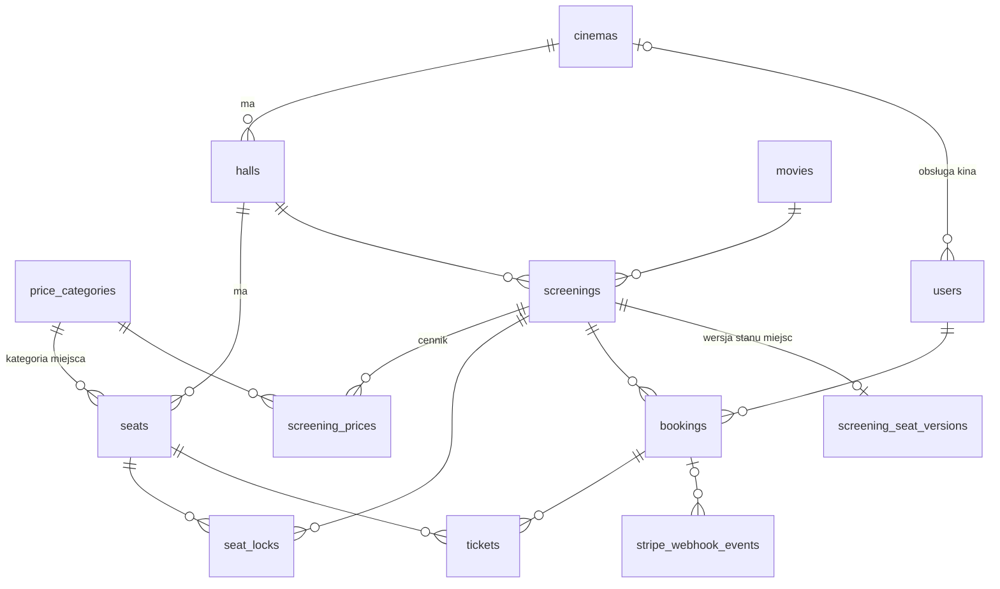
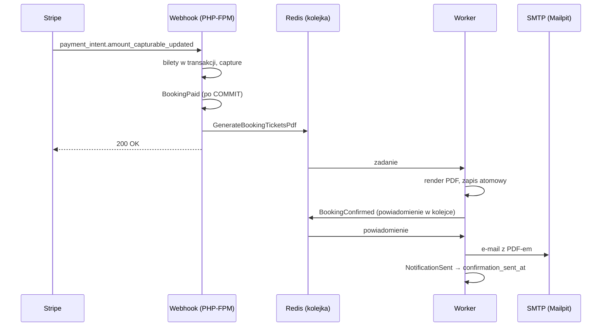

# System rezerwacji biletów kinowych

Pełna ścieżka sprzedaży biletów dla sieci kin: wybór kina i seansu, interaktywny
plan sali z atomową blokadą miejsc w czasie rzeczywistym, płatność Stripe,
bilety z kodem QR w PDF, panel administracyjny oraz aplikacja mobilna.

## Stack

| Warstwa | Technologia | Uzasadnienie |
|---|---|---|
| Backend | Laravel 13, PHP 8.4 | wymóg zadania |
| Baza danych | PostgreSQL 16 | patrz niżej |
| Cache, sesje, kolejka | Redis 7 (AOF) | jeden broker dla cache i kolejki, patrz Etap 5 |
| Serwer WWW | nginx + PHP-FPM (Alpine) | |
| Zadania w tle | kontenery `worker` (`queue:work`) i `scheduler` (`schedule:work`) | |
| WebSocket | Laravel Reverb (protokół Pushera) za nginx, kontener `reverb` | patrz Etap 6 |
| Płatności | Stripe (Payment Intents, `stripe/stripe-php`) | patrz Etap 4 |
| Bilety | `endroid/qr-code` (QR), `dompdf/dompdf` (PDF) | patrz Etap 5 |
| Poczta w środowisku deweloperskim | Mailpit | następca nierozwijanego Mailhoga |
| Konteneryzacja | Docker Compose | |

### Dlaczego PostgreSQL, a nie MySQL

Kluczowe mechanizmy bezpieczeństwa danych w tym systemie opierają się na
funkcjach, których MySQL nie posiada:

1. **Częściowe indeksy unikalne** (`UNIQUE ... WHERE ...`) — pozwalają wymusić
   „jedna aktywna blokada na miejsce" i „jeden nieanulowany bilet na miejsce"
   na poziomie bazy, bez blokad aplikacyjnych.
2. **Constraint `EXCLUDE USING gist`** — uniemożliwia zapisanie dwóch seansów
   nakładających się czasowo w tej samej sali.

Obie te rzeczy dałoby się zasymulować w MySQL kolumnami pomocniczymi i
transakcjami, ale kosztem złożoności i z gorszą gwarancją. Konsekwencja wyboru:
projekt jest związany z PostgreSQL — testy nie uruchomią się na SQLite,
co i tak byłoby bez sensu przy testowaniu współbieżności.

## Uruchomienie od zera

```bash
git clone <repo> cinema
cd cinema
cp backend/.env.example backend/.env

# Klucz podpisu kodów QR (bez niego aplikacja nie wystawi biletu).
sed -i "s/^TICKET_QR_KEY=$/TICKET_QR_KEY=$(openssl rand -hex 32)/" backend/.env
# Klucze Reverba (WebSocket): identyfikator aplikacji, klucz publiczny i sekret podpisu.
sed -i "s/^REVERB_APP_ID=.*/REVERB_APP_ID=$(shuf -i 100000-999999 -n 1)/" backend/.env
sed -i "s/^REVERB_APP_KEY=.*/REVERB_APP_KEY=$(openssl rand -hex 10)/" backend/.env
sed -i "s/^REVERB_APP_SECRET=.*/REVERB_APP_SECRET=$(openssl rand -hex 20)/" backend/.env
# Klucze trybu testowego Stripe'a: STRIPE_PUBLISHABLE_KEY, STRIPE_SECRET_KEY
# uzupełnij ręcznie w backend/.env (Dashboard Stripe → Developers → API keys).

# Worker i scheduler działają jako www-data (uid 82) i zapisują do storage/.
mkdir -p backend/storage/app/private/tickets backend/storage/fonts
chmod -R a+rwX backend/storage backend/bootstrap/cache

docker compose up --build -d
docker compose exec php composer install
docker compose exec php php artisan key:generate
docker compose exec php php artisan migrate --seed
docker compose restart worker scheduler reverb
```

Kroki po `docker compose up` trafią do entrypointu kontenera w Etapie 10
(wymóg „zero kroków ręcznych").

| Adres | Co |
|---|---|
| <http://localhost:8080/api/v1> | REST API |
| <http://localhost:8080/docs/api> | dokumentacja API (Scramble) |
| <http://localhost:8025> | Mailpit — cała poczta wysłana przez aplikację |
| `ws://localhost:8080/app/{REVERB_APP_KEY}` | WebSocket (Reverb przez nginx), patrz Etap 6 |

Webhooki Stripe'a lokalnie (Stripe CLI, osobny terminal):

```bash
stripe listen --forward-to localhost:8080/api/v1/webhooks/stripe
# wypisany sekret whsec_... wpisz do STRIPE_WEBHOOK_SECRET w backend/.env
```

Konta testowe (hasło `password`):

| E-mail | Rola |
|---|---|
| admin@cinema.test | administrator |
| anna@cinema.test | klient |
| piotr@cinema.test | klient |
| maria@cinema.test | klient |
| obsluga.warszawa@cinema.test | obsługa kina (Kino Atlantyk) |
| obsluga.krakow@cinema.test | obsługa kina (Kino Wisła) |
| obsluga.gdansk@cinema.test | obsługa kina (Kino Bałtyk) |

## Struktura repozytorium

```text
cinema/
├── docker-compose.yml        php, worker, scheduler, reverb, nginx, postgres, redis, mailpit
├── docker/
│   ├── nginx/default.conf    /app/ do Reverba, reszta poza public/ do PHP-FPM
│   ├── php/Dockerfile        PHP 8.4-FPM Alpine: pdo_pgsql, redis, gd, intl, pcntl, zbar
│   └── postgres/init/        tworzy bazę cinema_testing przy pierwszym starcie wolumenu
├── backend/                  aplikacja Laravel (API, kolejki, scheduler)
│   ├── app/
│   │   ├── Services/         logika biznesowa: blokady, rezerwacje, płatności, bilety
│   │   ├── Payments/         port PaymentGateway i jedyny adapter znający Stripe'a
│   │   ├── Tickets/          podpis i obraz kodu QR, PDF, zapis PDF-ów
│   │   ├── Http/             kontrolery (tylko HTTP), FormRequesty, zasoby JSON
│   │   ├── Jobs/, Listeners/, Notifications/, Events/   praca w tle
│   │   ├── Policies/         autoryzacja na poziomie zasobu
│   │   └── Exceptions/       wyjątki domenowe z kodem HTTP i polem code
│   ├── database/             migracje, fabryki, seedery
│   ├── routes/api.php        /api/v1
│   ├── routes/console.php    harmonogram
│   └── tests/                PHPUnit na PostgreSQL (Unit, Feature)
├── tools/realtime-probe/     (Etap 6) sonda WebSocket: pusher-js w kontenerze Node
├── frontend/                 (Etap 8) Vue 3
└── mobile/                   (Etap 9) Flutter
```

## Model danych



| Tabela | Rola | Najważniejsze ograniczenia |
|---|---|---|
| `cinemas` | kino: miasto, adres, **strefa czasowa**, `is_active` | `slug` UNIQUE |
| `halls` | sala: typy projekcji (`jsonb`), wymiary siatki planu | `(cinema_id, name)` UNIQUE |
| `seats` | miejsce: rząd, numer, typ, pozycja X/Y, kategoria cenowa | UNIQUE na `(hall, rząd, numer)` i na `(hall, x, y)`; CHECK typu |
| `price_categories` | standard, premium, VIP, loża — globalne dla sieci | `slug` UNIQUE |
| `movies` | tytuł, opis, czas trwania, kategoria wiekowa, gatunki (`jsonb`) | CHECK `duration_minutes > 0` |
| `screenings` | seans: `starts_at`, `ends_at`, `slot_ends_at`, projekcja, wersja językowa, status | **`EXCLUDE USING gist (hall_id =, tstzrange(starts_at, slot_ends_at) &&) WHERE status <> 'cancelled'`** |
| `screening_prices` | cena per seans i kategoria (grosze) | |
| `seat_locks` | tymczasowa blokada miejsca | **`UNIQUE (screening_id, seat_id) WHERE released_at IS NULL`** |
| `screening_seat_versions` | licznik wersji stanu miejsc per seans (Etap 6) | klucz główny = `screening_id`, CHECK `version > 0` |
| `bookings` | rezerwacja: `reference` (ULID), status, kwota, PaymentIntent, znaczniki powiadomień | CHECK statusu, `stripe_payment_intent_id` UNIQUE, indeks częściowy `bookings_confirmation_pending` |
| `tickets` | bilet: `code` (UUID v4), cena, status, `validated_at`, `validated_by_user_id` | **`UNIQUE (screening_id, seat_id) WHERE status <> 'cancelled'`**, `code` UNIQUE |
| `users` | klient, obsługa kina, administrator | CHECK `(role = 'staff') = (cinema_id IS NOT NULL)` |
| `stripe_webhook_events` | dziennik przetworzonych zdarzeń Stripe'a (bez treści) | klucz główny = `event_id` |

### Etap 1 — decyzje projektowe (1–13)

1. **Miejsca należą do sali, nie do seansu.** Plan sali definiuje się raz;
   stan miejsca na konkretnym seansie wynika z blokad i biletów, więc nie trzeba
   generować milionów wierszy „miejsce × seans" z góry.
2. **Love seat to jeden bilet z ceną pakietową.** Jedna pozycja na planie, jedna
   blokada, jeden kod QR — bez sklejania dwóch biletów, które trzeba by
   sprzedawać i anulować razem.
3. **`seats.type` i `price_category_id` to dwa niezależne wymiary.** Typ mówi,
   czym jest fotel (standard, podwójny, dla osób z niepełnosprawnością), kategoria
   — ile kosztuje. Miejsce dla osoby z niepełnosprawnością może być w strefie
   premium i odwrotnie.
4. **Pieniądze zawsze jako `integer` w groszach.** Żadnych `float` ani `decimal`
   w PHP; Stripe operuje na tych samych jednostkach.
5. **Seans ma trzy znaczniki czasu.** `starts_at`, `ends_at` (koniec filmu)
   i `slot_ends_at` (koniec sprzątania). Kolizje sal pilnuje `slot_ends_at`,
   a widz i raporty patrzą na `ends_at`.
6. **`tickets.screening_id` zdenormalizowane.** Bez tej kolumny indeks częściowy
   „jeden bilet na miejsce na seansie" nie miałby czego obejmować (seans jest
   w `bookings`, a indeks może obejmować tylko jedną tabelę).
7. **`seat_locks` używa `released_at` zamiast `DELETE`.** Ślad audytowy, a indeks
   częściowy i tak obejmuje tylko aktywne blokady.
8. **`bookings.user_id NOT NULL`.** Zakup wymaga konta; blokować miejsca można
   anonimowo (sesja zakupowa), ale płacić już nie.
9. **`bookings.reference` = ULID, `tickets.code` = UUID v4.** Numer rezerwacji jest
   sortowalny i czytelny dla supportu; kod biletu nie zdradza czasu zakupu.
   Żaden z nich nie jest sekwencyjny.
10. **PostgreSQL** — indeksy częściowe i `EXCLUDE` (patrz wyżej).
11. **Atomowość blokad na indeksie UNIQUE**, a nie na `SELECT ... FOR UPDATE`
    ani Redis `SETNX` (szczegóły w Etapie 2).
12. **Blokowanie all-or-nothing, `seat_id` sortowane rosnąco** — brak deadlocków
    i brak częściowo zajętych koszyków.
13. **Serwisy rzucają wyjątki domenowe**, a nie zwracają odpowiedzi HTTP; jedno
    miejsce tłumaczy je na JSON.

## Dane testowe

Seeder tworzy 3 kina w różnych miastach, 7 sal w trzech układach (z przejściami,
strefą Premium, rzędem VIP w sali IMAX, kanapami dla par w ostatnim rzędzie
i miejscami dla osób z niepełnosprawnością przy wejściu), 8 filmów,
repertuar od 2 dni wstecz do 13 dni w przód wraz z cennikami oraz jedno konto
obsługi na każde kino.

Ceny są wyliczane z ceny bazowej kategorii przez mnożniki: weekend +20%,
seans wieczorny +15%, poranek −20%, 3D ×1,15, IMAX ×1,35.

Generator repertuaru przesuwa kursor czasu dopiero za `slot_ends_at`
poprzedniego seansu, dzięki czemu nigdy nie narusza constraintu
`screenings_no_overlap`. Gdyby algorytm się pomylił, seeder przerwałby się
błędem bazy — poprawność jest weryfikowana przez samą bazę, nie przez
zaufanie do kodu.

## Znane ograniczenia i co zrobiłbym mając więcej czasu

- **Brak zakupu jako gość.** Wymagałby dostępu do biletów przez podpisany URL
  z ograniczonym czasem życia.
- **Gatunki filmów jako tablica `jsonb`.** Wystarczające do filtrowania;
  osobna tabela słownikowa byłaby potrzebna dopiero przy stronach gatunków
  i statystykach.
- **Kategorie cenowe globalne dla sieci.** Rozszerzenie do kategorii per kino
  to jedna nullowalna kolumna.
- **`halls.grid_rows` / `grid_cols` zdenormalizowane** względem `seats`.
  Świadome — frontend potrzebuje wymiarów planu przed pobraniem miejsc.
  Utrzymanie spójności należy do edytora układu sali.
- **Projekt związany z PostgreSQL.** Konsekwencja użycia indeksów częściowych
  i `EXCLUDE`; przenośność na inny silnik nie była celem.

Ograniczenia poszczególnych etapów są opisane w ich sekcjach.

## Stan prac

- [x] Etap 0 — Docker Compose, szkielet Laravela
- [x] Etap 1 — model danych, migracje, modele Eloquent, seeder
- [x] Etap 2 — blokowanie miejsc i test współbieżności
- [x] Etap 3 — REST API ścieżki zakupowej
- [x] Etap 4 — Stripe, webhook, obsługa wyścigu przy płatności
- [x] Etap 5 — bilety, QR, PDF, kolejki, mail, scheduler
- [x] Etap 6 — WebSocket (Laravel Reverb)
- [ ] Etap 7 — panel administracyjny (Livewire)
- [ ] Etap 8 — frontend Vue 3
- [ ] Etap 9 — aplikacja Flutter
- [ ] Etap 10 — CI/CD i dokumentacja

---

## Etap 2 — Blokowanie miejsc (współbieżność)

Najważniejsza część zadania. Gdy przy premierze setki osób klikają ten sam fotel,
system musi zagwarantować, że dokładnie jedna z nich go dostanie — i musi to
zagwarantować **baza danych**, a nie warunek w PHP.

### Co powstało

| Plik | Rola |
|---|---|
| `app/Services/SeatLockService.php` | cała logika: zakładanie, zwalnianie, czyszczenie blokad |
| `app/Exceptions/CinemaException.php` | bazowy wyjątek domenowy (status HTTP + kod błędu + kontekst) |
| `app/Exceptions/SeatsUnavailableException.php` | konflikt miejsca — 409 |
| `app/Exceptions/InvalidSeatSelectionException.php` | błędne dane wejściowe — 422 |
| `app/Exceptions/SeatLockLimitExceededException.php` | przekroczony limit miejsc — 422 |
| `app/Exceptions/ScreeningNotBookableException.php` | seans odwołany / zakończony / rozpoczęty — 409 |
| `app/Console/Commands/SweepExpiredSeatLocks.php` | czyszczenie wygasłych blokad (scheduler) |
| `app/Console/Commands/AttemptSeatLock.php` | pojedyncza próba blokady — narzędzie testu współbieżności |
| `tests/Feature/SeatLockConcurrencyTest.php` | **test obowiązkowy**: 20 równoczesnych procesów |
| `tests/Feature/SeatLock{Service,Expiry,Validation}Test.php` | 22 testy jednostkowe |
| `database/factories/*.php` | 10 factories |

### Mechanizm: częściowy indeks UNIQUE w PostgreSQL

Atomowość zapewnia jeden obiekt w bazie:

```sql
CREATE UNIQUE INDEX seat_locks_active_unique
    ON seat_locks (screening_id, seat_id)
    WHERE released_at IS NULL;
```

Gdy dwie transakcje próbują wstawić wiersz o tym samym kluczu, PostgreSQL wykrywa
konflikt na poziomie strony B-drzewa. Druga transakcja **blokuje się** i czeka na
rozstrzygnięcie pierwszej: po jej `COMMIT` dostaje `SQLSTATE 23505`, po `ROLLBACK`
spokojnie wstawia własny wiersz. Nie istnieje okno czasowe, w którym obie mogłyby
przejść — w odróżnieniu od naiwnego `if (! exists) insert`, które jest klasycznym
TOCTOU i przy stu równoczesnych żądaniach po prostu nie działa.

Wymuszenie leży w bazie, nie w aplikacji: nawet zapis wykonany z konsoli psql,
z pominięciem serwisu, nie złamie tej zasady.

### Dlaczego nie `SELECT ... FOR UPDATE`

`FOR UPDATE` blokuje **istniejące wiersze**. Nie blokuje ich nieobecności —
zapytanie zwracające zero wierszy nie zakłada żadnej blokady, więc dwa procesy
dostają pustkę i oba wstawiają. To phantom read i dokładnie ten błąd, którego
szuka się w tym zadaniu.

Żeby `FOR UPDATE` miało co blokować, potrzebna byłaby prefabrykowana tabela
`screening_seats` ze stanem każdego fotela na każdym seansie — miliony wierszy
generowanych z góry dla seansów, na które nikt nie przyjdzie. Wariant alternatywny,
blokowanie wiersza `screenings` jako mutexu na cały seans, serializuje całą salę:
przy premierze 300 osób wybierających **różne** miejsca stoi w jednej kolejce.

Poprawne warianty (`SERIALIZABLE` z pętlą retry na `40001`, `pg_advisory_xact_lock`)
działają, ale są droższe i mniej czytelne, a ograniczenie unikalności i tak zostałoby
jako pas bezpieczeństwa. Dwa mechanizmy zamiast jednego to koszt bez zysku.

### Dlaczego nie Redis `SET NX PX`

Redis kusi atomowym `SETNX` i wbudowanym TTL, ale wprowadza **drugie źródło prawdy**.
Bilety są w PostgreSQL; przy finalizacji płatności trzeba atomowo sprawdzić blokadę
i wystawić bilet, czego nie da się objąć jedną transakcją obejmującą Redis i Postgres
bez two-phase commit albo wzorca outbox — nakład nieproporcjonalny do zysku.
Dochodzi trwałość (`appendfsync everysec` gubi do sekundy zapisów, failover na replikę
gubi blokady) oraz brak śladu audytowego i raportowania.

Redis jest w projekcie i zostanie użyty do cache repertuaru i kolejek, ale
**nie odpowiada za poprawność blokad**. Przy skali wymagającej tysięcy blokad na
sekundę byłby szybkim filtrem przed bazą — warstwą dodatkową, nie zamiennikiem.

### Pułapka: predykat indeksu nie może zawierać `now()`

Naturalnym odruchem jest napisanie predykatu jako
`WHERE released_at IS NULL AND expires_at > now()`. PostgreSQL na to nie pozwoli —
w predykacie indeksu wolno używać wyłącznie funkcji `IMMUTABLE`, a `now()` jest
`STABLE`. Konsekwencja jest fundamentalna dla całego projektu:

> **Blokada, która wygasła, ale nie została zwolniona, nadal zajmuje wpis w indeksie.**

Gdyby serwis tego nie obsłużył, miejsce po porzuconym koszyku byłoby zablokowane
na zawsze. Dlatego `SeatLockService::lock()` zwalnia wygasłe blokady
**w tej samej transakcji, tuż przed własnym INSERT-em** — między jednym a drugim
nie ma okna, w które ktoś mógłby wejść.

Scheduler czyszczący wygasłe blokady to **higiena, nie mechanizm poprawności**.
Gdyby nie działał wcale, system nadal sprzedawałby prawidłowo; rosłaby tylko tabela,
a plan sali pokazywałby zajęte miejsce do chwili, gdy ktoś w nie kliknie.

### Algorytm `lock()`

Poza transakcją (tanio, bez trzymania locków):

1. Seans jest `bookable` i jeszcze się nie zaczął — inaczej **409**.
2. Lista miejsc niepusta, bez duplikatów — inaczej **422**.
3. Wszystkie miejsca należą do sali tego seansu i są aktywne — inaczej **422**.
   Ta kontrola jest konieczna, bo `seat_locks` ma klucz obcy do `seats`, a nie do
   `halls`: bez niej dałoby się zablokować fotel z innego kina.

W transakcji:

4. **Sortowanie `seat_id` rosnąco.** Gdy jeden klient bierze miejsca `{5, 9}`,
   a drugi `{9, 5}` i każdy idzie w swojej kolejności, powstaje cykl oczekiwań —
   deadlock, który PostgreSQL rozstrzyga zabiciem jednej transakcji (`40P01`),
   czyli błędem 500 dla losowego użytkownika. Stała kolejność czyni deadlock
   **strukturalnie niemożliwym**.
5. **Zwolnienie wygasłych blokad** na wybranych miejscach (`released_at = now()`).
   Gdy robią to dwie transakcje naraz, `UPDATE` zakłada lock na wierszu; druga
   po zwolnieniu locka ponownie ewaluuje `WHERE` na nowej wersji wiersza
   (EvalPlanQual), widzi wypełnione `released_at` i aktualizuje zero wierszy.
6. **Idempotencja.** Miejsca, które ta sesja już trzyma, są pomijane przy wstawianiu.
   Podwójne kliknięcie i retry po timeoucie kończą się sukcesem, nie błędem.
   TTL **nie jest odnawiany** — inaczej klient trzymałby fotel bez końca, pingując
   endpoint co minutę.
7. **Kontrola limitu** miejsc na sesję (nie na żądanie — inaczej wystarczyłoby
   wysłać dziesięć żądań po jednym miejscu i zablokować całą salę).
8. **Jeden INSERT na wszystkie miejsca.** Konflikt na którymkolwiek wywraca całe
   zapytanie i transakcję: blokowanie jest **all-or-nothing**, bo nie chcemy
   sprzedać trzech miejsc z pięciu i posadzić rodziny osobno.
9. **Sprawdzenie sprzedanych biletów.** Bilety są w innej tabeli, więc indeks
   blokad ich nie pilnuje. Kontrola idzie **po** INSERT-cie: skoro nasz wpis
   przeszedł, nikt nie trzyma aktywnej blokady tego miejsca, a bilet powstaje
   wyłącznie z aktywnej blokady — więc nikt nie jest właśnie w trakcie finalizacji.

Po `23505` transakcja jest wycofywana, a dopiero **poza nią** serwis odpytuje bazę,
które konkretnie miejsca są zajęte, i zwraca je klientowi. W PostgreSQL transakcja
po błędzie jest zatruta (`25P02`) i nie wykonałaby żadnego kolejnego zapytania.

### Błędy domenowe zamiast wycieków `QueryException`

Serwis nie wie nic o HTTP i nie zwraca response'ów — rzuca wyjątki opisujące problem
biznesowy. Jedno miejsce w `bootstrap/app.php` (Etap 3) przetłumaczy je na spójny JSON,
dzięki czemu ten sam wyjątek obsłuży REST API, komendę konsolową i Livewire.
`QueryException` nigdy nie wychodzi na zewnątrz — niósłby fragment SQL-a, czyli wyciek
szczegółów implementacji.

| Kod błędu | HTTP | Kiedy |
|---|---|---|
| `SEATS_UNAVAILABLE` | 409 | miejsce trzyma inna sesja albo jest sprzedane |
| `SCREENING_NOT_BOOKABLE` | 409 | seans odwołany, zakończony lub już się zaczął |
| `EMPTY_SEAT_SELECTION` | 422 | pusta lista miejsc |
| `DUPLICATE_SEATS` | 422 | to samo miejsce podane dwa razy |
| `SEATS_NOT_IN_HALL` | 422 | miejsce nie istnieje lub jest z innej sali |
| `SEATS_INACTIVE` | 422 | miejsce wyłączone ze sprzedaży |
| `SEAT_LOCK_LIMIT_EXCEEDED` | 422 | przekroczony limit miejsc na sesję |

Rozróżnienie 409 od 422 jest celowe: **409** to konflikt stanu zasobu na serwerze
(żądanie było poprawne), **422** to błąd w danych żądania.

### Zwalnianie i scheduler

- `release()` — zwalnia wskazane miejsca; wymaga zgodności `session_id`, więc znajomość
  identyfikatora miejsca nie wystarcza do zwolnienia cudzej blokady. Idempotentne:
  powtórne odkliknięcie zwraca 0, a nie błąd. Nie rusza blokad wpiętych w rezerwację
  (`booking_id`) — te należą do procesu płatności.
- `releaseSession()` — porzucenie koszyka, zwalnia wszystko, co sesja trzyma na seansie.
- `sweepExpired()` — oznacza wygasłe blokady jako zwolnione, porcjami
  (`SEAT_LOCK_SWEEP_BATCH`, domyślnie 500), żeby jeden przebieg nie zakładał locków
  na dziesiątkach tysięcy wierszy. Dwa kroki, bo PostgreSQL nie zna `UPDATE ... LIMIT`.
- Komenda `cinema:seat-locks:sweep` w harmonogramie co minutę,
  z `withoutOverlapping()` i `runInBackground()`.

Blokady nigdy nie są usuwane — `released_at` zamiast `DELETE` daje ślad audytowy:
widać, kto trzymał miejsce i kiedy je puścił.

### Testy

```bash
php artisan test                        # całość
php artisan test --group=concurrency    # tylko test obowiązkowy
```

Baza testowa `cinema_testing` powstaje **automatycznie** przy pierwszym
`docker compose up` (skrypt `docker/postgres/init/01-create-test-database.sql`
wykonywany przez obraz postgres z `/docker-entrypoint-initdb.d/`). Nie ma żadnego
kroku ręcznego przed uruchomieniem testów.

**Testy nie działają na SQLite — i nie mogą.** SQLite nie zna częściowych indeksów
(`CREATE UNIQUE INDEX ... WHERE`) ani `EXCLUDE USING gist`, a `:memory:` to jedno
połączenie w jednym procesie. Test współbieżności musiałby więc testować coś innego
niż produkcja, co czyniłoby go bezwartościowym. `phpunit.xml` wskazuje PostgreSQL,
a osobny test-bezpiecznik (`DatabaseEnvironmentTest`) pilnuje, żeby nikt nie uruchomił
czyszczących testów na bazie deweloperskiej.

**Test obowiązkowy** uruchamia 20 procesów systemowych przez `proc_open()`.
Nie użyto `pcntl_fork()`: procesy potomne dziedziczyłyby po rodzicu to samo
połączenie PDO i stan aplikacji, więc nie byłyby niezależnymi klientami bazy.
Rozszerzenie `pcntl` jest w obrazie (potrzebuje go `queue:work` do limitu czasu
zadań), ale do tego testu się nie nadaje. Każdy proces boot-uje Laravel od
zera i otwiera własne połączenie — izolacja identyczna z produkcyjną. Wspólna
**bariera startu** (znacznik `microtime` przekazywany argumentem) sprawia, że wszystkie
uderzają w bazę równocześnie, zamiast po kolei w miarę startowania.

Test dowodzi trzech rzeczy:

1. przy 20 równoczesnych żądaniach na to samo miejsce powstaje **dokładnie jedna**
   blokada, a 19 pozostałych dostaje `SEATS_UNAVAILABLE` / 409 — żaden nie kończy
   się wyjątkiem technicznym;
2. równoczesne żądania na **różne** miejsca wszystkie się udają (blokada nie jest
   globalnym mutexem na seans);
3. blokowanie nachodzących na siebie par miejsc `{i, i+1}` w pierścieniu nie powoduje
   deadlocków — dzięki deterministycznej kolejności sortowania.

Test współbieżności używa `DatabaseTruncation`, a nie `RefreshDatabase`: ten drugi
opakowuje test w transakcję, a dane niezatwierdzone są **niewidoczne dla innych
połączeń** — procesy potomne nie zobaczyłyby ani seansu, ani miejsc i test byłby
fałszywie zielony. Z tego samego powodu klasa sprząta po sobie w `tearDown()`:
zapisuje dane naprawdę, więc nie ma transakcji, która by je cofnęła.

### Konfiguracja

```env
SEAT_LOCK_TTL=600                    # czas życia blokady w sekundach
SEAT_LOCK_MAX_SEATS=10               # limit miejsc na sesję i seans
SEAT_LOCK_SWEEP_BATCH=500            # rozmiar porcji przy czyszczeniu
```

### Znane ograniczenia i co dalej

- **Brak endpointów HTTP** — serwis jest gotowy, ale API ścieżki zakupowej powstaje
  w Etapie 3. Wtedy dojdzie `FormRequest`, mapowanie wyjątków na JSON w
  `bootstrap/app.php`, rate limiting na endpointach blokowania i przekazywanie
  identyfikatora sesji nagłówkiem.
- ~~Kontener `scheduler` jeszcze nie istnieje~~ — **rozwiązane w Etapie 5**:
  kontener `scheduler` uruchamia `schedule:work`, a `cinema:seat-locks:sweep`
  wykonuje się co minutę.
- **Migracje nie uruchamiają się same** przy `docker compose up` — po starcie trzeba
  wykonać `php artisan migrate --seed`. Docelowo trafi to do entrypointu kontenera PHP.
- ~~Brak broadcastu~~ — **rozwiązane w Etapie 6**: każda zmiana stanu miejsc
  podbija wersję w `SeatStateRecorder`, a po COMMIT wychodzi zdarzenie
  `seats.changed` na kanale seansu.
- **Bariera startu w teście to 3 sekundy** — na wolniejszej maszynie część procesów
  może wystartować już po niej. Test pozostaje poprawny (asercje dotyczą wyniku,
  nie czasu), ale kontencja jest wtedy słabsza. Docelowo lepszym rozwiązaniem byłaby
  bariera na tabeli w bazie albo na Redisie.
- **Gdybym miał więcej czasu**: dorzuciłbym test z `pg_sleep()` wstrzykniętym między
  zwolnienie wygasłej blokady a INSERT, żeby udowodnić, że okno między tymi krokami
  jest faktycznie zamknięte transakcją, a nie tylko wąskie.

---

## Etap 3 — REST API ścieżki zakupowej

Publiczne API dla dwóch klientów: aplikacji webowej Vue (Etap 8) i mobilnej
Flutter (Etap 9). Obsługuje pełną ścieżkę od wyboru kina po wycenę koszyka.

### Wersjonowanie

Wersja siedzi w ścieżce (`/api/v1/...`), nadawana przez `apiPrefix`
w `bootstrap/app.php`. Nie w nagłówku `Accept`, bo:

- aplikacja Flutter w sklepie nie aktualizuje się na żądanie — musi istnieć
  możliwość zamrożenia `v1` i wystawienia `v2` obok,
- prefiks nadaje framework, zanim wczyta plik tras, więc nie da się
  przypadkiem dodać endpointu bez wersji (grupa `Route::prefix('v1')`
  takiej gwarancji nie daje — wystarczy dopisać trasę pod klamrą),
- daje się wywołać `curl`-em, zacache'ować po URL i pokazać w Scramble.

### Endpointy

| Metoda | Ścieżka | Uwagi |
|---|---|---|
| POST | `/auth/register` | limit 10/h per IP |
| POST | `/auth/login` | limit 5/min per (e-mail+IP) oraz 20/min per IP |
| POST | `/auth/logout` | kasuje token TEGO urządzenia |
| GET | `/auth/me` | |
| GET | `/cinemas` | grupowane po miastach, bez paginacji |
| GET | `/cinemas/{cinema}` | klucz: slug |
| GET | `/cinemas/{cinema}/screening-dates` | kalendarz |
| GET | `/cinemas/{cinema}/screenings?date=` | paginowany |
| GET | `/screenings/{screening}` | |
| GET | `/screenings/{screening}/seat-map` | stan każdego miejsca |
| GET | `/screenings/{screening}/seat-locks` | koszyk + timer |
| POST | `/screenings/{screening}/seat-locks` | 201 / 409, limit 30/min per sesja |
| DELETE | `/screenings/{screening}/seat-locks/{seat}` | odkliknięcie, idempotentne |
| DELETE | `/screenings/{screening}/seat-locks` | porzucenie koszyka (sendBeacon) |
| GET | `/bookings` | tylko własne, paginowane |
| GET | `/bookings/{reference}` | klucz: ULID, chronione Policy |
| POST | `/broadcasting/auth` | (Etap 6) podpis kanału prywatnego; token opcjonalny, limit 60/min per klient i 1200/min per IP |

### Kształt odpowiedzi

Sukces — zawsze koperta `data`; listy dokładają `links` i `meta` z paginacji:

    { "data": { ... } }
    { "data": [ ... ], "links": { ... }, "meta": { ... } }

Koperta pozwala dołożyć `meta` do dowolnej odpowiedzi bez łamania kontraktu.
Nie ma pola `success` — status HTTP już to mówi, a dublowanie stanu w dwóch
miejscach kończy się tym, że któreś kłamie.

Błąd — jeden kształt dla wszystkiego:

    {
      "message": "Wybrane miejsca zostały właśnie zajęte.",
      "code": "SEATS_UNAVAILABLE",
      "context": { "seat_ids": [17, 18], "seats": ["B7", "B8"] },
      "errors":  { "pole": ["komunikat"] }
    }

- `message` — dla człowieka, po polsku, gotowe do wyświetlenia
- `code` — dla maszyny; frontend rozgałęzia się po nim, nigdy po treści
  komunikatu ani po samym statusie (409 ma dwie różne przyczyny)
- `context` — dane do reakcji UI, np. które fotele przemalować na czerwono
- `errors` — wyłącznie przy 422, w formacie zgodnym z Laravelem

### Kody błędów

| Kod | HTTP | Kiedy |
|---|---|---|
| `VALIDATION_FAILED` | 422 | błąd walidacji FormRequest |
| `UNAUTHENTICATED` | 401 | brak lub nieważny token |
| `INVALID_CREDENTIALS` | 401 | złe dane logowania |
| `FORBIDDEN` | 403 | Policy odmówiła dostępu do zasobu |
| `RESOURCE_NOT_FOUND` | 404 | adres poprawny, rekordu brak |
| `ENDPOINT_NOT_FOUND` | 404 | nie ma takiego adresu |
| `METHOD_NOT_ALLOWED` | 405 | zła metoda HTTP |
| `SEATS_UNAVAILABLE` | 409 | konflikt blokady miejsc |
| `SCREENING_NOT_BOOKABLE` | 409 | seans odwołany lub rozpoczęty |
| `PRICE_NOT_CONFIGURED` | 409 | brak ceny dla kategorii miejsca |
| `INVALID_SESSION_ID` | 422 | zły format nagłówka X-Session-Id |
| `CHANNEL_FORBIDDEN` | 403 | (Etap 6) brak dostępu do kanału WebSocket |
| `TOO_MANY_REQUESTS` | 429 | przekroczony limit (+ Retry-After) |
| `REALTIME_UNAVAILABLE` | 503 | (Etap 6) broadcaster nie potrafi podpisywać kanałów |
| `SERVER_ERROR` | 500 | wszystko pozostałe, bez stack trace |

### Konwencje pól

- **Pieniądze**: `{ "amount": 3500, "currency": "PLN", "formatted": "35,00 zł" }`.
  `amount` to grosze jako `int`. Formatuje serwer, bo `Intl.NumberFormat`
  w przeglądarce i `NumberFormat` w Dartcie dają dla `pl_PL` różne wyniki.
- **Czas seansu**: ISO 8601 z offsetem, przeliczony do strefy KINA
  (`2026-09-11T18:30:00+02:00`). Klient wyświetla dosłownie — bez
  `toLocaleString()`. Widz w Londynie ma zobaczyć 18:30, godzinę z biletu.
- **Timer**: zawsze para `expires_at` + `expires_in_seconds`. Zegar telefonu
  bywa przestawiony; datą klient się resynchronizuje, sekundami odlicza.
- **Enum**: surowa wartość plus `*_label` po polsku, żeby klient nie
  utrzymywał własnego słownika tłumaczeń.

### Etap 3 — decyzje projektowe (14–31)

14. **Wersja API w ścieżce (`/api/v1`), nadawana przez `apiPrefix`.** Framework
    narzuca prefiks przed wczytaniem pliku tras, więc nie da się dodać endpointu
    bez wersji — nawet przez pomyłkę.
15. **Identyfikator sesji zakupowej wydaje serwer.** 32 losowe znaki alfanumeryczne,
    nagłówek `X-Session-Id` w żądaniu i w odpowiedzi. Klient generujący własny
    identyfikator mógłby wysłać `abc` i wejść w cudzy koszyk. Zły format to 422,
    a nie ciche wydanie nowego — inaczej klient z zepsutym localStorage gubiłby
    blokady bez żadnego sygnału.
16. **Sanctum z tokenami bearer, nie sesja cookie.** Jedno API dla Vue i Fluttera;
    aplikacja mobilna nie ma ciasteczek przeglądarki.
17. **Wylogowanie kasuje tylko `currentAccessToken()`.** `$user->tokens()->delete()`
    wyrzuciłoby użytkownika także z telefonu.
18. **Nieudane logowanie zawsze zwraca ten sam komunikat** (ochrona przed user
    enumeration). Przy nieistniejącym koncie wykonujemy hashowanie „na pusto”,
    żeby czas odpowiedzi nie zdradzał, czy konto istnieje.
19. **`role` poza `#[Fillable]`, a `AuthService` ustawia `UserRole::Customer` jawnie.**
    Dwie niezależne bariery przed privilege escalation przez masowe przypisanie.
20. **Jeden kształt błędu z polem `code`.** Frontend rozgałęzia się po `code`,
    a nie po statusie HTTP (409 ma co najmniej dwie różne przyczyny) ani po treści
    komunikatu, która może się zmienić przy tłumaczeniu.
21. **`dontReport(CinemaException::class)`.** Zajęte miejsce to normalny wynik
    biznesowy, nie awaria. Bez tego log tonąłby w tysiącach wpisów przy każdej
    premierze, a prawdziwe błędy ginęłyby w szumie.
22. **Logi na stderr (`LOG_CHANNEL=stderr`), nie do pliku** — zgodnie z 12-factor
    app; logi zbiera Docker. Przy okazji znika problem uprawnień do
    `storage/logs` między CLI (uid 1000) a PHP-FPM.
23. **`Money` jako typ wartościowy, formatowanie po stronie serwera.** Kwoty
    w groszach (int), pole `formatted` liczy backend, bo `Intl` w przeglądarce
    i `NumberFormat` w Darcie dają dla `pl_PL` różne wyniki (spacje, separatory).
24. **Czasy seansów w strefie kina, ISO 8601 z offsetem.** Widz w Londynie
    kupujący bilet do Krakowa ma zobaczyć godzinę z biletu, nie swoją lokalną.
25. **Enum jako surowa wartość + osobne pole `*_label` po polsku.** Klient
    rozgałęzia się po wartości, wyświetla etykietę i nie utrzymuje słownika
    tłumaczeń w dwóch aplikacjach.
26. **Plan sali nie ujawnia, czyja jest blokada** (`held` vs `held_by_you`).
    Ten sam payload pójdzie przez Reverb, a wymóg 1.3 zabrania danych osobowych
    w broadcastach.
27. **Wycena koszyka wyłącznie po stronie serwera (`CartPricingService`).** Serwis
    nie przyjmuje żadnej kwoty z zewnątrz. Brak ceny dla kategorii to wyjątek
    `PRICE_NOT_CONFIGURED`, nigdy ciche zero — darmowy bilet jest gorszy niż błąd.
28. **Limit blokowania miejsc kluczowany sesją zakupową, nie IP.** Klienci
    w galerii handlowej dzielą jedno publiczne IP za NAT-em; limit per IP
    zablokowałby wszystkich naraz.
29. **Policy na poziomie zasobu + ULID w URL.** Route model binding znajduje rekord
    niezależnie od tego, kto pyta — jedyną barierą przed IDOR jest
    `Gate::authorize()`. ULID utrudnia zgadywanie, ale nie jest zabezpieczeniem.
30. **`preventLazyLoading()` poza produkcją.** Problem N+1 objawia się jako błąd
    w teście, a nie jako 300 zapytań na produkcji.
31. **Cache repertuaru świadomie przesunięty do Etapu 7**, razem z inwalidacją przy
    zmianach w panelu admina. Dziś dałoby się napisać tylko cache na TTL — czyli
    dokładnie to, co zadanie odradza. `RepertoireService` jest jedynym miejscem
    odczytu repertuaru, więc podmiana dotknie dwóch metod, a nie kontrolerów.

### Etap 3 — pułapki, na które trafiliśmy (F–I)

- **F. `use Throwable;` w pliku bez namespace** (`bootstrap/app.php`) daje Warning
  „The use statement with non-compound name has no effect”. `php -l` tego nie
  wykrywa, a ostrzeżenie wypisuje się przed nagłówkami i psuje status HTTP.
  Rozwiązanie: w pliku bez namespace pisać `\Throwable` bez `use`.
- **G. Domknięcia w `with()` i `withCount()` dostają różne obiekty.**
  `with(['rel' => fn ($q) => ...])` dostaje obiekt relacji (`BelongsTo`,
  `HasMany`), a `withCount(['rel as alias' => fn ($q) => ...])` dostaje
  `Builder`. Otypowanie pierwszego jako `Builder` kończy się `TypeError`.
- **H. Laravel nie przebudowuje aplikacji między żądaniami w jednym teście.**
  Guard cachuje rozwiązanego użytkownika, więc test unieważnienia tokenu musi
  wywołać `$this->app['auth']->forgetGuards()` między żądaniami — inaczej drugie
  żądanie „przejdzie” z usuniętym tokenem.
- **I. Rate limiter trzyma liczniki w cache.** Bez `Cache::flush()` w `setUp()`
  drugie uruchomienie pakietu w ciągu minuty startuje ze zużytym limitem
  i testy padają losowo.

### Etap 3 — testy

| Klasa testu | Liczba | Obszar |
|---|---:|---|
| `AuthApiTest` | 8 | rejestracja, logowanie, wylogowanie, ochrona roli |
| `SeatLockApiTest` | 9 | blokowanie przez API: 409, idempotencja, `X-Session-Id`, limit |
| `CatalogApiTest` | 7 | kina, repertuar dnia, plan sali |
| `BookingAuthorizationTest` | 6 | policy rezerwacji, dostęp do cudzej rezerwacji (IDOR) |
| `CartPricingServiceTest` | 5 | wycena koszyka po stronie serwera, brak ceny |
| Etapy 1–2 | 29 | ograniczenia bazy, `SeatLockService`, test współbieżności |
| **Razem** | **64** | |

Uruchomienie całego pakietu (baza `cinema_testing` z `phpunit.xml`):

    art test

Testy integracyjne sprawdzają kontrakt API, nie implementację: status HTTP,
pole `code` błędu i kształt `data`. Dzięki temu refaktoryzacja serwisu nie
wymaga przepisywania testów, a zmiana kontraktu od razu je czerwieni.

---

## Etap 4 — płatności Stripe, webhook, wyścig przy płatności

Ścieżka zakupowa działa od kliknięcia miejsca do pobrania pieniędzy:
koszyk zamienia się w rezerwację, rezerwacja w płatność, a potwierdzona
płatność w bilety. Nieopłacone rezerwacje wygasają same i zwalniają miejsca.

Powstały: `config/payments.php`, warstwa `app/Payments` (interfejs
`PaymentGateway`, adapter Stripe'a, DTO, enum statusów), `BookingService`,
`PaymentService`, middleware `VerifyStripeSignature`, kontrolery checkoutu
i webhooka, komenda `cinema:bookings:expire`, tabela `stripe_webhook_events`
oraz 9 testów.

### Metoda integracji: Payment Intents + Payment Element / PaymentSheet

Do wyboru były Checkout (przekierowanie), Payment Element (osadzony)
i własny formularz karty. Wybrałem **PaymentIntent tworzony na serwerze**,
konsumowany przez Payment Element w Vue i PaymentSheet we Flutterze.

| Kryterium | Checkout | **Payment Element** | Własny formularz |
|---|---|---|---|
| Wspólny backend dla weba i mobile | webview + deep link | **jeden `client_secret`** | dwie implementacje |
| Timer 10 minut | sesja wygasa najwcześniej po 30 min | pełna kontrola | pełna kontrola |
| Zakres PCI DSS | minimalny | minimalny | najszerszy (SAQ D) |
| BLIK, Apple/Google Pay, 3-D Secure | tak | tak | ręcznie |

Rozstrzygnęły dwa argumenty. Po pierwsze, `flutter_stripe` przyjmuje ten sam
`client_secret` co Payment Element, więc backend nie wie, kto pyta.
Po drugie, czas: sesja Checkout wygasa najwcześniej po 30 minutach, a nasza
blokada miejsca po 10 — trzeba by synchronizować dwa niezależne zegary.

PaymentIntent tworzymy przed pokazaniem formularza (nie w trybie deferred),
bo BLIK nie działa, gdy dane płatności zbiera się przed utworzeniem intentu.

### Wyścig przy płatności

Problem z zadania: co, jeśli blokada miejsca wygaśnie dokładnie wtedy, gdy
klient finalizuje płatność?

```text
10:00:00  A blokuje miejsce H7 (TTL 10 min)
10:09:30  A klika "Zapłać", bank pokazuje 3-D Secure
10:10:00  blokada wygasa, scheduler zwalnia miejsce
10:10:05  B blokuje H7
10:10:40  A zatwierdza w aplikacji banku — płatność OK
10:10:42  webhook: "zapłacone" za miejsce, które ma już B
```

Problem nie sprowadza się do zegara. Webhook to wiadomość sieciowa
z opóźnieniem i ponowieniami, a w chwili płatności nasz serwer w niej nie
uczestniczy — rozmawiają ze sobą przeglądarka, bank i operator płatności.

Rozważone warianty:

| Wariant | Dlaczego sam nie wystarcza |
|---|---|
| Wydłużenie blokady na czas płatności | Zmniejsza okno, nie zamyka go |
| Blokada bez limitu do czasu webhooka | Porzucone płatności trzymają salę w nieskończoność |
| Weryfikacja w webhooku + automatyczny zwrot | Pieniądze zostały pobrane, czyli dokładnie to, czego zadanie zabrania |
| **Autoryzacja bez pobrania + weryfikacja + capture albo anulowanie** | Działa tylko dla metod ze wsparciem dla ręcznego capture (BLIK go nie ma) |

#### Wybrane rozwiązanie

Karty i portfele dostają `payment_method_options[card][capture_method]=manual`,
czyli **autoryzację bez pobrania**: bank blokuje środki, ale pieniądze nie
zmieniają właściciela. BLIK zostaje przy pobraniu automatycznym (nie wspiera
ręcznego capture), a jego ścieżkę ratunkową stanowi automatyczny zwrot.
Ustawienie jest per metoda płatności, bo globalne `capture_method=manual`
sprawiłoby, że Stripe w ogóle nie pokazałby klientowi BLIK-a.

Całość opiera się na dwóch regułach.

**Reguła 1: najpierw miejsce, potem pieniądze.** Proces ma dwa kroki i każdy
da się cofnąć, ale nie tak samo tanio. Cofnięcie biletu jest natychmiastowe,
darmowe i niewidoczne dla klienta. Cofnięcie płatności to zwrot: widoczny na
wyciągu, powolny i generujący zgłoszenia do obsługi. Dlatego najpierw
w jednej transakcji zamieniamy blokady w bilety (gwarancją jest indeks
`tickets_active_seat_unique`), a dopiero po jej zatwierdzeniu wołamy capture.
Nigdy odwrotnie.

**Reguła 2: o tym, czy miejsce jest nasze, decyduje wiersz w bazie, a nie
zegar.** Przy wystawianiu biletów NIE sprawdzamy `expires_at`. Sprawdzamy pod
`SELECT ... FOR UPDATE`, czy blokady rezerwacji nadal mają `released_at IS NULL`.

- Rezerwacja wygasła minutę temu, ale nikt nie zwolnił blokad? Honorujemy
  płatność — wygasła, lecz niezwolniona blokada nadal zajmuje indeks
  częściowy, więc nikt inny nie mógł tego miejsca zająć.
- Scheduler zdążył zwolnić blokady? Nie honorujemy, nawet sekundę po terminie.

Kompletność miejsc sprawdzamy przez porównanie sumy cen trzymanych foteli
z kwotą rezerwacji. Gdy czegokolwiek brakuje, suma się nie zgadza i nie
powstaje ani jeden bilet.

#### Maszyna stanów rezerwacji

```text
                         checkout (koszyk → rezerwacja)
                                    │
          ┌──────────────────── PENDING ─────────────────────┐
          │                        │                         │
   minął expires_at        amount_capturable_updated   payment_intent.canceled
   (scheduler)             albo succeeded (BLIK)              │
          ▼                        ▼                          ▼
  EXPIRED + anuluj PI     zajęcie miejsc w transakcji      CANCELLED
                          ┌────────┴─────────┐
                     udało się          nie udało się
                          │                  │
                    PAID + capture     karta → anuluj PI → EXPIRED
                                       BLIK  → zwrot     → REFUNDED
```

`payment_intent.payment_failed` nie zwalnia miejsc: PaymentIntent wraca do
stanu `requires_payment_method`, a klient może poprawić dane karty w oknie
płatności. Literówka w CVC nie może kosztować go miejsc — to świadome
odejście od dosłownego brzmienia zadania.

| Sytuacja | Wynik |
|---|---|
| Płatność w oknie | bilety, `paid`, capture |
| Autoryzacja po terminie, blokady nietknięte | bilety, `paid` — płatność późna, ale bezpieczna |
| Autoryzacja po przejęciu miejsca przez kogoś innego | brak biletów, anulowanie autoryzacji, **zero obciążenia** |
| To samo, ale BLIK (pobranie automatyczne) | brak biletów, automatyczny zwrot, `refunded` |
| To samo zdarzenie webhooka dwa razy | drugie nic nie zmienia, biletów tyle samo |
| Awaria między wystawieniem biletów a capture | Stripe ponawia zdarzenie, capture wykonuje się z tym samym kluczem idempotencji |
| Karta odrzucona | `pending`, miejsca trzymane do końca okna |

#### Idempotencja — trzy warstwy

1. **Tabela `stripe_webhook_events`** — pamięć o przetworzonych zdarzeniach
   i ślad audytowy (identyfikatory, typ, wynik; **bez treści zdarzenia**, bo
   payload zawiera dane osobowe płacącego). Wiersz powstaje PO przetworzeniu:
   zapis na wejściu sprawiłby, że przerwana obsługa zostałaby przy ponowieniu
   uznana za wykonaną.
2. **Maszyna stanów pod `SELECT ... FOR UPDATE`** na wierszu rezerwacji —
   właściwy zamek. Webhook i scheduler biorą ten sam wiersz, więc wykonują
   się po kolei i nie ma stanu pośredniego.
3. **`UNIQUE (screening_id, seat_id) WHERE status <> 'cancelled'`** na
   biletach — ostatnia linia obrony przed podwójną sprzedażą.

Po stronie operatora dochodzą **deterministyczne klucze idempotencji**
(`booking:{ULID}:create-intent`, `:capture`, `:cancel`, `:refund`). Klucz
losowy nie chroniłby przed ponowieniem po awarii, bo nowy proces wylosowałby
nowy. Podwójne kliknięcie "Zapłać" zatrzymują niezależnie: zamek na blokadach
w checkoucie, zapisane `stripe_payment_intent_id` i ten właśnie klucz.

#### Nowe endpointy

| Metoda | Ścieżka | Opis |
|---|---|---|
| POST | `/api/v1/screenings/{screening}/booking` | koszyk → rezerwacja + płatność; 201 przy pierwszym wywołaniu, 200 przy powtórzeniu |
| POST | `/api/v1/webhooks/stripe` | zdarzenia operatora; bez auth i bez CSRF, chroniony wyłącznie podpisem |

Checkout nie przyjmuje **żadnych danych w ciele żądania**: miejsca wynikają
z blokad sesji zakupowej, kwota z cennika seansu. Nowe kody błędów:
`EMPTY_CART` (422), `BOOKING_ALREADY_PENDING` (409), `BOOKING_NOT_PAYABLE`
(409), `PAYMENT_REJECTED` (402), `PAYMENT_PROVIDER_UNAVAILABLE` (503),
`INVALID_WEBHOOK_SIGNATURE` (400).

#### Konfiguracja

Klucze trybu testowego w `.env` (wzorzec w `.env.example`):
`STRIPE_PUBLISHABLE_KEY`, `STRIPE_SECRET_KEY`, `STRIPE_WEBHOOK_SECRET`,
`STRIPE_WEBHOOK_TOLERANCE` (300 s, ochrona przed powtórzeniem podsłuchanego
żądania), `PAYMENT_WINDOW_SECONDS` (domyślnie 600). Adapter odmawia startu,
gdy poza produkcją poda mu się klucz inny niż `sk_test_`.

Podpis weryfikujemy na surowym ciele żądania (`$request->getContent()`);
ponowne zakodowanie JSON-a zmienia bajty i unieważnia podpis. Odrzucone
żądanie trafia do logu jawnym `Log::warning`, bo `CinemaException` jest
w `dontReport()`, a próba podszycia się pod operatora to sygnał
bezpieczeństwa, nie normalny wynik biznesowy.

#### Testy Etapu 4

| Klasa | Testy | Obszar |
|---|---:|---|
| `StripeWebhookTest` | 5 | podpis podrobiony, brak podpisu, przeterminowany znacznik czasu, bilety po autoryzacji, brak duplikatów przy powtórzonym zdarzeniu |
| `PaymentRaceTest` | 4 | utrata miejsca w trakcie płatności, płatność późna przy nietkniętych blokadach, wygaszanie rezerwacji, nieudana próba zapłaty |

W testach podmieniamy wyłącznie operacje pieniężne. Weryfikacja podpisu
przechodzi przez prawdziwy kod, bo test atrapy kryptografii niczego nie dowodzi.

#### Znane ograniczenia

- Gdyby `capture` nie powiódł się trwale, rezerwacja zostaje `paid` bez
  pobranych pieniędzy do czasu zdarzenia `payment_intent.canceled`.
  Docelowo przydałaby się komenda uzgadniająca stan z operatorem.
- Zwroty przy BLIK-u pozostają jedyną ścieżką, w której klient widzi
  obciążenie i zwrot, a nie tylko blokadę środków.
- `capture` wołamy synchronicznie w obsłudze webhooka; po wdrożeniu kolejek
  (Etap 5) naturalne będzie przeniesienie go do zadania w tle.
  Po Etapie 5 świadomie zostało synchronicznie — uzasadnienie w sekcji Etapu 5.

---

## Etap 5 — bilety, kody QR, PDF, kolejki, mail, scheduler

Po opłaceniu rezerwacji klient dostaje e-mail z PDF-em (jeden bilet na stronę,
każdy z kodem QR), może pobrać PDF i pojedyncze kody z historii zakupów,
a obsługa kina skanuje bilety przy wejściu. Wszystko, co wolne albo zawodne
(render PDF, SMTP), dzieje się w tle — webhook Stripe'a nie czeka na pocztę.

Powstały: kontenery `worker`, `scheduler` i `mailpit`, warstwa `app/Tickets`
(podpis tokenu, obraz QR, PDF, zapis PDF-ów), `app/Queue/RetryPolicy`,
zdarzenie `BookingPaid`, zadanie `GenerateBookingTicketsPdf`, powiadomienia
`BookingConfirmed` i `ScreeningReminder`, endpointy pobierania i walidacji
biletów, rola obsługi kina, trzy nowe komendy harmonogramu i 67 testów.

### Przepływ po płatności



1. `PaymentService` emituje `BookingPaid` **wyłącznie po udanym capture**
   (albo po wystawieniu biletów dla płatności pobranej automatycznie) —
   jedno źródło prawdy zamiast nasłuchiwania na zmianę kolumny `status`.
2. Zdarzenie implementuje `ShouldDispatchAfterCommit`: gdyby transakcja się
   wycofała, worker nie dostanie zadania dla rezerwacji, której w bazie nie ma.
3. Listener `QueueBookingConfirmation` jest synchroniczny i robi tylko
   `dispatch()` (milisekundy). Błąd kolejki łapie i loguje — **webhook zawsze
   odpowiada 2xx**, bo bilety już istnieją, a pieniądze są pobrane.
   Ponowienie zdarzenia przez Stripe'a niczego by nie naprawiło; naprawia to
   komenda ponawiająca potwierdzenia (niżej).
4. `GenerateBookingTicketsPdf` renderuje i zapisuje PDF, po czym wysyła
   powiadomienie. Zadanie jest idempotentne (`ShouldBeUnique` po id rezerwacji,
   zapis przez plik tymczasowy i `move`).
5. `BookingConfirmed` jest powiadomieniem w kolejce z własnym `shouldSend()`:
   nie wyśle się dla rezerwacji nieopłaconej ani już potwierdzonej.
6. Listener `MarkBookingConfirmationSent` na `NotificationSent` ustawia
   `confirmation_sent_at` dopiero po faktycznym wysłaniu.

### Kolejka: Redis, nie RabbitMQ

| Kryterium | **Redis** | RabbitMQ |
|---|---|---|
| Nowy element infrastruktury | nie — Redis już jest (cache, limitery, zamki) | nowy broker, konfiguracja, monitoring |
| Sterownik w Laravelu | wbudowany, Horizon w przyszłości | pakiet zewnętrzny |
| Opóźnienia (backoff) | natywnie (sorted set) | wtyczka `delayed_message_exchange` |
| `ShouldBeUnique`, `onOneServer`, `withoutOverlapping` | ten sam Redis jako magazyn zamków | i tak potrzebny Redis |
| Routing, wielu konsumentów, gwarancje potwierdzeń | podstawowe | mocna strona |

Rozstrzyga skala i koszt: kilkadziesiąt e-maili na minutę w szczycie premiery
to nic dla Redisa, a zamki dla harmonogramu i unikalnych zadań i tak w nim
żyją. RabbitMQ miałby sens przy wielu usługach wymieniających zdarzenia.
Ryzyko Redisa — utrata zadań przy restarcie — ogranicza włączony AOF.

### Ponawianie i nieudane zadania

Wszystkie zadania i powiadomienia korzystają z `RetryPolicy` (trait
`UsesRetryPolicy`):

| Parametr | Wartość | Dlaczego |
|---|---|---|
| Maksymalna liczba prób | 3 | wymóg zadania; SMTP, który nie działa trzy razy z rzędu, wymaga człowieka |
| Opóźnienia | 10 s, potem 40 s (podstawa 10 s, mnożnik 4) | wykładniczo: chwilowa czkawka mija po 10 s, restart usługi po minucie |
| Rozrzut (jitter) | ±20% | po awarii SMTP setki zadań nie wracają w tej samej sekundzie |
| `--timeout` workera | 60 s | zabija zawieszone zadanie |
| `retry_after` Redisa | 90 s | musi być **większe** niż timeout, inaczej zadanie wykona się dwa razy równolegle |
| `stop_grace_period` | 75 s | przy restarcie kontenera bieżące zadanie zdąży się skończyć |

`$tries` jest **właściwością**, a `backoff()` **metodą**: powiadomienia
i mailable w kolejce ignorują metodę `tries()` (pułapka Y).

Po trzeciej porażce zadanie trafia do `failed_jobs`, a `Queue::failing`
(w `QueueServiceProvider`) zapisuje wpis `error` z klasą zadania, UUID,
kolejką i **klasą** wyjątku — bez jego komunikatu, bo komunikat błędu SMTP
potrafi zawierać adres e-mail klienta. Pełny ślad zostaje w `failed_jobs`.

```bash
docker compose exec php php artisan queue:failed        # lista
docker compose exec php php artisan queue:retry all     # ponowienie po naprawie
```

### Kod QR — co jest w środku

```text
T1.9b2f4c1e-3a7d-4e8b-9c0f-1a2b3c4d5e6f.Xq3vB9kLmN0pR2sT
│  │                                    └─ 12 bajtów HMAC-SHA256, base64url
│  └─ tickets.code (UUID v4)
└─ wersja formatu
```

Rozważone warianty:

| Wariant | Problem |
|---|---|
| Sam UUID | każdy ciąg w formacie UUID trafia do bazy; brak wersjonowania |
| JWT z danymi biletu | długi (gęsty QR, gorzej czytelny z pękniętego ekranu telefonu), dane osobowe i miejsce w kodzie, zmiana seansu unieważnia wydruk |
| URL do API | skaner obsługi nie jest przeglądarką; adres zdradza infrastrukturę |
| **`T1.{uuid}.{mac}`** | krótki, podpisany, bez danych osobowych; stan biletu zawsze z bazy |

- **Podpis** odrzuca podrobione i zniekształcone kody bez zapytania do bazy
  (`hash_equals`, stały czas porównania).
- **Osobny klucz `TICKET_QR_KEY`**, nie `APP_KEY`: rotacja klucza aplikacji
  (sesje, szyfrowanie) nie może unieważnić sprzedanych biletów. Brak wartości
  domyślnej — aplikacja bez klucza odmawia wystawienia biletu, zamiast podpisać
  go pustym ciągiem. `phpunit.xml` ma własny klucz testowy.
- **MAC skrócony do 12 bajtów (96 bitów).** Weryfikacja jest wyłącznie online,
  za limiterem 120 prób na minutę, więc zgadnięcie podpisu jest niewykonalne.
  Skrót ma konkretny powód: token ma 56 znaków i mieści się w **QR wersji 6**
  (41×41 modułów). Przy pełnym MAC-u kod przechodził do wersji 7, która ma
  wzorzec wyrównania dokładnie na środku — pod logo. Test dekodujący obraz
  (`zbarimg`) padał, choć korekcja błędów teoretycznie powinna to wytrzymać.
- **Prefiks `T1`** zostawia miejsce na `T2` z podpisem Ed25519, gdyby skanery
  miały działać offline (klucz publiczny w skanerze zamiast sekretu HMAC).

Parametry obrazu (`endroid/qr-code` 6): korekcja błędów **High** (30%), logo
na 20% szerokości z wyciętym tłem, margines 10% (strefa ciszy), kodowanie
ISO-8859-1 (token jest czystym ASCII, a nagłówek ECI dla UTF-8 myli część
starszych skanerów), 480 px.

Kod biletu nie pojawia się w URL-ach, odpowiedziach API ani jako tekst w PDF-ie
— jedynym nośnikiem jest obraz QR, a `TicketResource` zwraca `qr_url`.
Test `TicketQrRendererTest` generuje PNG i **dekoduje go** `zbarimg`, bo test
sprawdzający tylko nagłówek PNG przepuściłby nieczytelny kod.

### PDF: dompdf

| Biblioteka | Dlaczego nie |
|---|---|
| wkhtmltopdf / Snappy | projekt zarchiwizowany, binarka z nieaktualnym WebKitem |
| Browsershot (Chromium) | kilkaset MB w obrazie, proces przeglądarki na każde zadanie |
| mPDF | licencja GPL-2.0 |
| **dompdf 3** | czysty PHP, LGPL, wystarczający CSS dla prostego układu biletu |

- **Czcionka DejaVu Sans** — wbudowane czcionki PDF (Helvetica) nie mają
  polskich znaków; zamiast „ą” byłoby „?”. Cache czcionek w `storage/fonts`.
- **Bezpieczne opcje**: wyłączone zasoby zdalne, JavaScript i PHP w szablonie.
  Tytuł filmu pochodzi z panelu admina; `` w opisie nie
  może zamienić renderera w narzędzie do skanowania sieci wewnętrznej.
- **Obrazy jako data URI** (QR i logo) — konsekwencja wyłączenia zasobów zdalnych.
- **Jeden bilet na stronę A4**: każdy bilet da się wydrukować i wręczyć
  osobno.
- **Godziny w strefie czasowej kina**, liczone przez `BookingTicketsPresenter`.
  Ten sam presenter przygotowuje dane dla PDF-a i treści e-maila, więc oba
  kanały nie mogą się rozjechać.
- **Zapis**: `storage/app/private/tickets`, najpierw plik tymczasowy, potem
  `move` — pobierający nigdy nie dostanie połowy pliku. Gdy pliku brak
  (worker jeszcze nie skończył, dysk wyczyszczony), `TicketPdfStore` renderuje
  PDF w locie.

### Poczta

Mailpit w kontenerze przechwytuje całą pocztę (<http://localhost:8025>).
Mailhog nie jest rozwijany od 2020 roku; Mailpit ma ten sam model pracy
i API do testów.

- `BookingConfirmed` — numer rezerwacji, seans, miejsca, PDF w załączniku
  (`bilety-{reference}.pdf`).
- `ScreeningReminder` — przypomnienie przed seansem, **bez załącznika**:
  bilety klient już ma, a kilkusetkilobajtowy PDF wysłany drugi raz tylko
  obciąża skrzynki i zwiększa ryzyko trafienia do spamu.

Gwarancje dostarczenia są różne i świadomie dobrane:

| Wiadomość | Gwarancja | Dlaczego |
|---|---|---|
| Potwierdzenie | **at-least-once** | brak biletów jest gorszy niż duplikat; worker, który padnie między SMTP a zapisem znacznika, wyśle je ponownie |
| Przypomnienie | **at-most-once** | brak przypomnienia to drobiazg, dwa przypomnienia wyglądają na błąd systemu |

### API biletów

| Metoda | Ścieżka | Kto | Opis |
|---|---|---|---|
| GET | `/api/v1/bookings/{booking}/tickets/pdf` | właściciel rezerwacji | PDF ze wszystkimi biletami |
| GET | `/api/v1/bookings/{booking}/tickets/{ticket}/qr` | właściciel rezerwacji | PNG kodu jednego biletu |
| POST | `/api/v1/tickets/validate` | obsługa kina, administrator | skanowanie przy wejściu |

- **Token Sanctum zamiast podpisanego URL-a.** Podpisany link zostaje w historii
  przeglądarki, logach proxy i można go przesłać dalej — a PDF to bilety na
  okaziciela. Aplikacja mobilna i tak ma token.
- **`scopeBindings()`** — bilet jest szukany wyłącznie wśród biletów rezerwacji
  z URL-a, więc id cudzego biletu daje 404, a nie cudzy kod QR.
- Odpowiedzi z biletami mają `Cache-Control: private, no-store`.
- Pobranie biletów rezerwacji, która nie jest opłacona: 409
  `BOOKING_TICKETS_UNAVAILABLE`.
- Limitery per użytkownik: `ticket-downloads` 30/min, `ticket-validation`
  120/min (bramka przy dużej sali to ok. 1–2 skany na sekundę).

#### Walidacja biletu

Kolejność sprawdzeń jest celowa — tańsze i niezdradzające informacji najpierw:

1. uprawnienie do seansu (policy `ScreeningPolicy::validateTickets`):
   administrator wszędzie, obsługa tylko w swoim kinie → 403;
2. format i podpis tokenu → 422 (bez zapytania do bazy);
3. bilet istnieje → 404;
4. bilet należy do skanowanego seansu → 409 z godziną właściwego seansu, żeby
   obsługa mogła pokierować widza do innej sali;
5. okno czasowe: od `TICKET_VALIDATION_OPENS_MINUTES` przed początkiem do końca
   filmu (`ends_at`) → 409;
6. **atomowy `UPDATE tickets SET status = 'used' … WHERE id = ? AND status = 'valid'`**;
7. gdy `UPDATE` nie zmienił wiersza, serwis czyta bilet ponownie i zwraca
   przyczynę: wykorzystany (z godziną pierwszego skanu) albo anulowany → 409.

Status biletu jest sprawdzany **wynikiem `UPDATE`**, a nie wcześniejszym
`SELECT`-em. Bramki przy dwóch wejściach skanujące ten sam zrzut ekranu
jednocześnie przejdą kroki 1–5, ale tylko jeden `UPDATE` zmieni wiersz — drugi
skaner dostaje „bilet już wykorzystany”. Sprawdzenie statusu przed `UPDATE`
przepuściłoby oba.

| Kod | HTTP | Znaczenie |
|---|---:|---|
| `TICKET_TOKEN_INVALID` | 422 | kod nie jest biletem tego systemu albo podpis się nie zgadza |
| `TICKET_NOT_FOUND` | 404 | poprawny podpis, brak biletu (np. usunięty) |
| `TICKET_WRONG_SCREENING` | 409 | bilet na inny seans |
| `TICKET_CANCELLED` | 409 | bilet anulowany |
| `TICKET_ALREADY_USED` | 409 | bilet już zeskanowany |
| `TICKET_OUTSIDE_VALIDATION_WINDOW` | 409 | za wcześnie (w odpowiedzi `opens_at`) albo film się skończył (`ended_at`) |

Wszystkie kody pochodzą z jednej klasy `TicketValidationException`
z metodami fabrycznymi — skaner rozgałęzia się po `code`, a komunikat po polsku
wyświetla obsłudze.

### Rola obsługi kina

Nowa wartość `UserRole::Staff` i kolumna `users.cinema_id`. Constraint
`CHECK ((role = 'staff') = (cinema_id IS NOT NULL))` gwarantuje w bazie, że
pracownik obsługi zawsze ma kino, a klient i administrator nie mają żadnego.
Klucz obcy `restrictOnDelete` — kina z kontami obsługi nie da się usunąć
niechcący. Seeder tworzy jedno konto obsługi na kino.

### Harmonogram

| Komenda | Częstość | Co robi |
|---|---|---|
| `cinema:seat-locks:sweep` | co minutę | zwalnia wygasłe blokady (Etap 2) |
| `cinema:bookings:expire` | co minutę | wygasza nieopłacone rezerwacje (Etap 4) |
| `cinema:screenings:finish` | co 5 min | oznacza zakończone seanse jednym `UPDATE` |
| `cinema:bookings:resend-confirmations` | co 15 min | ponawia brakujące potwierdzenia |
| `cinema:screenings:send-reminders` | co 5 min | przypomnienia przed seansem |

Każde zadanie ma `withoutOverlapping()`, `onOneServer()` (zamek w Redisie —
przy dwóch replikach schedulera nic nie wykona się dwa razy),
`runInBackground()` i `appendOutputTo()`. Wyjście trafia do `/proc/1/fd/2`
kontenera, czyli do `docker compose logs scheduler`; domyślne `/dev/null`
ukrywało błędy komend (pułapka V).

**Ponawianie potwierdzeń.** Komenda bierze rezerwacje opłacone **15–120 minut
temu** bez `confirmation_sent_at` (indeks częściowy
`bookings_confirmation_pending`). Dolna granica daje zwykłej ścieżce czas na
trzy próby z backoffem; górna nie pozwala, żeby po tygodniowej awarii SMTP
klienci dostali potwierdzenia do seansów, które już się odbyły. Po dłuższej
awarii jest `--all`.

**Przypomnienia.** Rezerwacja jest **najpierw zajmowana** jednym zapytaniem
`UPDATE bookings … SET reminder_sent_at = now() FROM screenings … RETURNING id`,
a dopiero potem powiadomienie trafia do kolejki. Dwa równoległe przebiegi nie
wyślą dwóch przypomnień (stąd at-most-once). Pomijane są:

- seanse, które już się zaczęły,
- rezerwacje opłacone już po momencie przypomnienia — klient właśnie dostał
  potwierdzenie, drugi e-mail minutę później byłby spamem.

`ScreeningReminder::shouldSend()` sprawdza jeszcze raz status rezerwacji
i seansu w chwili wysyłki (seans mógł zostać odwołany, gdy zadanie czekało).

### Infrastruktura

```text
php        PHP-FPM, obsługa HTTP
worker     php artisan queue:work redis --timeout=60 --tries=3 --sleep=3 --max-time=3600
scheduler  php artisan schedule:work
mailpit    SMTP :1025, interfejs :8025
```

- `worker` i `scheduler` używają tego samego obrazu (kotwica `x-php-app`
  w `docker-compose.yml`) i działają jako `www-data` (uid 82), nie root.
- `--max-time=3600` — worker kończy się co godzinę, a Docker go wznawia;
  wycieki pamięci w długo żyjącym procesie nie narastają.
- **Worker trzyma kod w pamięci** — po zmianie kodu
  `docker compose restart worker scheduler` (pułapka N).
- Obraz PHP zawiera `zbar` i `imagemagick` wyłącznie na potrzeby testu
  dekodującego QR.

### Konfiguracja

| Zmienna | Domyślnie | Znaczenie |
|---|---|---|
| `QUEUE_CONNECTION` | `redis` | |
| `REDIS_QUEUE_RETRY_AFTER` | `90` | sekundy; musi być większe niż `--timeout` workera |
| `MAIL_HOST` / `MAIL_PORT` | `mailpit` / `1025` | |
| `MAIL_FROM_ADDRESS` / `MAIL_FROM_NAME` | `bilety@cinema.test` / `Kino - bilety` | |
| `TICKET_QR_KEY` | **brak** | klucz podpisu QR, `openssl rand -hex 32` |
| `TICKET_VALIDATION_OPENS_MINUTES` | `60` | ile minut przed seansem obsługa może skanować |
| `CONFIRMATION_RETRY_AFTER_MINUTES` | `15` | dolna granica okna ponawiania potwierdzeń |
| `CONFIRMATION_RETRY_WINDOW_MINUTES` | `120` | górna granica |
| `SCREENING_REMINDER_MINUTES` | `120` | ile minut przed seansem wysłać przypomnienie |
| `SCHEDULE_OUTPUT` | `/dev/null` | w Compose `/proc/1/fd/2` |

Parametry obrazu QR i PDF-a są w `config/tickets.php`.

### Etap 5 — decyzje projektowe (46–90)

46. **Redis jako kolejka**, nie RabbitMQ — brak nowego brokera, zamki w tym samym Redisie.
47. **Token `T1.{uuid}.{mac}`** — krótki, podpisany, wersjonowany, bez danych osobowych.
48. **dompdf** — czysty PHP, LGPL, bez przeglądarki w obrazie.
49. **endroid/qr-code** — generowanie po stronie serwera, logo, pełna kontrola ECC.
50. **Mailpit** zamiast nierozwijanego Mailhoga.
51. **Rola `staff` z `cinema_id` i policy** zamiast osobnej tabeli uprawnień.
52. **Osobny kod błędu dla każdego wyniku walidacji** — skaner pokazuje obsłudze konkretną przyczynę.
53. **Zdarzenie `BookingPaid`** oddziela płatności od biletów i poczty.
54. **Łańcuch zadanie → powiadomienie** — PDF powstaje raz, e-mail tylko go dołącza.
55. **PDF zapisany na dysku z renderem awaryjnym** — szybkie pobieranie, brak zależności od workera.
56. **`RetryPolicy` + `Queue::failing`** — jedna polityka ponowień i jeden log porażek.
57. **`reminder_sent_at` zajmowany atomowo** przed wysłaniem.
58. **Powiadomienie dopiero po capture, odbiorca idempotentny.**
59. **Worker i scheduler jako uid 82, zapisy przez atomowy `move`.**
60. **Kod biletu usunięty z URL-i i odpowiedzi API** — jedynym nośnikiem jest obraz QR.
61. **`$tries` jako właściwość, `backoff()` jako metoda** (pułapka Y).
62. **Log porażki bez komunikatu wyjątku** — komunikat może zawierać dane osobowe.
63. **Osobny `TICKET_QR_KEY`, bez wartości domyślnej, własny klucz w `phpunit.xml`.**
64. **Parametry QR**: ECC High, logo 20%, margines 10%, ISO-8859-1.
65. **Test dekoduje obraz QR**, zamiast sprawdzać nagłówek PNG.
66. **MAC 12 bajtów → QR wersji 6** bez wzorca wyrównania pod logo.
67. **Renderer PDF dostaje gotowe teksty** z presentera; szablon nie liczy stref czasowych.
68. **Jeden bilet na stronę, bez kodu jako tekstu.**
69. **Bezpieczne opcje dompdf** — bez zasobów zdalnych, JS i PHP.
70. **Znaczniki `confirmation_sent_at` / `reminder_sent_at` + indeks częściowy.**
71. **`users.cinema_id` z `restrictOnDelete`.**
72. **`BookingPaid` emitowane tylko przez `PaymentService`**, we wszystkich trzech gałęziach kończących się opłaceniem.
73. **Listener synchroniczny z `try/catch`**; webhook zawsze 2xx po wystawieniu biletów.
74. **Zadanie PDF idempotentne, unikalne i atomowe.**
75. **Powiadomienie w kolejce z `shouldSend()`**, gwarancja at-least-once.
76. **`BookingTicketsPresenter` wspólny dla PDF-a i e-maila.**
77. **Katalog `tickets` z uprawnieniami dla wszystkich** — PHP-FPM i worker mają różne uid (pułapka AB).
78. **Token Sanctum zamiast podpisanego URL-a** do pobierania biletów.
79. **Bilet w URL-u ograniczony do rezerwacji (`scopeBindings`)**, klucz trasy = `id`.
80. **Kolejność walidacji od najtańszej + atomowy `UPDATE`** rozstrzygający wyścig skanerów.
81. **Jedna klasa wyjątku walidacji z metodami fabrycznymi.**
82. **Limitery per użytkownik** dla pobierania i walidacji.
83. **`qr_url` w `TicketResource` zamiast kodu.**
84. **Wyjście harmonogramu do logów kontenera.**
85. **`onOneServer()`** na wszystkich zadaniach harmonogramu.
86. **Kończenie seansów jednym `UPDATE`**, bez ładowania modeli.
87. **Ponawianie potwierdzeń w oknie 15–120 min, co 15 min.**
88. **Commit po każdym bloku pracy** — łatwy powrót zamiast kopii w `/tmp`.
89. **Przypomnienia at-most-once**, z oknem czasowym i pomijaniem spóźnionych płatności.
90. **Przypomnienie bez PDF-a.**

### Etap 5 — pułapki, na które trafiliśmy (N–AH)

- **N. Worker trzyma kod w pamięci.** Zmiana w klasie zadania nie działa, dopóki
  nie zrestartuje się kontenera `worker`.
- **O. `retry_after` musi być większe niż `--timeout`.** Inaczej Redis oddaje
  trwające zadanie drugiemu procesowi i wykonuje się ono równolegle dwa razy.
- **P. Pliki tworzone przez `docker compose exec` należą do roota.** Katalogi
  zakładamy w WSL jako zwykły użytkownik.
- **Q. W `phpunit.xml` kolejka jest `sync`.** `dispatch()` wykonuje zadanie od
  razu, w środku testowanej akcji; testy przepływu używają `Queue::fake()`.
- **R. `preventLazyLoading()` działa też w workerze.** Powiadomienie sięgające
  po niezaładowaną relację rzuca wyjątek dopiero w tle — relacje ładujemy jawnie.
- **S. Reguła nginx dla plików statycznych** — sprawdzone, nie dotyczy: ścieżki
  `/tickets/pdf` i `/qr` nie mają rozszerzeń, więc trafiają do PHP.
- **T. Czcionki dompdf.** Wbudowane czcionki nie mają polskich znaków, a katalog
  cache czcionek musi być zapisywalny dla workera.
- **U. `schedule:list` pokazuje zadania, ale ich nie uruchamia.** Potrzebny jest
  `schedule:work` (albo cron z `schedule:run`).
- **V. Wyjście schedulera domyślnie idzie do `/dev/null`.** Błąd komendy był
  niewidoczny, dopóki wyjście nie trafiło do logów kontenera.
- **W. Pływający tag obrazu bazowego.** Przebudowa pobrała nowszy obraz PHP
  i trwała prawie 4 minuty zamiast kilku sekund.
- **X. Domknięcia z `tinker --execute` nie da się zserializować** do kolejki
  (kod z `eval`). Do testów workera powstała klasa `QueueProbeJob`.
- **Y. Powiadomienia i mailable ignorują metodę `tries()`.** Liczbę prób trzeba
  podać właściwością `$tries`.
- **Z. Nieistniejący pakiet.** Dekoder QR proponowany jako zależność PHP nie
  jest na Packagist — sprawdzać przed `composer require`. Zastąpił go `zbarimg`.
- **Z2. `zbarimg` bez `imagemagick` nie czyta PNG** (`NoDecodeDelegate`).
- **Z3. Logo zasłania środkowy wzorzec wyrównania QR wersji 7.** Rozwiązanie:
  krótszy token i wersja 6 (decyzja 66).
- **AA. Błąd wewnątrz `$(...)` nie przerywa łańcucha `&&`.** Pusty wynik
  `cat` szedł dalej jako pusty skrypt; pomaga `test -s plik &&`.
- **AB. Flysystem zapisuje „prywatne” pliki z prawami 0700/0600.** Plik
  utworzony przez worker (uid 82) był nieczytelny dla innego procesu.
- **AC. Dysk z `throw => false` zwraca `false` zamiast rzucać wyjątek.**
  Wynik `put()` / `move()` trzeba sprawdzać jawnie.
- **AD. `PendingDispatch` wysyła zadanie w destruktorze.** Wyjątek kolejki
  wylatywał poza `try`; pomaga `unset()` wewnątrz bloku `try`.
- **AE. `ShouldBeUnique` zakłada zamek także przy `Queue::fake()`.** Drugi
  dispatch w tym samym teście był po cichu pomijany.
- **AF. `/tmp` w WSL znika po restarcie.** Kopie zapasowe zastępuje `git diff`.
- **AG. `git diff` nie pokazuje plików nieśledzonych** — do tego `git status`.
- **AH. PDO pgsql nie przyjmuje dwa razy tego samego parametru nazwanego.**
  W surowym `UPDATE … RETURNING` użyte są parametry pozycyjne `?`.

### Etap 5 — testy

| Klasa testu | Liczba | Obszar |
|---|---:|---|
| `RetryPolicyTest` (Unit) | 4 | liczba prób, wykładnicze opóźnienia, granice rozrzutu |
| `TicketTokenSignerTest` (Unit) | 14 | format, determinizm, podmiana UUID, inny klucz, zmieniona wersja, zniekształcone tokeny (data provider), brak klucza |
| `TicketQrRendererTest` | 4 | **dekodowanie obrazu z logo przez `zbarimg`**, kwadratowy PNG, data URI, brak pliku logo |
| `TicketPdfRendererTest` | 5 | strefa czasowa kina, miejsca i QR w kolejności, brak kodu jako tekstu, strona na bilet, nieopłacona rezerwacja |
| `StaffCinemaConstraintTest` | 3 | constraint roli i kina w bazie |
| `BookingConfirmationFlowTest` | 6 | `BookingPaid` dopiero po capture, brak drugiego ogłoszenia, ponowienie po awarii capture, BLIK, nieudana płatność, utrata miejsc |
| `GenerateBookingTicketsPdfTest` | 6 | zapis PDF i zlecenie e-maila, pominięcie nieopłaconej i już potwierdzonej, załącznik bez kodów, znacznik blokujący ponowną wysyłkę, polityka ponowień |
| `TicketDownloadTest` | 7 | PDF i QR właściciela, cudzy PDF, brak logowania, nieopłacona, bilet z innej rezerwacji → 404, `qr_url` zamiast kodu |
| `TicketValidationTest` | 10 | wpuszczenie, drugi skan, inny seans, podrobiony kod, anulowany, przed otwarciem wejścia, obsługa innego kina, klient, administrator, brak logowania |
| `FinishScreeningsCommandTest` | 2 | tylko zaplanowane seanse po końcu filmu, ponowne uruchomienie |
| `ResendBookingConfirmationsCommandTest` | 2 | okno ponawiania, `--all` |
| `SendScreeningRemindersCommandTest` | 4 | tylko opłacone w oknie, brak ponownej wysyłki, godzina w strefie kina bez kodu, anulowanie przed wysyłką |
| Etapy 1–4 | 74 | (w tym `StripeWebhookTest` i `PaymentRaceTest` z `Queue::fake()`) |
| **Razem** | **141** | |

### Etap 5 — weryfikacja na żywo

Poza testami automatycznymi sprawdzone ręcznie na działającym środowisku:

- płatność testowa przez Stripe CLI → webhook → bilety → capture;
- zadanie celowo padające: trzy próby z opóźnieniami ok. 10 s i 40 s, wpis
  w `failed_jobs` i w logu workera;
- kod QR odczytany przez `zbarimg` i aparat telefonu;
- PDF: `pdftotext` (polskie znaki), `pdffonts` (osadzona DejaVu Sans);
- e-mail z załącznikiem w Mailpit; ponowny dispatch nie wysłał duplikatu;
- pobranie PDF-a i QR przez `curl` z tokenem właściciela i odmowa dla innego
  użytkownika;
- dwa równoległe skany tego samego biletu: jeden sukces, jeden
  „już wykorzystany”;
- logi komend harmonogramu w `docker compose logs scheduler`;
- odzyskanie potwierdzenia komendą ponawiającą po zatrzymanym workerze.

### Etap 5 — znane ograniczenia i co dalej

- **`capture` nadal synchronicznie w webhooku** (zapowiedź z Etapu 4). Świadomie:
  capture musi nastąpić tuż po wystawieniu biletów, a ponowienia zapewnia sam
  Stripe. Przeniesienie do kolejki dodałoby stan „bilety są, pieniędzy jeszcze
  nie” bez realnego zysku przy czasie capture rzędu kilkuset milisekund.
- **Duplikat potwierdzenia jest możliwy** (at-least-once), przypomnienie może
  nie dojść (at-most-once) — patrz tabela gwarancji.
- **Brak zgody klienta na przypomnienia** — dziś dostaje je każdy. Docelowo
  preferencja w profilu; push (FCM) dojdzie z aplikacją mobilną.
- **Weryfikacja kodu tylko online.** Skanowanie offline wymagałoby tokenu `T2`
  z podpisem asymetrycznym i synchronizacji listy wykorzystanych biletów.
- **Brak ręcznego wpisania kodu** przy uszkodzonym ekranie — obsługa może
  wyszukać rezerwację po numerze w panelu (Etap 7).
- **Pracownik obsługi przypisany do jednego kina.** Obsługa kilku kin
  wymagałaby tabeli łączącej.
- **PDF-y na dysku lokalnym.** Przy kilku replikach PHP potrzebny jest S3 lub
  inny wspólny dysk; `TicketPdfStore` jest jedynym miejscem do zmiany.
- **Jeden Redis dla cache i kolejki, bez limitu `maxmemory`.** Dziś rośnie do
  granic pamięci hosta. Docelowo osobne instancje: cache z limitem i `allkeys-lru`,
  kolejka z `noeviction`, żeby wypychanie kluczy nigdy nie usunęło zadania.
- **`zbar` i `imagemagick` w obrazie produkcyjnym** — do usunięcia przez
  wieloetapowy Dockerfile (Etap 10), razem z przypięciem obrazu bazowego do
  konkretnej wersji.
- **Migracje i restart workera nie są automatyczne** — trafią do entrypointu
  w Etapie 10.

---

## Etap 6 — WebSocket (Laravel Reverb)

Plan sali zmienia się na żywo u wszystkich oglądających, właściciel rezerwacji
dowiaduje się o wyniku płatności bez odpytywania API, a panel dostaje feed
sprzedaży. Serwer WebSocket to **Laravel Reverb** (protokół Pushera), więc
klienci używają gotowych bibliotek: `laravel-echo` + `pusher-js` w Vue
i klienta Pushera we Flutterze.

Zasada przewodnia całego etapu: **broadcast to powiadomienie, a nie warunek
sprzedaży**. Blokada miejsca, płatność i bilety są zatwierdzone w bazie, zanim
cokolwiek wyjdzie do Reverba. Awaria Reverba kończy się ostrzeżeniem w logu,
nigdy błędem operacji.

### Architektura

```text
przeglądarka / telefon                       kontenery PHP (php, worker, scheduler)
  │                                             │
  │ ws://localhost:8080/app/{REVERB_APP_KEY}    │ POST http://reverb:8080/apps/{id}/events
  ▼                                             ▼   (podpis sekretem aplikacji)
nginx ── location /app/ ──────────────────► reverb (php artisan reverb:start)
  │
  └── /api/v1/broadcasting/auth ──► PHP-FPM: ChannelAuthorizationService → Policies
```

- Reverb nie ma portów na hoście. Klienci wchodzą przez nginx ścieżką `/app/`,
  a API publikacji (`/apps/...`) jest dostępne wyłącznie w sieci Dockera.
- Laravel publikuje zdarzenie **zwykłym żądaniem HTTP** (`pusher/pusher-php-server`
  na Guzzle). Reverb rozsyła je subskrybentom kanału.

### Kanały i zdarzenia

| Kanał | Kto może subskrybować | Zdarzenia |
|---|---|---|
| `private-screenings.{id}` | każdy, także anonim — jeśli seans jest w sprzedaży i jeszcze się nie zaczął (`ScreeningPolicy::watchSeatMap`) | `seats.changed`, `seats.resync` |
| `private-bookings.{reference}` | **tylko właściciel** rezerwacji (`BookingPolicy::listen`) | `booking.status-changed` |
| `private-cinemas.{id}.sales` | administrator i obsługa **tego** kina (`CinemaPolicy::viewSales`) | `sales.activity` |
| `private-sales` | tylko administrator (`CinemaPolicy::viewAnySales`) | `sales.activity` |

Payloady (pełne, bez skrótów):

```json
// seats.changed — stan ABSOLUTNY zmienionych miejsc, pogrupowany po statusie
{"screening_id": 53, "version": 7, "seats": {"held": [311, 312]}}

// seats.resync — zmiana za duża na jedno zdarzenie; klient pobiera plan sali
{"screening_id": 53, "version": 8}

// booking.status-changed
{"reference": "01M2…", "status": "paid", "status_label": "Opłacona",
 "occurred_at": "2026-09-15T20:01:52+00:00"}

// sales.activity — typ: booking.created | paid | cancelled | expired | refunded
{"type": "booking.paid", "reference": "01M2…", "status": "paid", "status_label": "Opłacona",
 "cinema": {"id": 1, "name": "Kino Atlantyk"},
 "screening": {"id": 51, "starts_at": "2026-09-15T16:45:00+02:00", "movie_title": "Incepcja", "hall_name": "Sala 1"},
 "seats_count": 2, "total": {"amount": 4400, "currency": "PLN", "formatted": "44,00 zł"},
 "occurred_at": "2026-09-15T20:01:52+00:00"}
```

**Żadnych danych osobowych** (wymóg 1.3): ani sesji zakupowej, ani e-maila,
imienia czy `user_id`. Broadcast mówi, *które* miejsce jest zajęte, a nie
*czyje*; feed mówi, *co* sprzedano, a nie *komu*. Testy pilnują białej listy
kluczy, więc nowe pole w payloadzie musi być świadomą decyzją.

Kiedy wychodzą zdarzenia rezerwacji:

| Moment | Kanał właściciela | Feed sprzedaży |
|---|---|---|
| `BookingService::checkout()` — **nowa** rezerwacja | — (klient zna wynik z odpowiedzi) | `booking.created` |
| `BookingPaid` — dopiero po capture (decyzja 72) | `paid` | `booking.paid` |
| wygaśnięcie / anulowanie / zwrot | status | `booking.expired` / `.cancelled` / `.refunded` |
| wycofanie biletów | `cancelled` | `booking.cancelled` |

### Autoryzacja kanałów

`POST /api/v1/broadcasting/auth` — własny endpoint zamiast `Broadcast::routes()`.
Standardowa ścieżka odrzuca kanał `private-*` kodem 403, zanim zapyta callback
kanału, jeśli żądanie nie ma zalogowanego użytkownika — a plan sali ma działać
także dla kupującego bez konta.

- Token bearer jest **opcjonalny**; użytkownika czytamy strażnikiem `sanctum`.
  O dostępie anonima decyduje Policy, nie middleware.
- `ChannelAuthorizationService` ma jawną mapę *nazwa kanału → zasób → Policy*.
  Nieznany kanał to odmowa — nie ma „domyślnie wpuść”.
- Podpis HMAC liczy ta sama biblioteka, której używa framework
  (`getPusher()->authorizeChannel()`), więc serwis nie dotyka obiektu `Request`.
- Sukces to surowe `{"auth": "klucz:podpis"}` bez koperty `data` — tego wymaga
  protokół Pushera. Błędy mają zwykły kształt z polem `code`.

| Kod | HTTP | Kiedy |
|---|---|---|
| `CHANNEL_FORBIDDEN` | 403 | brak uprawnień, nieznany kanał **albo nieistniejący zasób** (bez enumeracji rezerwacji i seansów) |
| `REALTIME_UNAVAILABLE` | 503 | skonfigurowany broadcaster nie potrafi podpisywać (błąd konfiguracji, logowany) |
| `VALIDATION_FAILED` | 422 | zły `socket_id` albo kanał spoza `private-*` |
| `TOO_MANY_REQUESTS` | 429 | limiter `broadcasting-auth`: 60/min per klient (użytkownik, sesja zakupowa albo IP) **i** 1200/min per IP |

### Kolejność zdarzeń i reconnect: wersja stanu miejsc

Tabela `screening_seat_versions` trzyma licznik per seans. Każda transakcja,
która zmienia stan miejsc (blokada, zwolnienie, sweep, bilety, wygaśnięcie,
wycofanie), jako **ostatnią instrukcję** wykonuje:

```sql
INSERT INTO screening_seat_versions (screening_id, version, updated_at) VALUES (?, 1, now())
ON CONFLICT (screening_id) DO UPDATE SET version = screening_seat_versions.version + 1, updated_at = now()
RETURNING version
```

- Upsert blokuje wiersz licznika do COMMIT, więc **numer wersji odpowiada
  kolejności commitów**. Transakcje, które przegrały wyścig o miejsce (409),
  do licznika w ogóle nie dochodzą.
- Plan sali (`GET /screenings/{id}/seat-map`) zwraca `seat_state_version`.
  Wersję czytamy **przed** stanem miejsc, więc jest dolną granicą: stan może
  zawierać zmiany nowsze niż wersja, nigdy starsze. Nie trzeba `REPEATABLE READ`.

**Algorytm klienta** (wymóg 1.3: „po utracie połączenia pełny stan przez REST,
potem subskrypcja”):

1. `GET seat-map` → stan i wersja `V`.
2. Subskrypcja `private-screenings.{id}`.
3. Po `subscription_succeeded` ponowny odczyt wersji. Jeśli jest większa niż
   `V`, zmiana wpadła w okno między snapshotem a subskrypcją — klient pobiera
   plan jeszcze raz. **Kolejność z wymogu ma to okno; licznik je zamyka.**
4. Zdarzenia z `version <= znana` klient pomija; zdarzenie z `version > znana + 1`
   oznacza lukę → `GET seat-map`. `seats.resync` → `GET seat-map`.

Zdarzenia niosą stan absolutny, więc ponowne zastosowanie jest nieszkodliwe.

Działająca konfiguracja klienta `pusher-js` (host, port, własny handler
autoryzacji) jest w `tools/realtime-probe/probe.mjs`, funkcja `connect()`.
W `laravel-echo` nazwy zdarzeń z `broadcastAs()` podaje się z kropką na
początku (`.seats.changed`), inaczej Echo dokleja przestrzeń nazw `App\Events`.

### Wysyłka po COMMIT, odporność i bezpiecznik

```text
DB::transaction
  ├─ … zmiana stanu miejsc / rezerwacji …
  ├─ SeatStateRecorder::record() → wersja N → DB::afterCommit(seatsChanged)
  └─ BookingService → DB::afterCommit(bookingChanged)
COMMIT ──────────────────────────────────────────────────────────────────
  └─ RealtimeNotifier
       ├─ bezpiecznik otwarty?  → pomiń (0 ms, bez logu)
       ├─ event(ShouldBroadcastNow) → Reverb (connect_timeout 0,5 s)
       └─ wyjątek → otwórz bezpiecznik na 10 s + JEDNO ostrzeżenie w logu
```

- **Po ROLLBACK zdarzenie nie wychodzi** — callback `afterCommit` przepada,
  więc klient nigdy nie zobaczy „ducha” zmiany, której nie ma w bazie.
  Żądanie HTTP do Reverba nie trzyma też blokad wierszy.
- **`ShouldBroadcastNow`, bez kolejki.** Spóźnione o 10–40 s zdarzenie (ponowienie
  z kolejki) niosłoby stan już nieaktualny.
- **Krótkie timeouty klienta publikacji** (`client_options`): framework domyślnie
  czeka 10 s na połączenie i 30 s na odpowiedź. Zmierzone przy niedostępnym
  hoście: 0,51 s zamiast 10,00 s.
- **Bezpiecznik** (`RealtimeCircuitBreaker`): klucz w cache (Redis) z czasem życia.
  Dopóki istnieje, żaden proces — php-fpm, worker, scheduler — nie próbuje
  wysyłać. `Cache::add()` to w Redisie `SET NX`, więc z kilku procesów, które
  zawiodły jednocześnie, dokładnie jeden zapisuje ostrzeżenie. Awaria samego
  cache nie blokuje wysyłki (*fail-open*).

Koszt awarii Reverba przed i po bezpieczniku:

| Scenariusz | Bez bezpiecznika | Z bezpiecznikiem |
|---|---|---|
| blokada miejsca | +0,5 s każda | +0,5 s pierwsza, potem ~0 |
| przejście rezerwacji (miejsca, właściciel, feed) | +1,5 s każde | ~0 przy otwartym |
| przebieg wygaszania 100 rezerwacji | do ~150 s | ~0,5 s |

### Infrastruktura

- Kontener **`reverb`** z tej samej kotwicy `x-php-app` co `php`, `worker`
  i `scheduler`: `php artisan reverb:start`, uid 82, healthcheck `GET /up`,
  bez sekcji `ports`.
- **nginx** `location ^~ /app/` z nagłówkami `Upgrade` / `Connection`
  i `proxy_read_timeout 120s`. Adres Reverba idzie przez zmienną
  i `resolver 127.0.0.11`, dzięki czemu nginx startuje i obsługuje API także
  wtedy, gdy kontenera `reverb` nie ma (502 wyłącznie na `/app/`).
- `laravel/reverb` 1.x instalowany ręcznie: `config/broadcasting.php` zawiera
  tylko połączenia `reverb`, `log` i `null`; `config/reverb.php` jest
  opublikowany bez zmian.
- **Reverb trzyma konfigurację w pamięci** — po zmianie `REVERB_*`:
  `docker compose restart reverb`.

### Konfiguracja

| Zmienna | Domyślnie | Znaczenie |
|---|---|---|
| `BROADCAST_CONNECTION` | `reverb` | w `phpunit.xml`: `null` |
| `REVERB_APP_ID` / `REVERB_APP_KEY` / `REVERB_APP_SECRET` | **brak** | identyfikator, klucz publiczny (trafia do klientów) i sekret podpisu |
| `REVERB_HOST` / `REVERB_PORT` / `REVERB_SCHEME` | `reverb` / `8080` / `http` | adres Reverba widziany **z kontenerów PHP** |
| `REVERB_SERVER_HOST` / `REVERB_SERVER_PORT` | `0.0.0.0` / `8080` | na czym nasłuchuje sam Reverb |
| `REVERB_CLIENT_CONNECT_TIMEOUT` / `REVERB_CLIENT_TIMEOUT` | `0.5` / `1.5` | sekundy; limit publikacji |
| `BROADCAST_MAX_PAYLOAD_BYTES` | `8000` | większa zmiana idzie jako `seats.resync` (Reverb przyjmuje do 10 000 bajtów) |
| `BROADCAST_BREAKER_SECONDS` | `10` | czas wstrzymania wysyłki po porażce; `0` wyłącza bezpiecznik |

### Etap 6 — decyzje projektowe (91–127)

91. **Ręczna instalacja Reverba** zamiast `install:broadcasting` / `reverb:install` —
    kontrola nad każdym plikiem; instalatory dopisują trasy kanałów i zależności frontu.
92. **Celowana aktualizacja zależności**: Guzzle 7 zamiast przeskoku całego drzewa
    (3 pakiety w dół zamiast 34 zmian, framework bez zmiany wersji).
93. **Krótkie timeouty klienta publikacji**: 0,5 s na połączenie, 1,5 s łącznie.
94. **Rozdzielone adresy Reverba**: publikacja z kontenerów na `reverb:8080`,
    klienci przez nginx `/app/`; osobne zmienne dla nasłuchu serwera.
95. **Reverb za nginx, wystawione tylko `/app/`**; HTTP API publikacji niedostępne z zewnątrz.
96. **`resolver` + zmienna w `proxy_pass`** — brak kontenera `reverb` nie wyłącza API.
97. **Kontener `reverb` z kotwicy `x-php-app`**, uid 82, healthcheck `GET /up`, bez portów na hosta.
98. **Własny endpoint autoryzacji** zamiast `Broadcast::routes()` — anonim na kanale seansu.
99. **Mapa kanał → zasób → Policy, domyślnie odmowa**; podpis przez `authorizeChannel()`.
100. **403 także dla nieistniejącego zasobu** — endpoint nie zdradza, które rezerwacje istnieją.
101. **Surowe `{"auth"}`** jako jedyny świadomy wyjątek od koperty `data`.
102. **`BookingPolicy::listen` węższe niż `view`** — administrator ma feed, nie podsłuch klienta.
103. **Feed kina dla obsługi tego kina, feed sieci tylko dla administratora.**
104. **503 `REALTIME_UNAVAILABLE`** dla broadcastera bez podpisów; odmowa pozostaje 403.
105. **Limiter o dwóch progach** (60/min per klient, 1200/min per IP) — przetrwa burzę
    reconnectów i salę za jednym NAT-em.
106. **Licznik wersji per seans** podbijany upsertem jako ostatnia instrukcja transakcji.
107. **Wersja w snapshocie jako dolna granica** — odczyt przed stanem miejsc.
108. **`SELECT … FOR UPDATE` + `UPDATE` po `id`** — wersja obejmuje wyłącznie miejsca
    zmienione w tej transakcji (sweep mógł część zwolnić wcześniej).
109. **Wysyłka przez `DB::afterCommit` z jednego miejsca** (`SeatStateRecorder`) —
    serwisy nie znają Reverba.
110. **`ShouldBroadcastNow` bez kolejki.**
111. **Awaria Reverba = ostrzeżenie w logu** (`RealtimeNotifier`), bez treści wyjątku (jak 62).
112. **Stan absolutny, posortowany, bez danych osobowych**; jawne `broadcastWith()`,
    bo bez niego Laravel wysłałby publiczne właściwości zdarzenia.
113. **`seats.resync` zamiast dzielenia payloadu** — jedna wersja = jedno zdarzenie.
114. **`event()` zamiast wstrzykniętego dispatchera** — `Event::fake()` działa w testach
    niezależnie od chwili zbudowania serwisu.
115. **„paid” ogłasza słuchacz `BookingPaid`**, nie `fulfil()` — bez sprzedaży, której nie było.
116. **Status przejścia podaje wywołujący**, nie odczyt z bazy po COMMIT.
117. **`booking.created` tylko do feedu** — nikt nie może jeszcze słuchać kanału rezerwacji.
118. **Jedno zdarzenie feedu na dwa kanały** — jedno żądanie do Reverba.
119. **Pola jak w REST** (`total`, `status_label`) i biała lista kluczy w testach.
120. **`seats_count` z `seat_locks`** — są przypięte do rezerwacji przy każdym statusie.
121. **Bez `tickets_ready`** — pobranie PDF-a generuje brakujący plik, a flaga
    wprowadzałaby problem kolejności zdarzeń.
122. **Bezpiecznik w cache z TTL**, `add()` = jeden log, *fail-open*, `BROADCAST_BREAKER_SECONDS`.
123. **Sonda WebSocket w repozytorium** (`tools/realtime-probe`), `pusher-js` 8.6.0
    przypięty z `package-lock.json`.
124. **Node w kontenerze z UID użytkownika**; tokeny sondy w pliku `0600`, usuwane po teście.
125. **Reconnect: REST → subskrypcja → ponowny odczyt wersji**; luka w numeracji → snapshot.
126. **`allowed_origins` = `*`** — klienci mobilni i serwerowi nie wysyłają `Origin`,
    a Reverb z listą odrzuca brak nagłówka; dane chronią podpisy kanałów i Policies.
127. **`starts_at` w strefie kina, `occurred_at` w strefie aplikacji** — oba ISO 8601 z offsetem.

### Etap 6 — pułapki, na które trafiliśmy (AI–AV)

- **AI. Guzzle 8 kontra `guzzlehttp/psr7` 2.x.** `composer require laravel/reverb`
  kończył się kodem 2; `-W` zmieniłby 34 pakiety razem z frameworkiem.
  Rozwiązanie: `require --no-update`, potem `update` czterech wskazanych pakietów.
- **AJ. Domyślne timeouty publikacji to 10 s i 30 s.** Przy niedziałającym
  Reverbie blokada miejsca wisiałaby 10 sekund.
- **AK. `Broadcast::routes()` odrzuca gościa przed callbackiem kanału** — kanał
  seansu dla anonima wymagał własnego endpointu.
- **AL. `NullBroadcaster` niczego nie sprawdza.** Test „odmowy” na
  `BROADCAST_CONNECTION=null` jest fałszywie zielony — testy autoryzacji
  przełączają się na broadcaster podpisujący z testowym kluczem.
- **AM. `BroadcastManager` pamięta utworzone połączenia.** Zmiana configu
  w teście nie działa bez `forgetDrivers()`.
- **AN. Statyczny `proxy_pass http://reverb:8080`** — gdy kontenera nie ma,
  nginx nie startuje wcale i pada całe API.
- **AO. `sed -i` na pliku zamontowanym pojedynczo.** `sed` tworzy nowy plik
  (nowy i-węzeł), a kontener dalej widzi stary.
- **AP. Reverb odrzuca połączenie bez nagłówka `Origin`,** gdy `allowed_origins`
  nie jest `*`. `pusher-js` w Node i klienci mobilni tego nagłówka nie wysyłają.
- **AQ. `PusherBroadcaster` opakowuje `Pusher\ApiErrorException`
  w `BroadcastException`** — klasa wyjątku zależy od tego, czy wołamy klienta
  Pushera wprost, czy przez broadcaster.
- **AR. Blok skopiowany bez pierwszej linii** (`cd ~/cinema && {`) — polecenia
  wykonały się pojedynczo, a `cd` zmienił katalog powłoki.
- **AS. Nowe pliki gotowe, łatka niezastosowana.** Testy padły na „zdarzenie
  wysłane 0 razy”, a `wc -l` nowych plików się zgadzało. Przed testami:
  `git status` musi pokazać `M` przy łatanych plikach.
- **AT. Raport nadpisywany `>`, commit dopisywany `>>`.** Plik z samym wynikiem
  commitu wyglądał na „zrobione”, choć pełnego zestawu nie uruchomiono.
  Komenda commitu sprawdza teraz w raporcie `EXIT całość: 0`.
- **AU. `pusher-js` 8 wymaga opcji `cluster`** nawet przy własnym `wsHost`.
- **AV. Po restarcie Dockera / WSL** pełny zestaw kończy się `EXIT 1` bez linii
  `Tests:`, a tinker wypisuje `Could not open input file: artisan` — nieaktualne
  montowanie katalogu, pomaga `cinema-up`.

### Etap 6 — testy

| Klasa testu | Liczba | Obszar |
|---|---:|---|
| `BroadcastingAuthTest` | 22 | kanał seansu (anonim, klient, odwołany, rozpoczęty, nieistniejący), kanał rezerwacji (właściciel przez token bearer, inny klient, administrator, anonim, nieistniejąca → 403), feed kina i sieci (obsługa swojego i innego kina, administrator, klient, anonim), nieznany kanał, walidacja, 503 bez podpisów, limiter |
| `SeatStateVersionTest` | 14 | wersja raz na operację, retry i 409 bez wersji, zwolnienia, sweep per seans, bilety, wygaśnięcie (także po sweepie), wycofanie, `seat_state_version` w planie sali |
| `SeatLockConcurrencyTest` | (3) | rozszerzony o wersję: 20 procesów na jedno miejsce → wersja 1, 10 różnych miejsc → 10 |
| `SeatEventsBroadcastTest` | 12 | jedno zdarzenie na zmianę z tą samą wersją, po COMMIT i nigdy po ROLLBACK, zwolnienia i sweep, bilety, payload bez danych osobowych, `seats.resync`, prawdziwy broadcaster pod martwym adresem |
| `BookingEventsBroadcastTest` | 13 | pełny payload feedu, podwójny checkout, ROLLBACK, przejścia (data provider), „paid” dopiero po capture, wycofanie biletów, biała lista kluczy, **nazwy kanałów ze zdarzeń przepuszczone przez prawdziwą autoryzację**, awaria Reverba |
| `RealtimeCircuitBreakerTest` | 6 | broadcaster liczący próby: otwarcie, wygaśnięcie (`travel`), sukcesy, `0` wyłącza, checkout bez zapytania przy otwartym, awaria cache |
| Etapy 1–5 | 141 | |
| **Razem** | **208** | |

### Etap 6 — weryfikacja na żywo

- Handshake WebSocket `101` przez nginx `/app/`; `/apps/...` z zewnątrz → 404;
  zatrzymany `reverb` → 502 wyłącznie na `/app/`, API działa.
- Publikacja do niedostępnego hosta: 0,51 s zamiast 10,00 s.
- Podpis kanału z endpointu porównany z niezależnie policzonym HMAC.
- Blokada przez API przy zatrzymanym Reverbie: `201` w 0,55 s, ostrzeżenie w logu
  (przed bezpiecznikiem).
- Zdarzenia rezerwacji: publikacja na dwa kanały w 0,05 s, payload 385 bajtów.
- Bezpiecznik: trzy cykle blokada/zwolnienie przy zatrzymanym Reverbie — pierwsza
  blokada 0,70 s, kolejne operacje 0,04–0,06 s, klucz w Redisie z TTL 8 s,
  **jedno** ostrzeżenie; po wygaśnięciu klucza wysyłka wraca, zero ostrzeżeń.
- **Sonda `tools/realtime-probe`** (`pusher-js` w kontenerze Node, przez nginx):
  **15/15 PASS** — dwóch anonimowych subskrybentów dostaje „held” i „free”
  z tą samą wersją po blokadzie `curl`-em, klient traci połączenie i wraca
  według algorytmu z wersją, właściciel dostaje status rezerwacji, administrator
  identyczny wpis feedu na obu kanałach, a anonim i obcy klient dostają
  `403 CHANNEL_FORBIDDEN` na cudzej rezerwacji i feedach.

Sonda potrzebuje danych i tokenów przygotowanych w tinkerze; skrypt
uruchamiający ją jednym poleceniem trafi do Etapu 10 (CI).

### Etap 6 — znane ograniczenia i co dalej

- **Kanał seansu jest „prywatny” jako bramka, a nie tajemnica.** Subskrybować
  może każdy, kto ogląda seans w sprzedaży; chroni go brak danych osobowych
  w payloadzie, a nie podpis.
- **Jedna instancja Reverba.** Skalowanie poziome wymaga włączenia skalowania
  Reverba przez Redis pub/sub oraz load balancera przepuszczającego WebSocket.
- **Brak `wss://` w środowisku deweloperskim** — TLS na nginx w Etapie 10.
- **Po awarii Reverba wysyłka wraca najpóźniej po 10 s** (bezpiecznik). Klienci
  wykrywają lukę po numerze wersji albo odświeżają stan przy reconnect.
- **Teoretyczny deadlock** między `fulfil()` (blokady rezerwacji w kolejności
  `seat_id`) a sweepem i `finish()` (kolejność `id`). PostgreSQL wykrywa go
  i przerywa jedną transakcję: webhook Stripe'a zostanie ponowiony, sweep
  wykona się w następnym przebiegu. Docelowo jedna kolejność blokad wszędzie.
- **`payment_intent.payment_failed` nie jest rozgłaszane** — rezerwacja zostaje
  `pending` (klient może poprawić dane karty w oknie płatności), a błąd karty
  zna od razu ze Stripe.js.
- **`occurred_at` w feedzie to chwila wysyłki**, nie znacznik z bazy. Feed jest
  powiadomieniem; źródłem prawdy będzie lista rezerwacji w panelu (Etap 7).
- **Sonda wywołuje zdarzenia rezerwacji próbną wysyłką**, a nie prawdziwym
  checkoutem (ten tworzyłby płatność w Stripe) — przejścia pokrywają testy.
- **`.env.example` ma `CACHE_STORE=database`**, a środowisko używa Redisa;
  bez `APP_NAME` klucze w Redisie mają prefiks `laravel-…`. Porządek w Etapie 10.
